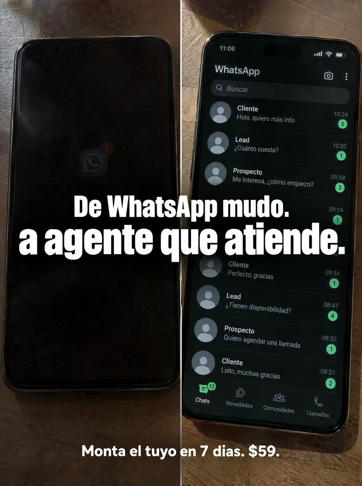

# 121 · Dos celulares: mudo contra activo

**Familia:** Diagrama y dato · **Necesitas:** Nada · **Resultado en Meta:** Sin datos propios todavía



## Qué es
Una imagen partida en dos con dos celulares sobre la mesa: a la izquierda uno apagado, con apenas un ícono tenue; a la derecha uno lleno de conversaciones de clientes, leads y prospectos. El titular cruza las dos mitades.

## Por qué funciona
El antes y el después se entienden sin leer: pantalla negra contra pantalla con movimiento. Las etiquetas de los chats (Cliente, Lead, Prospecto) hablan el idioma del vendedor y el titular resume el cambio en una línea.

## Cuándo usarlo
Público frío o tibio de negocios que venden por mensajería y sienten su canal apagado. Sirve para frenar el scroll y mostrar el cambio de estado.

## Así lo hicimos para Imperio
- **Texto en la imagen:** [celular izquierdo apagado, con un ícono tenue de WhatsApp y un 1 rojo] / [celular derecho a las 11:06 con la bandeja de WhatsApp: Buscar, chats de Cliente, Lead y Prospecto con consultas como Hola, quiero más info, Cuánto cuesta? y Me interesa, cómo empiezo?, horas, contadores verdes y la barra Chats (12), Novedades, Comunidades, Llamadas] / De WhatsApp mudo. / a agente que atiende. / Monta el tuyo en 7 dias. $59.
- **Texto principal:**
  > De WhatsApp mudo a agente que atiende. Monta el tuyo en 7 dias. $59.
- **Titular:** De WhatsApp mudo a agente que atiende

## Receta para tu marca
- **Formato:** dos fotos verticales lado a lado, separadas por una línea fina, con el mismo encuadre sobre una mesa de madera.
- **Izquierda:** [TU CANAL HOY] apagado o vacío, con apenas una señal tenue.
- **Derecha:** [TU CANAL CON TU PRODUCTO] activo, con conversaciones etiquetadas por tipo de contacto ([CLIENTE], [LEAD], [PROSPECTO]).
- **Titular:** De [ESTADO DE HOY] / a [ESTADO CON TU PRODUCTO], en blanco condensado y cruzando las dos mitades.
- **Oferta:** [TU ACCIÓN] en [TU PLAZO]. [TU PRECIO] en blanco, abajo.
- **Lo que no se toca:** el mismo teléfono y el mismo encuadre en las dos mitades, para que lo único que cambie sea la pantalla.

## Prompt con que se hizo el de Imperio (GPT Image 2.5)
```
[Prompt reconstruido mirando la imagen: el original de Imperio no quedó guardado]
Photorealistic split image: two vertical phone photos side by side, separated by a thin light line, both on a worn wooden table and shot from above. Left half: a black smartphone with the screen off, glossy dark glass, with only a very faint, dim generic speech-bubble app icon (no real logo) and a small red '1' badge barely visible. Right half: a smartphone in dark mode showing a chat app inbox, status bar '11:06', the app title 'WhatsApp', a search field 'Buscar', and a list of chats with gray default avatars, names, previews, times and green badges: 'Cliente' 'Hola, quiero más info' 10:24, 'Lead' 'Cuánto cuesta?' 10:20, 'Prospecto' 'Me interesa, cómo empiezo?' 09:58, 'Cliente' 'Perfecto, gracias' 09:14, 'Lead' 'Tienen disponibilidad?' 08:47, 'Prospecto' 'Quiero agendar una llamada' 08:32, 'Cliente' 'Listo, muchas gracias' 08:21, and a bottom tab bar 'Chats' (with a green '12' badge), 'Novedades', 'Comunidades', 'Llamadas'. Across the middle of both halves, a huge bold white condensed sans-serif headline on two lines: 'De WhatsApp mudo' / 'a agente que atiende.' Bottom center: bold white text 'Monta el tuyo en 7 días. $59.' Realistic, natural light. Vertical 4:5 Instagram/Facebook feed ad, sharp and professional. All on-image text is Spanish and must be rendered EXACTLY as written inside the quotes, with every accent and ñ correct and every digit exact. Never use inverted question marks or inverted exclamation marks. No em dashes. Do not add any other words, logos or watermarks.
```

## Ojo
- En el ejemplo de Imperio se colaron signos de apertura en el texto: pide en el prompt que no aparezcan.
- Usa un ícono genérico en vez del logo de WhatsApp: es una marca de terceros.
- Marca la casilla de contenido generado por IA en el Administrador de anuncios.
