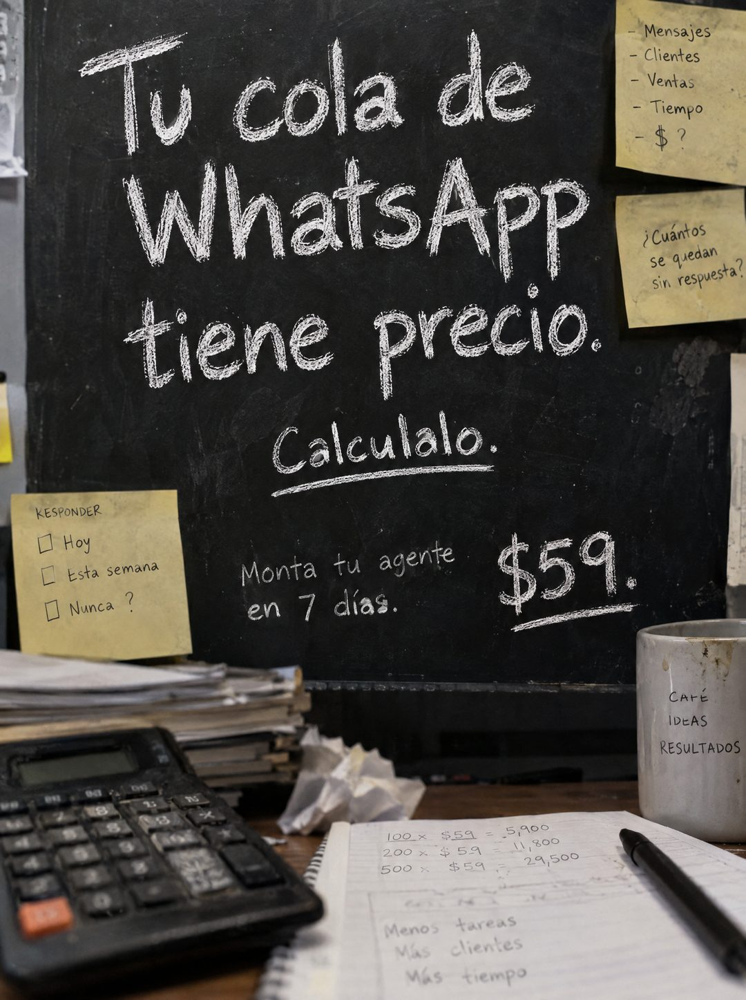

# 122 · Pizarra de tiza con calculadora

**Familia:** Objeto físico con texto · **Necesitas:** Nada · **Resultado en Meta:** Sin datos propios todavía



## Qué es
Una pizarra negra de tiza en una oficina con el titular escrito a mano, rodeada de post-its con preguntas y, abajo, un escritorio con calculadora, un cuaderno con cuentas y una taza. La pieza invita a sacar una cuenta antes de mostrar el precio.

## Por qué funciona
Le pone precio a algo que el cliente no mide (los mensajes que esperan) y le pide que lo calcule él, así se vuelve parte del argumento. La calculadora y las cuentas a mano hacen que se vea como una sesión de trabajo real y no como publicidad.

## Cuándo usarlo
Público tibio de negocios que ya reciben muchas consultas. Sirve para responder la objeción de precio: primero el costo del problema, después tu precio.

## Así lo hicimos para Imperio
- **Texto en la imagen:** Tu cola de WhatsApp tiene precio. / Calculalo. (subrayado) / Monta tu agente en 7 días. / $59. (subrayado) / Post-its: Mensajes, Clientes, Ventas, Tiempo, $ ? / Cuántos se quedan sin respuesta? / KESPONDER: Hoy, Esta semana, Nunca ? / Cuaderno: 100 × $59 = 5,900 / 200 × $59 = 11,800 / 500 × $59 = 29,500 / Menos tareas / Más clientes / Más tiempo / Taza: CAFÉ IDEAS RESULTADOS / [calculadora, papeles apilados y un papel arrugado]
- **Texto principal:**
  > Tu cola de WhatsApp tiene precio. Calculalo. Monta tu agente en 7 dias. $59.
- **Titular:** Tu cola de WhatsApp tiene precio

## Receta para tu marca
- **Escena:** pizarra negra de tiza en una oficina con luz cálida; abajo, un escritorio con calculadora, papeles apilados, un papel arrugado, taza y cuaderno con cuentas.
- **Titular:** a tiza y en grande, Tu [EL PROBLEMA QUE TU CLIENTE NO MIDE] tiene precio, y debajo la orden Calcúlalo, subrayada.
- **Apoyos:** post-its pegados en la pizarra con [LO QUE CUESTA EL PROBLEMA] en lista y [LA PREGUNTA INCÓMODA].
- **Oferta:** a tiza, abajo: [TU ACCIÓN] en [TU PLAZO], y [TU PRECIO] grande y subrayado.
- **Colores:** negro de pizarra, blanco tiza y amarillo de post-it; sin colores de marca.
- **Lo que no se toca:** la invitación a calcular y una cuenta visible en el cuaderno hecha con [EL VALOR REAL DE UN CLIENTE TUYO].

## Prompt con que se hizo el de Imperio (GPT Image 2.5)
```
[Prompt reconstruido mirando la imagen: el original de Imperio no quedó guardado]
Photorealistic phone photo of a black chalkboard on an office wall, filling most of the frame, warm indoor light, chalk dust and eraser smudges. Written in large white chalk handwriting: 'Tu cola de' / 'WhatsApp' / 'tiene precio.' and below it 'Calcúlalo.' with a chalk underline. Lower on the board, smaller chalk handwriting at the left: 'Monta tu agente' / 'en 7 días.' and at the right, large: '$59.' with an underline. Yellow sticky notes taped to the board: at the top right one with a handwritten list '- Mensajes', '- Clientes', '- Ventas', '- Tiempo', '- $ ?'; below it another one reading 'Cuántos' / 'se quedan' / 'sin respuesta?'; at the left side another one titled 'RESPONDER' with empty checkboxes 'Hoy', 'Esta semana', 'Nunca ?'. Foreground desk: an old black calculator with an orange key at the bottom left, a stack of papers and folders, a crumpled paper ball, a stained white mug at the right with handwritten 'CAFÉ' / 'IDEAS' / 'RESULTADOS', and an open spiral notebook with a pen showing handwritten math '100 × $59 = 5.900', '200 × $59 = 11.800', '500 × $59 = 29.500' and below 'Menos tareas', 'Más clientes', 'Más tiempo'. Realistic, slightly gritty. Vertical 4:5 Instagram/Facebook feed ad, sharp and professional. All on-image text is Spanish and must be rendered EXACTLY as written inside the quotes, with every accent and ñ correct and every digit exact. Never use inverted question marks or inverted exclamation marks. No em dashes. Do not add any other words, logos or watermarks.
```

## Ojo
- En el ejemplo de Imperio se colaron signos de apertura en el texto: pide en el prompt que no aparezcan.
- Revisa letra por letra lo escrito a mano: en el ejemplo de Imperio salieron 'KESPONDER' y 'Calculalo' sin tilde.
- Marca la casilla de contenido generado por IA en el Administrador de anuncios.
