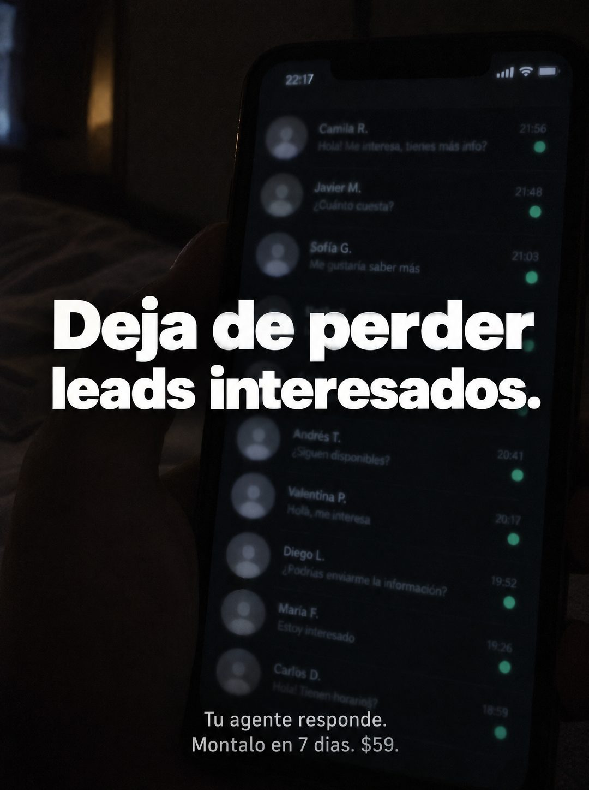

# 123 · Lista de chats en la oscuridad

**Familia:** Interfaz creíble · **Necesitas:** Nada · **Resultado en Meta:** Sin datos propios todavía



## Qué es
Un celular sostenido en la mano en un cuarto a oscuras, con la lista de chats llena de consultas sin responder, cada una con su punto verde. La lista está fuera de foco y el titular blanco va encima, al centro.

## Por qué funciona
La foto parece tomada por el dueño en la cama, revisando a última hora lo que no alcanzó a contestar, un momento que conoce cualquiera que vende por chat. Los puntos verdes hacen el trabajo: cada uno es un interesado esperando.

## Cuándo usarlo
Público frío de negocios que venden por mensajería y contestan tarde. Sirve para frenar el scroll con una escena íntima y vender respuesta automática.

## Así lo hicimos para Imperio
- **Texto en la imagen:** [celular en la mano a oscuras, 22:17, lista de chats desenfocada con nombres (Camila R., Javier M., Sofía G., Andrés T., Valentina P., Diego L., María F., Carlos D.), consultas como Cuánto cuesta? o Me gustaría saber más, horas y puntos verdes de no leído] / Deja de perder leads interesados. / Tu agente responde. / Montalo en 7 dias. $59.
- **Texto principal:**
  > Deja de perder leads interesados. Tu agente responde. Montalo en 7 dias. $59.
- **Titular:** Deja de perder leads interesados

## Receta para tu marca
- **Escena:** celular en la mano en un cuarto oscuro, con la pantalla como única luz, foto algo movida y con grano.
- **Pantalla:** lista de chats desenfocada con [NOMBRES GENÉRICOS O TIPOS DE CONTACTO], consultas cortas de compra y puntos de no leído.
- **Titular:** Deja de perder [A QUIÉN PIERDE TU CLIENTE], en blanco grande al centro, sobre la pantalla.
- **Oferta:** dos líneas chicas abajo: [LO QUE HACE TU PRODUCTO]. / [TU ACCIÓN] en [TU PLAZO]. [TU PRECIO].
- **Colores:** casi negro y el verde de los puntos; nada de color de marca.
- **Lo que no se toca:** la oscuridad y el desenfoque: si la lista se lee nítida, parece una captura y no un momento.

## Prompt con que se hizo el de Imperio (GPT Image 2.5)
```
[Prompt reconstruido mirando la imagen: el original de Imperio no quedó guardado]
Dark, grainy phone photo in a bedroom at night, lit only by the phone screen. A hand holds a black smartphone close to the camera, slightly out of focus. The screen shows a dark chat list with gray default avatars, names, short message previews, times and green unread dots: 'Camila R.' 'Hola! Me interesa, tienes más info?' 21:56, 'Javier M.' 'Cuánto cuesta?' 21:48, 'Sofía G.' 'Me gustaría saber más' 21:03, 'Andrés T.' 'Siguen disponibles?' 20:41, 'Valentina P.' 'Hola, me interesa' 20:17, 'Diego L.' 'Podrías enviarme la información?' 19:52, 'María F.' 'Estoy interesado' 19:26, 'Carlos D.' 'Hola! Tienen horarios?' 18:59; the status bar shows '22:17'. The list is soft and blurry, barely legible. Over the center, a large bold white sans-serif headline on two lines: 'Deja de perder' / 'leads interesados.' At the bottom, two small light gray lines: 'Tu agente responde.' / 'Móntalo en 7 días. $59.' Realistic low light, heavy noise. Vertical 4:5 Instagram/Facebook feed ad, sharp and professional. All on-image text is Spanish and must be rendered EXACTLY as written inside the quotes, with every accent and ñ correct and every digit exact. Never use inverted question marks or inverted exclamation marks. No em dashes. Do not add any other words, logos or watermarks.
```

## Ojo
- En el ejemplo de Imperio se colaron signos de apertura en el texto: pide en el prompt que no aparezcan.
- Los nombres de la lista son de ejemplo: déjalos desenfocados y nunca uses chats ni nombres de clientes reales.
- Marca la casilla de contenido generado por IA en el Administrador de anuncios.
