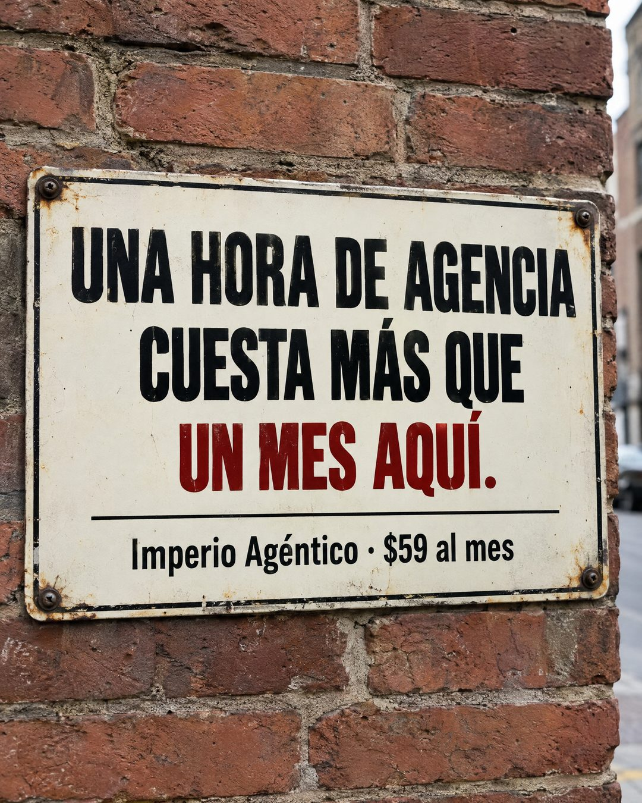

# 125 · Letrero esmaltado que compara precios

**Familia:** Objeto físico con texto · **Necesitas:** Nada · **Resultado en Meta:** $11 invertidos, 0 compras (cuenta de Imperio, sep 2026) (muestra chica)



## Qué es
Un letrero de metal esmaltado, atornillado a una pared de ladrillo en la calle, que compara lo que cuesta la alternativa cara con lo que cuesta tu oferta. En el ejemplo de Imperio, una hora de agencia contra un mes de comunidad.

## Por qué funciona
Parece una foto tomada al pasar, no un diseño, y un letrero atornillado se lee como algo fijo, casi oficial. La comparación hace la cuenta por quien lee: ancla tu precio contra algo que ya conoce y que cuesta más, así tu precio se ve chico sin que tengas que decir que es barato.

## Cuándo usarlo
Público frío o tibio que conoce la alternativa cara (agencia, consultor, técnico, clases particulares). Sirve para responder la objeción de precio antes de que aparezca.

## Así lo hicimos para Imperio
- **Texto en la imagen:** UNA HORA DE AGENCIA / CUESTA MÁS QUE / UN MES AQUÍ. (en rojo) / Imperio Agéntico · $59 al mes (más chico, bajo una línea fina)
- **Texto principal:**
  > Una hora de agencia cuesta más que un mes aquí. No lo digo por decir.
  >
  > Por $59 al mes tienes 6 sesiones en vivo a la semana y +3.800 personas construyendo agentes al lado tuyo.
  >
  > La idea es simple: aprendes a armarlo tú, en vez de arrendarlo. Entra acá 👇
- **Titular:** Imperio Agéntico · $59 al mes

## Receta para tu marca
- **Escena:** foto de frente de un letrero de metal esmaltado color crema con borde oscuro, atornillado a [UNA PARED REAL DE TU CIUDAD], con luz natural nublada y algo de óxido en los tornillos.
- **Titular:** tres líneas en mayúsculas condensadas negras: [UNA UNIDAD DE LA ALTERNATIVA CARA] / CUESTA MÁS QUE / [UNA UNIDAD DE TU OFERTA], la última en rojo oscuro y con punto final.
- **Pie:** bajo una línea fina, más chico: [TU MARCA] · [TU PRECIO].
- **Colores:** crema, negro y un solo color de acento en la última línea; usa el de tu marca solo si es oscuro y se lee bien.
- **Lo que no se toca:** un objeto fotografiado en un lugar real, sin logo, stickers ni grafitis, y una comparación que se pueda comprobar.

## Prompt con que se hizo el de Imperio (GPT Image 2.5)
```
Photorealistic photo, 4:5. A vintage enamel metal sign screwed onto an old red brick wall in a city street, shot straight on with natural overcast daylight, slight wear and rust at the screw holes, shallow depth of field on the wall edges. The sign is cream colored with a thin dark border and bold black condensed sans-serif lettering. Text on the sign, exactly as written, with accents exactly as written:
Line 1 (large): "UNA HORA DE AGENCIA"
Line 2 (large): "CUESTA MÁS QUE"
Line 3 (large, in deep red): "UN MES AQUÍ."
Below a thin rule, smaller: "Imperio Agéntico · $59 al mes"
Render every character and every digit, do not truncate. Do not add inverted question or exclamation marks. Do not add any other text, logos, stickers, graffiti or words. Premium, restrained, real photograph, not an illustration.
```

## Ojo
- La comparación tiene que ser verdadera: usa un precio de mercado que tu cliente pueda comprobar, no el caso más caro que encontraste.
- Marca la casilla de contenido generado por IA en el Administrador de anuncios.
