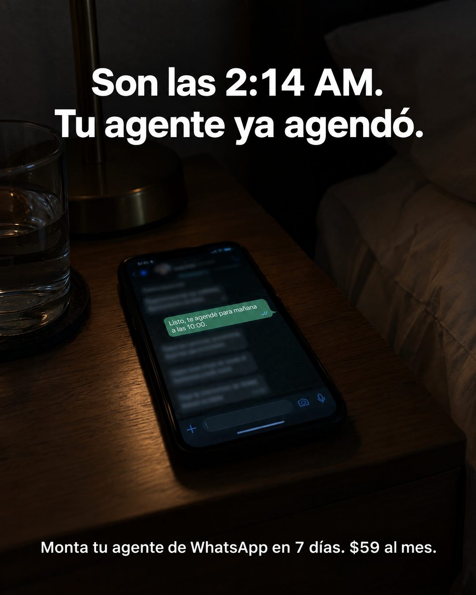

# 126 · Teléfono en la mesa de noche

**Familia:** Foto nativa · **Necesitas:** Nada · **Resultado en Meta:** $88 invertidos, 2 compras, $44,0 por compra (cuenta de Imperio, sep 2026) (muestra chica)



## Qué es
Una foto oscura de un dormitorio de noche: el teléfono sobre la mesa de noche muestra un chat donde tu producto ya resolvió algo mientras el dueño duerme. Arriba van la hora exacta y lo que ya pasó; abajo, la oferta en una línea.

## Por qué funciona
La hora con minutos (2:14, no 2:00) hace que se sienta como un momento real y no como un eslogan. No explica el producto, muestra el resultado: una sola burbuja se puede leer y todo lo demás está desenfocado, así que el ojo va directo ahí.

## Cuándo usarlo
Público frío o tibio que pierde clientes fuera de horario: clínicas, restaurantes, tiendas online, cualquier servicio con agenda. Sirve para frenar el scroll y mostrar el beneficio en un segundo.

## Así lo hicimos para Imperio
- **Texto en la imagen:** Son las 2:14 AM. / Tu agente ya agendó. / Listo, te agendé para mañana a las 10:00. (única burbuja legible del chat en el teléfono; el resto, desenfocado) / Monta tu agente de WhatsApp en 7 días. $59 al mes. (abajo, más chico)
- **Texto principal:**
  > Un cliente te escribe a las 2 de la mañana. Tú duermes. Tu agente le responde y le agenda la cita.
  >
  > Eso es lo que armamos en el curso de Agentes de WhatsApp (instalación en 1 clic, literal).
  >
  > Monta el tuyo en 7 días. $59 al mes 👇
- **Titular:** Imperio Agéntico · $59 al mes

## Receta para tu marca
- **Escena:** foto oscura de [EL LUGAR DONDE ESTÁS CUANDO NO TRABAJAS], con el teléfono boca arriba iluminando la escena y un vaso de agua o una lámpara al lado.
- **Pantalla:** un chat donde solo una burbuja se lee: [LO QUE TU PRODUCTO RESPONDE O RESUELVE, EN UNA FRASE]. Nombres, fotos de perfil y el resto de la conversación, desenfocados.
- **Titular:** dos líneas blancas grandes arriba: Son las [HORA EXACTA CON MINUTOS]. / [LO QUE TU PRODUCTO YA HIZO, EN PASADO].
- **Pie:** una línea blanca chica abajo: [TU PROMESA CON PLAZO]. [TU PRECIO].
- **Colores:** los de la escena a oscuras; el único color fuerte es la burbuja del chat.
- **Lo que no se toca:** la hora con minutos, la escena a oscuras y una sola frase legible en la pantalla.

## Prompt con que se hizo el de Imperio (GPT Image 2.5)
```
Photorealistic photo, 4:5. Dark bedroom at night, a smartphone lying face up on a wooden nightstand next to a glass of water, the phone screen glowing and lighting the scene. The screen shows a WhatsApp business chat: the chat bubbles are soft and out of focus, only one green outgoing bubble is sharp and readable, reading exactly: "Listo, te agendé para mañana a las 10:00." The rest of the conversation is blurred and illegible. Above the phone, large bold white clean sans-serif overlay text, exactly as written with accents:
"Son las 2:14 AM."
"Tu agente ya agendó."
At the bottom, smaller white overlay text, exactly as written:
"Monta tu agente de WhatsApp en 7 días. $59 al mes."
Render every character and every digit, do not truncate. Do not add inverted question or exclamation marks. Do not add names, profile photos, prices or any other readable text. Moody, cinematic, real photograph.
```

## Ojo
- El chat es una demostración de tu producto, nunca la captura de un cliente real: sin nombres, fotos de perfil ni números legibles.
- Marca la casilla de contenido generado por IA en el Administrador de anuncios.
