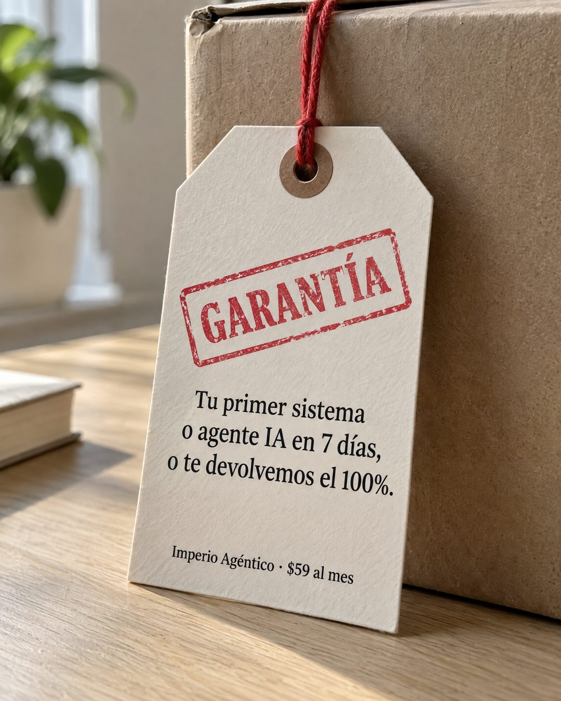

# 128 · Etiqueta de garantía con timbre

**Familia:** Oferta y precio · **Necesitas:** Nada. Solo sirve si ya ofreces una garantía real · **Resultado en Meta:** $67 invertidos, 0 compras (cuenta de Imperio, sep 2026) (muestra chica)



## Qué es
Una etiqueta de cartulina colgada con un hilo rojo de una caja de cartón, con un timbre rojo que dice GARANTÍA y tu promesa escrita como en un producto físico. Abajo, tu marca y tu precio en letra chica.

## Por qué funciona
La garantía deja de ser una línea perdida en la página de venta y se vuelve un objeto que viene con la compra, como en cualquier producto que se puede tocar. El timbre y la cartulina le dan peso de documento, y una promesa con plazo y porcentaje es concreta: se puede cobrar.

## Cuándo usarlo
Público tibio o remarketing que ya está interesado pero teme perder su dinero. Sirve para responder la objeción de riesgo y empujar la compra.

## Así lo hicimos para Imperio
- **Texto en la imagen:** GARANTÍA (timbre rojo) / Tu primer sistema / o agente IA en 7 días, / o te devolvemos el 100%. / Imperio Agéntico · $59 al mes (letra chica, abajo)
- **Texto principal:**
  > Tu primer sistema o agente IA en 7 días, o te devolvemos el 100%.
  >
  > Ojo: la condición es que hagas el trabajo, no que veas videos (para eso están las 6 sesiones en vivo a la semana, pa cuando te trabas).
  >
  > $59 al mes 👇
- **Titular:** Imperio Agéntico · $59 al mes

## Receta para tu marca
- **Escena:** foto tipo producto de [UN EMPAQUE QUE CALCE CON TU NEGOCIO] sobre una mesa de madera clara, con luz de ventana desde un lado.
- **Etiqueta:** cartulina crema colgada con hilo rojo y un timbre rojo algo torcido que dice GARANTÍA.
- **Texto:** serif negra en tres líneas: [LO QUE PROMETES] en [TU PLAZO], o [LO QUE DEVUELVES].
- **Pie:** letra chica abajo: [TU MARCA] · [TU PRECIO].
- **Colores:** crema, cartón kraft y rojo de timbre; tu marca no necesita aparecer en color.
- **Lo que no se toca:** el timbre, y el plazo y el porcentaje exactos de tu garantía real, sin códigos de barra ni logos.

## Prompt con que se hizo el de Imperio (GPT Image 2.5)
```
Photorealistic product-style photo, 4:5. A thick cream cardstock warranty tag hanging by a red string from the corner of a plain kraft cardboard box, on a light oak table, soft window light from the left. A red rubber-stamp impression slightly rotated on the tag reads "GARANTÍA". Printed black serif text on the tag, exactly as written with accents:
"Tu primer sistema o agente IA en 7 días,"
"o te devolvemos el 100%."
Small at the bottom of the tag: "Imperio Agéntico · $59 al mes"
Render every character and every digit, do not truncate. Do not add inverted question or exclamation marks. No other text, no barcodes with numbers, no logos. Crisp, tactile, real photograph, editorial still life.
```

## Ojo
- Imprime solo la garantía que de verdad ofreces, con el mismo plazo y porcentaje de tus condiciones; si tiene requisitos, dilos en el texto principal.
- Marca la casilla de contenido generado por IA en el Administrador de anuncios.
