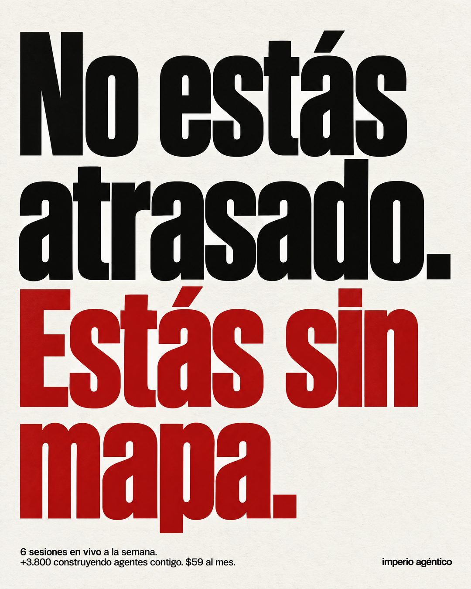

# 129 · Titular gigante que cambia el diagnóstico

**Familia:** Tipografía dura · **Necesitas:** Nada · **Resultado en Meta:** $39 invertidos, 2 compras, $19,7 por compra (cuenta de Imperio, sep 2026) (muestra chica)



## Qué es
Solo texto: un titular gigante en negro que niega lo que tu cliente cree de sí mismo y, debajo, en rojo y del mismo tamaño, el problema real que tu producto resuelve. Abajo, en letra chica, la oferta.

## Por qué funciona
Le quita la culpa a quien lee y le pone nombre a su problema, y eso se siente como una opinión, no como publicidad. Es tipografía dura: afirma algo y no se esconde detrás de una foto bonita, así que se lee completo en un segundo.

## Cuándo usarlo
Público frío que siente que llegó tarde o que no es capaz (de aprender, de ordenarse, de vender). Sirve para frenar el scroll y abrir la conversación antes de hablar del producto.

## Así lo hicimos para Imperio
- **Texto en la imagen:** No estás / atrasado. / Estás sin / mapa. (en rojo) / 6 sesiones en vivo a la semana. / +3.800 construyendo agentes contigo. $59 al mes. (letra chica, abajo a la izquierda) / imperio agéntico (abajo a la derecha)
- **Texto principal:**
  > No estás atrasado con la IA. Estás sin mapa.
  >
  > Acá tienes la ruta ordenada, 6 sesiones en vivo a la semana y +3.800 personas construyendo lo mismo que tú.
  >
  > $59 al mes 👇
- **Titular:** Imperio Agéntico · $59 al mes

## Receta para tu marca
- **Formato:** fondo blanco hueso con grano de papel, sin fotos ni íconos.
- **Titular:** condensada negra enorme, alineada a la izquierda y ocupando casi todo el cuadro: No estás [LO QUE TU CLIENTE TEME SER]. Debajo, del mismo tamaño y en rojo: Estás sin [LO QUE TU PRODUCTO LE DA].
- **Texto:** abajo a la izquierda, en letra chica: [QUÉ INCLUYE TU OFERTA EN UNA LÍNEA] / [UN DATO REAL Y TU PRECIO].
- **Marca:** [TU MARCA] en texto chico abajo a la derecha.
- **Colores:** negro, rojo y blanco hueso; si tu marca tiene un color fuerte, puede reemplazar al rojo.
- **Lo que no se toca:** dos frases cortas con punto final, el contraste entre negro y color, y nada de imagen.

## Prompt con que se hizo el de Imperio (GPT Image 2.5)
```
Brutalist typographic ad, 4:5, no photography. Solid off-white paper background with subtle paper grain. Huge heavy black condensed grotesk type, left aligned, tight leading, filling most of the frame, exactly as written with accents:
"No estás"
"atrasado."
Then in the same huge size but in deep red:
"Estás sin"
"mapa."
At the bottom left, small black sans-serif text, exactly as written:
"6 sesiones en vivo a la semana."
"+3.800 construyendo agentes contigo. $59 al mes."
Bottom right, tiny wordmark: [TU MARCA: logo y nombre]
Render every character and every digit, do not truncate. Do not add inverted question or exclamation marks. No other text, no icons, no gradients. Swiss, stark, high contrast.
```

## Ojo
- Si pones una cifra en la letra chica (clientes, miembros, ventas), que sea real y del día en que publicas.
- Marca la casilla de contenido generado por IA en el Administrador de anuncios.
