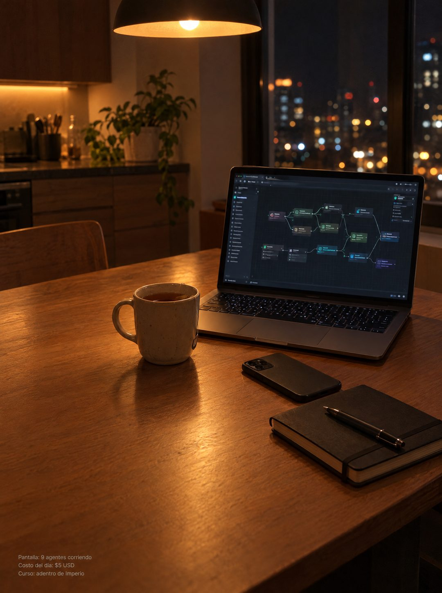

# 130 · Foto nativa en cocina de noche (Native)

**Familia:** Foto nativa · **Necesitas:** Nada. Si tienes una foto real de tu cocina, mejor · **Resultado en Meta:** $22 invertidos, 0 compras (cuenta de Imperio, sep 2026) (muestra chica)



## Qué es
Variante de la foto nativa del escritorio (formato 7): el mismo texto en letra chica, pero el contenedor cambia a la mesa de la cocina de noche, con la laptop abierta, una taza de té, el teléfono boca abajo y las luces de la ciudad en la ventana.

## Por qué funciona
Conserva lo que hizo funcionar al original (no parece anuncio y la única venta es la letra chica) y cambia solo la escena, así quien ya vio la versión del escritorio la recibe como una foto nueva. La noche y la luz cálida sugieren que el trabajo sigue corriendo cuando el día ya terminó.

## Cuándo usarlo
Cuando la foto nativa original ya se vio mucho en público frío y quieres rotar sin perder lo que funciona. Sirve para negocios que se pueden mostrar desde la casa: servicios digitales, trabajo remoto, cursos.

## Así lo hicimos para Imperio
- **Texto en la imagen:** Pantalla: 9 agentes corriendo / Costo del día: $5 USD / Curso: adentro de Imperio (letra chica gris, abajo a la izquierda)
- **Texto principal:**
  > Son las 11 de la noche y estoy mirando los logros que publicaron hoy.
  >
  > Automatizaciones nuevas, primeros clientes cobrados, sistemas andando. Ninguno lo hice yo, y ese es exactamente el punto.
  >
  > +3.300 personas construyendo en español, +$220.000 USD en ventas que publicaron ellos mismos.
  >
  > Entra y mira el muro por dentro. $59 al mes 👇
- **Titular:** Imperio Agéntico · $59 al mes

## Receta para tu marca
- **Escena:** foto tipo celular de [LA MESA DE TU CASA] de noche, con una lámpara colgante cálida y una ventana con luces de ciudad desenfocadas.
- **Protagonista:** [LA HERRAMIENTA O EL RESULTADO DE TU NEGOCIO] en una laptop abierta, con todo el texto de la pantalla ilegible; al lado una taza, el teléfono boca abajo y un cuaderno cerrado.
- **Texto:** las mismas tres líneas de letra chica gris de tu versión del formato 7, abajo a la izquierda: [QUÉ SE VE] / [UN DATO CONCRETO CON CIFRA] / [DÓNDE SE APRENDE O SE COMPRA].
- **Colores:** los tonos cálidos de la escena; nada de colores de marca.
- **Lo que no se toca:** el mismo texto de la versión original, la esquina de abajo a la izquierda libre para la letra chica, y cero titular, logo o botón.

## Prompt con que se hizo el de Imperio (GPT Image 2.5)
```
[Nota: el de Imperio se generó en 3:4. Para el feed pídelo en 4:5]
[Referencia: adjunta como imagen de referencia el formato 007 de esta biblioteca (su ejemplo.jpg) o tu propia versión de ese formato] Photorealistic smartphone photo, natural and unposed, same native style as the reference image but a completely different scene: a kitchen table at night. An open laptop shows a dark node-based automation workflow canvas with connected boxes and lines; all interface text is tiny, blurred and illegible. Next to it a mug of tea, a phone lying face down, a small closed notebook with a pen. A warm pendant lamp lights the table; behind, a window with out-of-focus city lights at night. Moody warm tones, slight grain, looks like a real photo someone took of their own setup. Vertical composition with calm empty table surface in the lower-left area. In the bottom-left corner, small plain light-grey sans-serif caption text on three lines, exactly as in the reference: "Pantalla: 9 agentes corriendo" then "Costo del día: $5 USD" then "Curso: adentro de Imperio". Render every character, accent and digit exactly, do not truncate. No other readable text, no logos, no watermarks, no opening question or exclamation marks.
```

## Ojo
- El dato de la letra chica tiene que ser verdadero y verificable: aquí no hay titular que lo suavice.
- Que nada en la pantalla se pueda leer: si aparece texto, una marca o el logo de otra app, se rehace.
- Marca la casilla de contenido generado por IA en el Administrador de anuncios.
