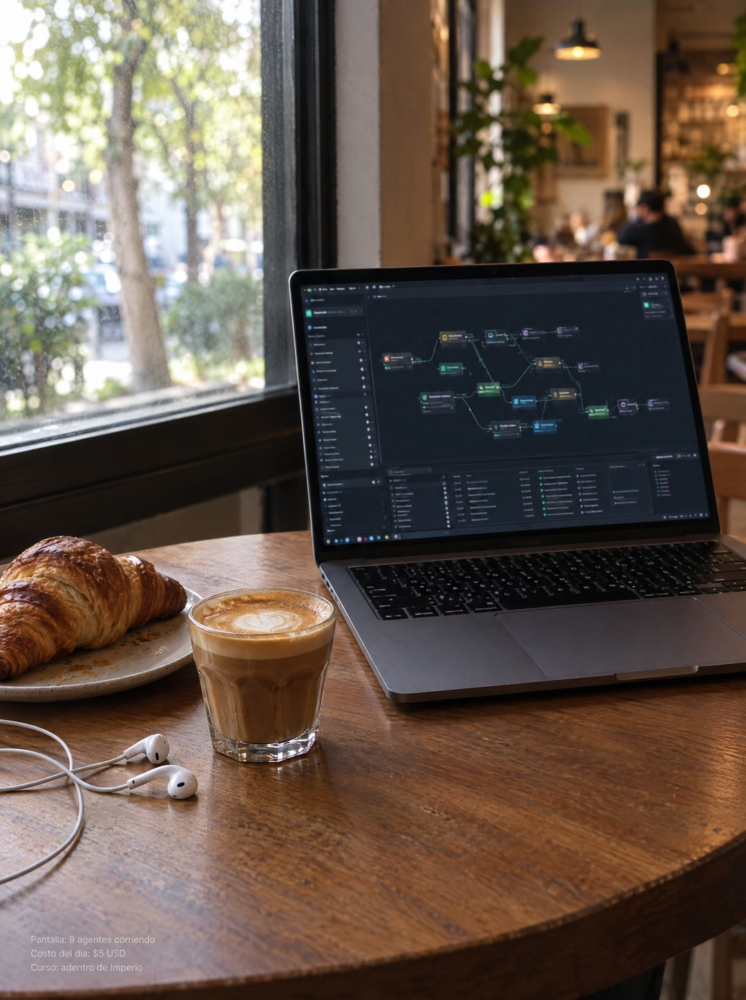

# 131 · Foto nativa en mesa de café (Native)

**Familia:** Foto nativa · **Necesitas:** Nada. Si tienes una foto real trabajando en un café, mejor · **Resultado en Meta:** $11 invertidos, 0 compras (cuenta de Imperio, sep 2026) (muestra chica)



## Qué es
Variante de la foto nativa del escritorio (formato 7): el mismo texto en letra chica, pero el contenedor pasa a una mesa de café junto a la ventana, de día, con la laptop abierta, un cortado, un croissant y audífonos.

## Por qué funciona
La luz de día y el café dicen que el trabajo se puede hacer desde cualquier parte, sin oficina. Como cambia solo la escena, se ve nuevo para quien ya vio el original, pero conserva lo que lo hizo funcionar: no parece anuncio y la venta está en la letra chica.

## Cuándo usarlo
Rotación de la foto nativa en público frío, sobre todo si tu cliente quiere libertad de horario o de lugar. Sirve para freelancers, servicios digitales y cursos.

## Así lo hicimos para Imperio
- **Texto en la imagen:** Pantalla: 9 agentes corriendo / Costo del día: $5 USD / Curso: adentro de Imperio (letra chica gris, abajo a la izquierda)
- **Texto principal:**
  > Son las 10 de la mañana y estoy mirando los logros que publicaron ayer.
  >
  > Automatizaciones nuevas, primeros clientes cobrados, sistemas andando. Ninguno lo hice yo, y ese es exactamente el punto.
  >
  > +3.300 personas construyendo en español, +$220.000 USD en ventas que publicaron ellos mismos.
  >
  > Entra y mira el muro por dentro. $59 al mes 👇
- **Titular:** Imperio Agéntico · $59 al mes

## Receta para tu marca
- **Escena:** foto tipo celular de [UNA MESA DE CAFÉ O EL LUGAR DONDE TRABAJAS FUERA DE CASA], de día y junto a una ventana, con el local desenfocado detrás.
- **Protagonista:** [LA HERRAMIENTA O EL RESULTADO DE TU NEGOCIO] en una laptop abierta, con la pantalla ilegible; al lado un café, algo para comer y audífonos.
- **Texto:** las mismas tres líneas de letra chica gris de tu versión del formato 7, abajo a la izquierda, sobre la parte vacía de la mesa.
- **Colores:** los de la escena real, cálidos y naturales.
- **Lo que no se toca:** el mismo texto de la versión original, cero titular, logo o botón, y ningún letrero ni marca del café legible en el fondo.

## Prompt con que se hizo el de Imperio (GPT Image 2.5)
```
[Nota: el de Imperio se generó en 3:4. Para el feed pídelo en 4:5]
[Referencia: adjunta como imagen de referencia el formato 007 de esta biblioteca (su ejemplo.jpg) o tu propia versión de ese formato] Photorealistic smartphone photo, natural and unposed, same native style as the reference image but a completely different scene: a small wooden cafe table next to a large window in soft daylight. An open laptop shows a dark node-based automation workflow canvas with connected boxes and lines; all interface text is tiny, blurred and illegible. A cortado coffee in a small glass, a croissant on a plate, white wired earphones. The cafe interior behind is softly out of focus with no readable signs. Realistic colors, slight grain. Vertical composition with calm empty table surface in the lower-left area. In the bottom-left corner, small plain light-grey sans-serif caption text on three lines, exactly as in the reference: "Pantalla: 9 agentes corriendo" then "Costo del día: $5 USD" then "Curso: adentro de Imperio". Render every character, accent and digit exactly, do not truncate. No other readable text, no logos, no watermarks, no opening question or exclamation marks.
```

## Ojo
- El dato de la letra chica tiene que ser verdadero y verificable: aquí no hay titular que lo suavice.
- Que no se lea ningún letrero, marca ni logo del café: si aparece uno, se rehace.
- Marca la casilla de contenido generado por IA en el Administrador de anuncios.
