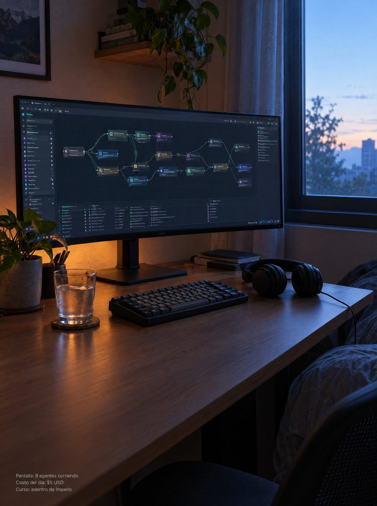

# 132 · Foto nativa del escritorio al amanecer (Native)

**Familia:** Foto nativa · **Necesitas:** Nada. Si tienes una foto real de tu escritorio, mejor · **Resultado en Meta:** $339 invertidos, 3 compras, $113,1 por compra (cuenta de Imperio, sep 2026)



## Qué es
Variante de la foto nativa del escritorio (formato 7): el mismo texto en letra chica, pero en un escritorio chico en la esquina de un dormitorio al amanecer, con un solo monitor ancho, teclado, audífonos y un vaso de agua.

## Por qué funciona
La luz azul de la mañana mezclada con el brillo del monitor cuenta, sin decirlo, que algo quedó corriendo toda la noche. Es la variante más parecida al original, así que sirve para probar si lo que rinde es la escena o la hora del día.

## Cuándo usarlo
Rotación de la foto nativa en público frío cuando el original ya se vio mucho. Sirve para negocios que se manejan desde la casa: servicios digitales, creadores, consultores.

## Así lo hicimos para Imperio
- **Texto en la imagen:** Pantalla: 9 agentes corriendo / Costo del día: $5 USD / Curso: adentro de Imperio (letra chica gris, abajo a la izquierda)
- **Texto principal:**
  > Son las 7 de la mañana y estoy mirando los logros que publicaron anoche.
  >
  > Automatizaciones nuevas, primeros clientes cobrados, sistemas andando. Ninguno lo hice yo, y ese es exactamente el punto.
  >
  > +3.300 personas construyendo en español, +$220.000 USD en ventas que publicaron ellos mismos.
  >
  > Entra y mira el muro por dentro. $59 al mes 👇
- **Titular:** Imperio Agéntico · $59 al mes

## Receta para tu marca
- **Escena:** foto de [TU ESCRITORIO EN CASA] al amanecer, con luz azul fría de la ventana mezclada con el brillo cálido de la pantalla, ordenado pero no de catálogo.
- **Protagonista:** un solo monitor ancho con [LA HERRAMIENTA O EL RESULTADO DE TU NEGOCIO], con todo el texto ilegible; teclado, audífonos, un vaso de agua y una planta.
- **Texto:** las mismas tres líneas de letra chica gris de tu versión del formato 7, abajo a la izquierda, sobre la parte libre del escritorio.
- **Colores:** azul de mañana y ámbar de pantalla; nada de colores de marca.
- **Lo que no se toca:** el mismo texto de la versión original, cero titular, logo o botón, y una escena que se vea vivida.

## Prompt con que se hizo el de Imperio (GPT Image 2.5)
```
[Nota: el de Imperio se generó en 3:4. Para el feed pídelo en 4:5]
[Referencia: adjunta como imagen de referencia el formato 007 de esta biblioteca (su ejemplo.jpg) o tu propia versión de ese formato] Photorealistic photo, natural and unposed, same native style as the reference image but a completely different scene: a compact home desk in a bedroom corner at dawn. A single ultrawide monitor shows a dark node-based automation workflow canvas with many connected nodes; all interface text is tiny, blurred and illegible. A mechanical keyboard, over-ear headphones, a glass of water, a small potted plant. Cool blue morning light from a window mixed with the warm monitor glow, lived-in and real, not staged. Vertical composition with calm empty desk surface in the lower-left area. In the bottom-left corner, small plain light-grey sans-serif caption text on three lines, exactly as in the reference: "Pantalla: 9 agentes corriendo" then "Costo del día: $5 USD" then "Curso: adentro de Imperio". Render every character, accent and digit exactly, do not truncate. No other readable text, no logos, no watermarks, no opening question or exclamation marks.
```

## Ojo
- El dato de la letra chica tiene que ser verdadero y verificable: aquí no hay titular que lo suavice.
- Deja el escritorio como lo tendría alguien que trabaja ahí: si se ve de catálogo, deja de parecer una foto nativa.
- Marca la casilla de contenido generado por IA en el Administrador de anuncios.
