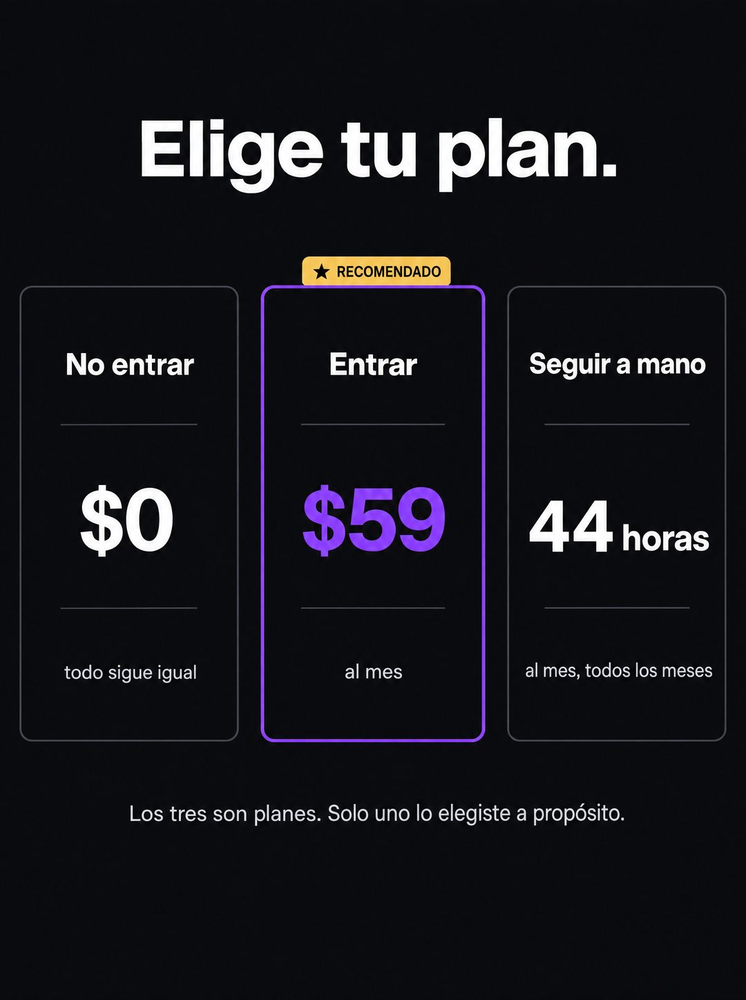

# 133 · Elige tu plan en modo oscuro (variante)

**Familia:** Oferta y precio · **Necesitas:** Nada · **Resultado en Meta:** $280 invertidos, 4 compras, $70,0 por compra (cuenta de Imperio, sep 2026)



## Qué es
Variante de Elige tu plan (formato 47): la misma tabla de tres planes (el tercero es el costo de no hacer nada), pero en modo oscuro: fondo casi negro, texto blanco y la tarjeta del medio con borde y precio en violeta.

## Por qué funciona
En un feed claro, un bloque negro con una tabla de precios corta el scroll por contraste. Mantiene el giro del original: el tercer plan no se paga en dinero sino en horas, y la frase final hace que quien lee note que ya está pagando uno sin haberlo elegido.

## Cuándo usarlo
Público tibio o remarketing que ya conoce tu precio y lo está postergando. Sirve para responder la objeción de precio y como rotación cuando la versión clara ya se vio.

## Así lo hicimos para Imperio
- **Texto en la imagen:** Elige tu plan. / No entrar / $0 / todo sigue igual / ★ RECOMENDADO (pestaña dorada sobre la tarjeta del medio) / Entrar / $59 (en violeta) / al mes / Seguir a mano / 44 horas / al mes, todos los meses / Los tres son planes. Solo uno lo elegiste a propósito.
- **Texto principal:**
  > Nadie elige el tercero a propósito, pero es el que más gente está pagando.
  >
  > 44 horas al mes repitiendo lo mismo cuesta bastante más que $59.
  >
  > Adentro: +35 cursos, 5 sesiones en vivo por semana y +1.800 logros publicados para copiar ideas 👇
- **Titular:** Imperio Agéntico · $59 al mes

## Receta para tu marca
- **Formato:** fondo casi negro y titular blanco grande arriba: Elige tu plan.
- **Tarjetas:** tres columnas con borde gris fino: [NO COMPRAR] / $0 / [QUÉ PASA SI NO HACE NADA]; [COMPRAR] / [TU PRECIO] / [PERIODO]; [SEGUIR COMO ESTÁ] / [EL COSTO OCULTO EN HORAS O DINERO] / [CADA CUÁNTO LO PAGA].
- **Jerarquía:** la tarjeta del medio con borde grueso y precio en el color de tu marca, y una pestaña dorada arriba con una estrella y la palabra RECOMENDADO.
- **Pie:** una línea gris clara centrada: Los tres son planes. Solo uno lo elegiste a propósito.
- **Lo que no se toca:** los tres planes con el mismo diseño, el tercero con un costo que no es tu precio, y la frase final.

## Prompt con que se hizo el de Imperio (GPT Image 2.5)
```
[Nota: el de Imperio se generó en 3:4. Para el feed pídelo en 4:5]
[Referencia: adjunta como imagen de referencia el formato 047 de esta biblioteca (su ejemplo.jpg) o tu propia versión de ese formato] Clean minimal graphic design, the same pricing-table layout as the reference but in dark mode: near-black background, white text. Large bold sans-serif headline at the top: "Elige tu plan." Below, three tall rounded rectangle cards side by side with thin dark-grey borders. The middle card has a thick violet border and a small golden tab above it reading "RECOMENDADO" with a small star. Left card, exactly: "No entrar", a thin divider, big "$0", divider, small "todo sigue igual". Middle card, exactly: "Entrar", divider, big violet "$59", divider, small "al mes". Right card, exactly: "Seguir a mano", divider, big "44 horas", divider, small "al mes, todos los meses". Footer line centered at the bottom in light grey: "Los tres son planes. Solo uno lo elegiste a propósito." Generous spacing, crisp typography. Render every character, accent and digit exactly, do not truncate. No other text, no logos, no opening question or exclamation marks.
```

## Ojo
- El costo del tercer plan tiene que salir de una cuenta que puedas defender (las horas reales de la tarea que reemplazas), no de un número redondo inventado.
- Si sale texto roto, manos deformes o cifras mal escritas, se rehace.
- Marca la casilla de contenido generado por IA en el Administrador de anuncios.
