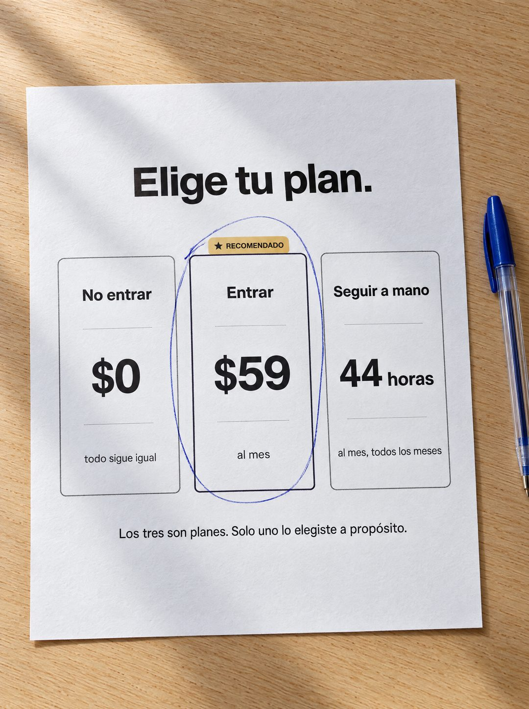

# 134 · Elige tu plan en hoja impresa (variante)

**Familia:** Oferta y precio · **Necesitas:** Nada · **Resultado en Meta:** $7 invertidos, 0 compras (cuenta de Imperio, sep 2026) (muestra chica)



## Qué es
Variante de Elige tu plan (formato 47): la misma tabla de tres planes, pero impresa en una hoja fotografiada desde arriba sobre un escritorio de madera, con un bolígrafo azul al lado y un círculo a mano alrededor del plan del medio.

## Por qué funciona
Pasa de pantalla a objeto: una hoja fotografiada se siente como un papel que alguien estuvo comparando de verdad, no como un diseño. El círculo a mano muestra una decisión ya tomada y lleva el ojo directo al plan del medio.

## Cuándo usarlo
Público tibio o remarketing que está comparando opciones. Sirve para responder la objeción de precio con algo que no parece anuncio.

## Así lo hicimos para Imperio
- **Texto en la imagen:** Elige tu plan. / No entrar / $0 / todo sigue igual / ★ RECOMENDADO / Entrar / $59 / al mes (columna del medio, encerrada en un círculo de bolígrafo azul) / Seguir a mano / 44 horas / al mes, todos los meses / Los tres son planes. Solo uno lo elegiste a propósito.
- **Texto principal:**
  > Nadie elige el tercero a propósito, pero es el que más gente está pagando.
  >
  > 44 horas al mes repitiendo lo mismo cuesta bastante más que $59.
  >
  > Adentro: +35 cursos, 5 sesiones en vivo por semana y +1.800 logros publicados para copiar ideas 👇
- **Titular:** Imperio Agéntico · $59 al mes

## Receta para tu marca
- **Escena:** foto cenital de una hoja blanca impresa sobre [UNA MESA DE MADERA CLARA], con luz de ventana, sombra suave y un bolígrafo azul al lado.
- **Contenido:** la misma tabla de tu versión del formato 47: Elige tu plan., tres columnas con [NO COMPRAR] / $0, [COMPRAR] / [TU PRECIO] y [SEGUIR COMO ESTÁ] / [EL COSTO OCULTO], y la frase final.
- **Marca a mano:** un círculo suelto de bolígrafo azul alrededor de la columna del medio, la que lleva la pestaña dorada con la palabra RECOMENDADO.
- **Colores:** impresión en negro sobre papel blanco; lo único con color es el bolígrafo azul y la pestaña dorada.
- **Lo que no se toca:** que sea papel fotografiado, el círculo a mano y la frase final: Los tres son planes. Solo uno lo elegiste a propósito.

## Prompt con que se hizo el de Imperio (GPT Image 2.5)
```
[Nota: el de Imperio se generó en 3:4. Para el feed pídelo en 4:5]
[Referencia: adjunta como imagen de referencia el formato 047 de esta biblioteca (su ejemplo.jpg) o tu propia versión de ese formato] Photorealistic top-down photo of a printed sheet of white paper lying on a light oak desk, a blue ballpoint pen resting beside it, soft window daylight with a gentle shadow and subtle paper texture. The sheet shows the same pricing table as the reference, printed in black: headline "Elige tu plan." and three boxed columns. Left column: "No entrar", "$0", "todo sigue igual". Middle column with a small printed tag above it "RECOMENDADO": "Entrar", "$59", "al mes". Right column: "Seguir a mano", "44 horas", "al mes, todos los meses". Printed footer line: "Los tres son planes. Solo uno lo elegiste a propósito." Someone has drawn a quick loose hand-drawn blue ballpoint circle around the middle column. Render every character, accent and digit exactly, do not truncate. No other text, no logos, no opening question or exclamation marks.
```

## Ojo
- El costo del tercer plan tiene que salir de una cuenta que puedas defender (las horas reales de la tarea que reemplazas), no de un número redondo inventado.
- Si sale texto roto, manos deformes o cifras mal escritas, se rehace.
- Marca la casilla de contenido generado por IA en el Administrador de anuncios.
