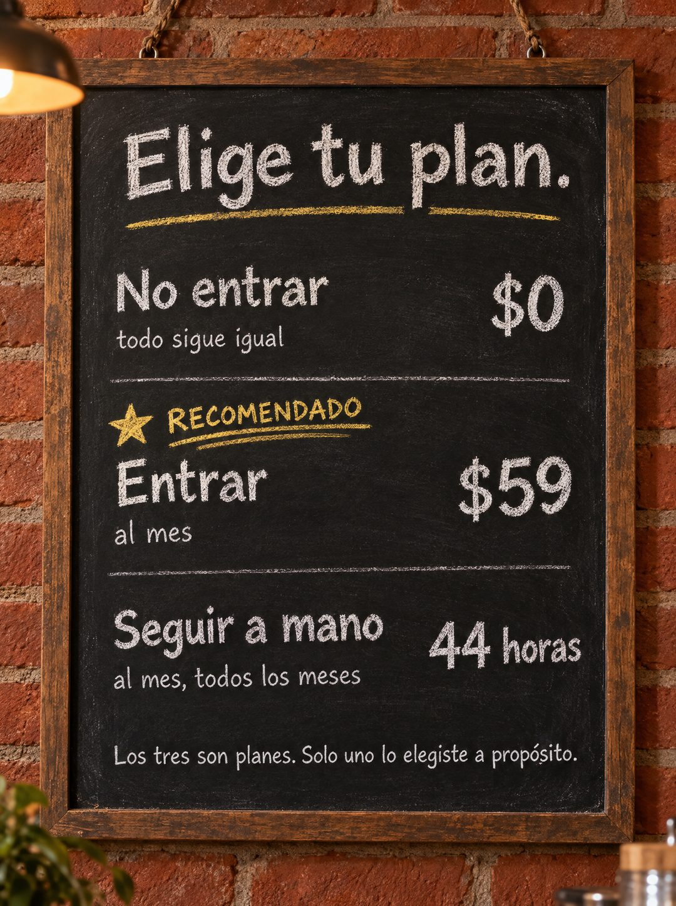

# 135 · Elige tu plan en pizarra de café (variante)

**Familia:** Oferta y precio · **Necesitas:** Nada · **Resultado en Meta:** $14 invertidos, 0 compras (cuenta de Imperio, sep 2026) (muestra chica)



## Qué es
Variante de Elige tu plan (formato 47): los mismos tres planes escritos con tiza en la pizarra de menú de un café, uno debajo del otro con el precio a la derecha, y el del medio marcado con una estrella y la palabra RECOMENDADO en tiza amarilla.

## Por qué funciona
La pizarra convierte la tabla de precios en un menú, algo que todos saben leer y elegir, así que el tercer plan (pagar en horas) se entiende sin explicación. Es un objeto real escrito a mano, y eso gana a una tabla que parece hecha en Canva.

## Cuándo usarlo
Público frío o tibio, sobre todo en rubros de comida, comercio o servicios de barrio. Sirve para responder la objeción de precio con un tono liviano.

## Así lo hicimos para Imperio
- **Texto en la imagen:** Elige tu plan. / No entrar / $0 / todo sigue igual / ★ RECOMENDADO (en tiza amarilla) / Entrar / $59 / al mes / Seguir a mano / 44 horas / al mes, todos los meses / Los tres son planes. Solo uno lo elegiste a propósito. (precios alineados a la derecha, como en un menú)
- **Texto principal:**
  > Nadie elige el tercero a propósito, pero es el que más gente está pagando.
  >
  > 44 horas al mes repitiendo lo mismo cuesta bastante más que $59.
  >
  > Adentro: +35 cursos, 5 sesiones en vivo por semana y +1.800 logros publicados para copiar ideas 👇
- **Titular:** Imperio Agéntico · $59 al mes

## Receta para tu marca
- **Escena:** foto de una pizarra de menú con marco de madera colgada en [UNA PARED DE LADRILLO O DE TU LOCAL], con luz cálida de café y polvo de tiza real.
- **Titular:** Elige tu plan. en tiza blanca, subrayado en amarillo.
- **Menú:** tres ítems uno bajo el otro, cada uno con su precio a la derecha y una línea chica abajo: [NO COMPRAR] $0, [COMPRAR] [TU PRECIO] y [SEGUIR COMO ESTÁ] [EL COSTO OCULTO].
- **Jerarquía:** el ítem del medio con una estrella y la palabra RECOMENDADO en tiza amarilla; el resto, en blanco.
- **Lo que no se toca:** la letra a mano, el orden de menú con precios a la derecha y la frase final: Los tres son planes. Solo uno lo elegiste a propósito.

## Prompt con que se hizo el de Imperio (GPT Image 2.5)
```
[Nota: el de Imperio se generó en 3:4. Para el feed pídelo en 4:5]
[Referencia: adjunta como imagen de referencia el formato 047 de esta biblioteca (su ejemplo.jpg) o tu propia versión de ese formato] Photorealistic photo of a cafe chalkboard menu board hanging on a red brick wall, hand-lettered in white chalk with a few yellow chalk accents, warm cafe lighting, realistic chalk dust texture. Title at the top: "Elige tu plan." Three items listed one under the other like a menu, each with its price aligned to the right. First item: "No entrar" with price "$0" and a small line under it "todo sigue igual". Second item highlighted with a yellow chalk star and the word "RECOMENDADO": "Entrar" with price "$59" and a small line under it "al mes". Third item: "Seguir a mano" with price "44 horas" and a small line under it "al mes, todos los meses". At the bottom in smaller chalk: "Los tres son planes. Solo uno lo elegiste a propósito." The word propósito must carry the acute accent on the o: p-r-o-p-ó-s-i-t-o. Render every character, accent and digit exactly, do not truncate. No other text, no logos, no opening question or exclamation marks.
```

## Ojo
- Si una palabra con tilde sale mal en la tiza, deletréala en el prompt (p-r-o-p-ó-s-i-t-o), como se hizo en el ejemplo de Imperio.
- Si sale texto roto, manos deformes o cifras mal escritas, se rehace.
- Marca la casilla de contenido generado por IA en el Administrador de anuncios.
