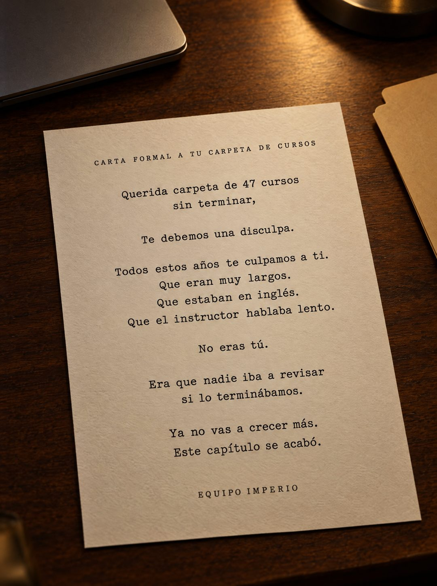

# 136 · Carta formal en hoja a máquina (Formal apology to an object)

**Familia:** Objeto físico con texto · **Necesitas:** Nada · **Resultado en Meta:** $1 invertidos, 0 compras (cuenta de Imperio, sep 2026) (muestra chica)



## Qué es
Variante de la carta formal a un objeto (formato 50): el mismo texto de disculpa, pero escrito a máquina en una hoja crema fotografiada sobre un escritorio oscuro, junto a una laptop cerrada y una carpeta vacía, con luz de lámpara.

## Por qué funciona
La carta deja de ser un diseño y pasa a ser un papel real que alguien dejó sobre la mesa, y la carpeta vacía al lado completa la historia sin decir nada. Mantiene lo que funcionó en el original: no es normal ver a una marca disculpándose, y la curiosidad hace que se lea hasta el final.

## Cuándo usarlo
Público frío que ya compró soluciones parecidas y no las terminó (cursos, gimnasios, apps, dietas). Sirve para frenar el scroll y quitar la culpa antes de vender.

## Así lo hicimos para Imperio
- **Texto en la imagen:** CARTA FORMAL A TU CARPETA DE CURSOS / Querida carpeta de 47 cursos sin terminar, / Te debemos una disculpa. / Todos estos años te culpamos a ti. / Que eran muy largos. / Que estaban en inglés. / Que el instructor hablaba lento. / No eras tú. / Era que nadie iba a revisar si lo terminábamos. / Ya no vas a crecer más. / Este capítulo se acabó. / EQUIPO IMPERIO
- **Texto principal:**
  > 47 cursos guardados y ningún sistema corriendo. No es culpa de los cursos.
  >
  > Es que nadie iba a revisar si los terminabas. Adentro sí: 5 sesiones en vivo a la semana y +3.300 personas construyendo lo mismo.
  >
  > $59 al mes 👇
- **Titular:** Imperio Agéntico · $59 al mes

## Receta para tu marca
- **Escena:** foto de una hoja crema algo inclinada sobre [UN ESCRITORIO DE MADERA OSCURA], con luz cálida de lámpara, bordes desenfocados y la carta nítida; al lado, [EL OBJETO AL QUE LE ESCRIBES] en versión física.
- **Encabezado:** en mayúsculas chicas y espaciadas: CARTA FORMAL A [EL OBJETO QUE GUARDA LA FRUSTRACIÓN DE TU CLIENTE].
- **Texto:** letra de máquina de escribir, centrada, una idea por línea: Querida [OBJETO CON UNA CIFRA], / Te debemos una disculpa. / [LAS EXCUSAS QUE TU CLIENTE SE DICE] / No eras tú. / Era que [LA CAUSA REAL QUE TU PRODUCTO RESUELVE]. / [EL CIERRE].
- **Firma:** EQUIPO [TU MARCA] en mayúsculas espaciadas, sin logo.
- **Lo que no se toca:** el tono de disculpa formal, las frases cortas de una línea y la línea No eras tú. justo antes de la causa real.

## Prompt con que se hizo el de Imperio (GPT Image 2.5)
```
[Nota: el de Imperio se generó en 3:4. Para el feed pídelo en 4:5]
[Referencia: adjunta como imagen de referencia el formato 050 de esta biblioteca (su ejemplo.jpg) o tu propia versión de ese formato] Photorealistic photo of a single sheet of cream letter paper lying slightly angled on a dark walnut desk, next to a closed laptop and an empty manila folder, warm desk-lamp light, realistic paper texture, the edges of the frame slightly out of focus but the letter perfectly sharp and legible. The letter is typed in a classic serif typewriter font, centered, with exactly this text and line breaks: at the top in small letter-spaced capitals "CARTA FORMAL A TU CARPETA DE CURSOS". Then: "Querida carpeta de 47 cursos sin terminar," / "Te debemos una disculpa." / "Todos estos años te culpamos a ti." / "Que eran muy largos." / "Que estaban en inglés." / "Que el instructor hablaba lento." / "No eras tú." / "Era que nadie iba a revisar si lo terminábamos." / "Ya no vas a crecer más." / "Este capítulo se acabó." Signed at the bottom in small letter-spaced capitals: "EQUIPO IMPERIO". Render every character, accent and digit exactly, do not truncate or skip lines. No other text, no logos, no opening question or exclamation marks.
```

## Ojo
- Si sale texto roto, manos deformes o cifras mal escritas, se rehace.
- El texto principal de Meta va corto: la carta ya es larga y no tiene que competir con ella.
- Marca la casilla de contenido generado por IA en el Administrador de anuncios.
