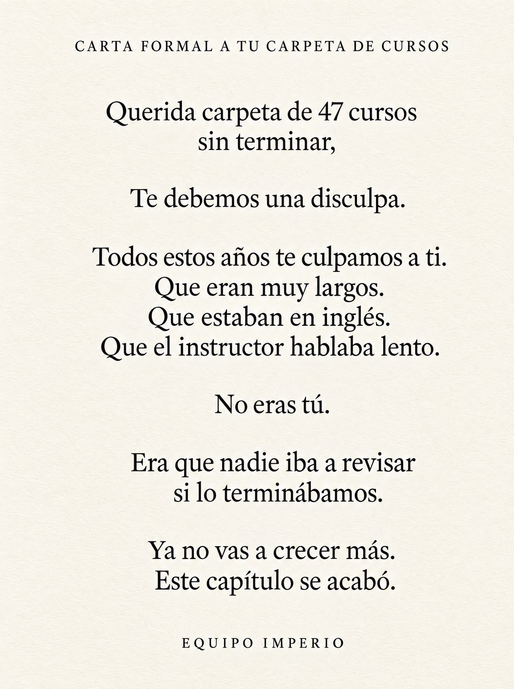

# 137 · Carta formal en fondo claro (Formal apology to an object)

**Familia:** Tipografía dura · **Necesitas:** Nada · **Resultado en Meta:** $56 invertidos, 1 compra, $56,0 por compra (cuenta de Imperio, sep 2026) (muestra chica)



## Qué es
Variante de la carta formal a un objeto (formato 50): el mismo texto, pero invertido, con letras negras en serif elegante sobre fondo blanco hueso con grano de papel, en vez de letras blancas sobre negro.

## Por qué funciona
En fondo claro se parece a una carta impresa o a un aviso de página completa en un diario, y se lee más formal y más fácil en el feed. Como no cambia ni una palabra, sirve para probar si lo que rendía en el original era el texto o el fondo negro.

## Cuándo usarlo
Público frío, como rotación del original cuando ya se vio mucho. Sirve para marcas sobrias y para públicos que leen.

## Así lo hicimos para Imperio
- **Texto en la imagen:** CARTA FORMAL A TU CARPETA DE CURSOS / Querida carpeta de 47 cursos sin terminar, / Te debemos una disculpa. / Todos estos años te culpamos a ti. / Que eran muy largos. / Que estaban en inglés. / Que el instructor hablaba lento. / No eras tú. / Era que nadie iba a revisar si lo terminábamos. / Ya no vas a crecer más. / Este capítulo se acabó. / EQUIPO IMPERIO
- **Texto principal:**
  > 47 cursos guardados y ningún sistema corriendo. No es culpa de los cursos.
  >
  > Es que nadie iba a revisar si los terminabas. Adentro sí: 5 sesiones en vivo a la semana y +3.300 personas construyendo lo mismo.
  >
  > $59 al mes 👇
- **Titular:** Imperio Agéntico · $59 al mes

## Receta para tu marca
- **Formato:** solo texto sobre fondo blanco hueso con grano de papel muy sutil, sin imágenes ni logo.
- **Encabezado:** en mayúsculas chicas y espaciadas: CARTA FORMAL A [EL OBJETO QUE GUARDA LA FRUSTRACIÓN DE TU CLIENTE].
- **Texto:** serif negra tipo Garamond, centrada, con interlineado amplio y el mismo texto de tu versión del formato 50, una idea por línea.
- **Firma:** EQUIPO [TU MARCA] en mayúsculas chicas y espaciadas.
- **Colores:** negro sobre blanco hueso; nada de color de marca.
- **Lo que no se toca:** el texto exacto de tu versión original, la jerarquía (encabezado chico, carta grande, firma chica) y el aire alrededor.

## Prompt con que se hizo el de Imperio (GPT Image 2.5)
```
[Nota: el de Imperio se generó en 3:4. Para el feed pídelo en 4:5]
[Referencia: adjunta como imagen de referencia el formato 050 de esta biblioteca (su ejemplo.jpg) o tu propia versión de ese formato] Minimal typographic poster, the inverse of the reference: warm off-white paper background with a very subtle paper grain, deep black elegant serif text (Garamond-like), centered, generous line spacing. Exactly this text and line breaks: at the top in small letter-spaced capitals "CARTA FORMAL A TU CARPETA DE CURSOS". Then: "Querida carpeta de 47 cursos sin terminar," / "Te debemos una disculpa." / "Todos estos años te culpamos a ti." / "Que eran muy largos." / "Que estaban en inglés." / "Que el instructor hablaba lento." / "No eras tú." / "Era que nadie iba a revisar si lo terminábamos." / "Ya no vas a crecer más." / "Este capítulo se acabó." At the bottom in small letter-spaced capitals: "EQUIPO IMPERIO". Render every character, accent and digit exactly, do not truncate or skip lines. No other text, no logos, no opening question or exclamation marks.
```

## Ojo
- Si sale texto roto, manos deformes o cifras mal escritas, se rehace.
- El texto principal de Meta va corto: la carta ya es larga y no tiene que competir con ella.
- Marca la casilla de contenido generado por IA en el Administrador de anuncios.
