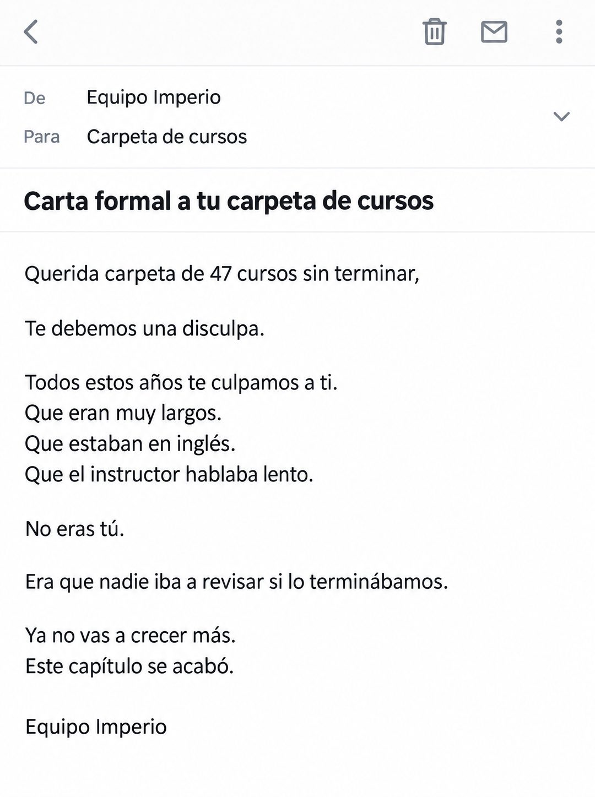

# 138 · Carta formal en un correo (Formal apology to an object)

**Familia:** Interfaz creíble · **Necesitas:** Nada · **Resultado en Meta:** $12 invertidos, 0 compras (cuenta de Imperio, sep 2026) (muestra chica)



## Qué es
Variante de la carta formal a un objeto (formato 50): el mismo texto, pero como un correo abierto en una app de correo genérica del teléfono, enviado por Equipo Imperio a Carpeta de cursos, con el título de la carta como asunto.

## Por qué funciona
Un correo abierto parece algo personal que llegó a la bandeja, no un anuncio, y el destinatario absurdo (una carpeta) obliga a leer para entender. En letra de sistema, el texto se lee como un mensaje y no como un póster, y eso le baja la guardia a quien lo ve.

## Cuándo usarlo
Público frío o tibio en el teléfono, sobre todo si tu negocio ya habla con sus clientes por correo. Sirve para frenar el scroll y quitar la culpa antes de vender.

## Así lo hicimos para Imperio
- **Texto en la imagen:** [barra superior con íconos de volver, papelera, correo y menú] / De Equipo Imperio / Para Carpeta de cursos / Carta formal a tu carpeta de cursos (asunto, en negrita) / Querida carpeta de 47 cursos sin terminar, / Te debemos una disculpa. / Todos estos años te culpamos a ti. / Que eran muy largos. / Que estaban en inglés. / Que el instructor hablaba lento. / No eras tú. / Era que nadie iba a revisar si lo terminábamos. / Ya no vas a crecer más. / Este capítulo se acabó. / Equipo Imperio
- **Texto principal:**
  > 47 cursos guardados y ningún sistema corriendo. No es culpa de los cursos.
  >
  > Es que nadie iba a revisar si los terminabas. Adentro sí: 5 sesiones en vivo a la semana y +3.300 personas construyendo lo mismo.
  >
  > $59 al mes 👇
- **Titular:** Imperio Agéntico · $59 al mes

## Receta para tu marca
- **Formato:** captura de un correo abierto en modo claro, a pantalla completa y sin el marco del teléfono, con íconos grises genéricos arriba.
- **Encabezado:** De [TU MARCA O TU EQUIPO] / Para [EL OBJETO AL QUE LE ESCRIBES] / asunto en negrita: Carta formal a [EL OBJETO].
- **Texto:** el mismo texto de tu versión del formato 50 en sans serif limpia, una idea por línea y con espacio entre bloques.
- **Firma:** [TU MARCA O TU EQUIPO] en texto normal.
- **Colores:** blanco y gris de app de correo; nada de colores de marca.
- **Lo que no se toca:** una app genérica, sin direcciones de correo, sin avatares con letras y sin logos de apps reales.

## Prompt con que se hizo el de Imperio (GPT Image 2.5)
```
[Nota: el de Imperio se generó en 3:4. Para el feed pídelo en 4:5]
[Referencia: adjunta como imagen de referencia el formato 050 de esta biblioteca (su ejemplo.jpg) o tu propia versión de ese formato] Clean realistic mockup of an email opened in a generic minimal mail app, light mode, shown full-frame as a phone screen without the phone body. Header rows: sender name "Equipo Imperio", recipient "Carpeta de cursos", subject in bold "Carta formal a tu carpeta de cursos". No email addresses, no avatars with letters, no real brand logos, a few generic grey interface icons. The email body in a clean sans-serif, exactly this text and line breaks: "Querida carpeta de 47 cursos sin terminar," / "Te debemos una disculpa." / "Todos estos años te culpamos a ti." / "Que eran muy largos." / "Que estaban en inglés." / "Que el instructor hablaba lento." / "No eras tú." / "Era que nadie iba a revisar si lo terminábamos." / "Ya no vas a crecer más." / "Este capítulo se acabó." Signature line: "Equipo Imperio". Render every character, accent and digit exactly, do not truncate or skip lines. No other text, no opening question or exclamation marks.
```

## Ojo
- No uses el logo ni la interfaz exacta de Gmail, Outlook u otra app de correo: que sea genérica.
- Si sale texto roto, manos deformes o cifras mal escritas, se rehace.
- Marca la casilla de contenido generado por IA en el Administrador de anuncios.
