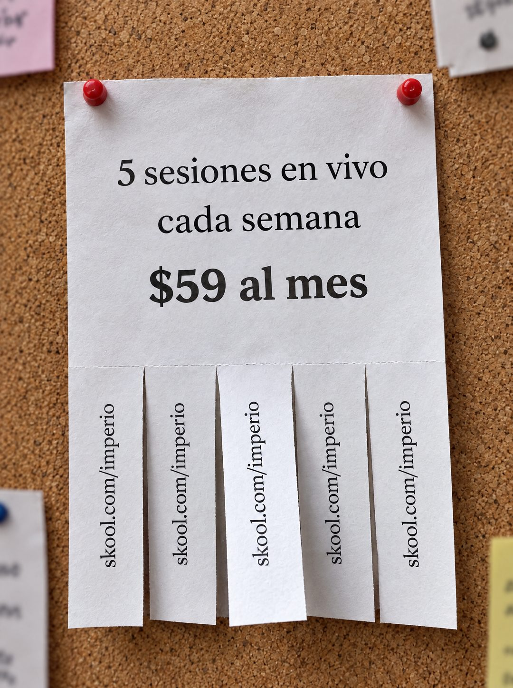

# 139 · Flyer con tiras en el corcho (Free ticket)

**Familia:** Oferta y precio · **Necesitas:** Nada · **Resultado en Meta:** $101 invertidos, 1 compra, $101,2 por compra (cuenta de Imperio, sep 2026)



## Qué es
Variante del flyer con tiras para arrancar (formato 18): el mismo papel con la oferta arriba y cinco tiras con tu enlace abajo, pero clavado con dos chinches rojas en un tablero de corcho, entre otros avisos desenfocados.

## Por qué funciona
El tablero de corcho es el lugar natural de este flyer, así que la foto se lee como algo encontrado y no como un anuncio. Los avisos de alrededor le dan contexto de comunidad, y las tiras invitan a llevarse el dato como en cualquier aviso de barrio.

## Cuándo usarlo
Público frío, para negocios locales o con una oferta que se explica en tres líneas (clases, sesiones, servicios). Sirve para frenar el scroll con un objeto conocido y dejar el precio a la vista.

## Así lo hicimos para Imperio
- **Texto en la imagen:** 5 sesiones en vivo / cada semana / $59 al mes / skool.com/imperio (en cada una de las cinco tiras, de lado) / [otros avisos desenfocados alrededor]
- **Texto principal:**
  > 5 sesiones en vivo cada semana. No son webinars grabados: llegas con tu problema real y sales con el sistema andando.
  >
  > Más +35 cursos en español y +1.800 logros publicados por los miembros para copiar ideas.
  >
  > $59 al mes, y si no es para ti tienes 7 días de garantía 👇
- **Titular:** Imperio Agéntico · $59 al mes

## Receta para tu marca
- **Escena:** foto de un tablero de corcho con [UN FLYER BLANCO] clavado con dos chinches rojas, y bordes de otros avisos desenfocados e ilegibles alrededor.
- **Texto:** serif negra centrada: [QUÉ INCLUYE TU OFERTA] / [CADA CUÁNTO] / y más grande, en negrita: [TU PRECIO].
- **Tiras:** cinco tiras verticales abajo, todas sin arrancar, cada una con [TU ENLACE CORTO] escrito de lado.
- **Colores:** papel blanco, tinta negra y corcho; el único color extra son las chinches.
- **Lo que no se toca:** tres líneas como máximo, el precio en negrita y el mismo dato repetido en todas las tiras.

## Prompt con que se hizo el de Imperio (GPT Image 2.5)
```
[Nota: el de Imperio se generó en 3:4. Para el feed pídelo en 4:5]
[Referencia: adjunta como imagen de referencia el formato 018 de esta biblioteca (su ejemplo.jpg) o tu propia versión de ese formato] Photorealistic photo of the same kind of tear-off paper flyer as the reference, pinned with two red pushpins on a cork bulletin board. Parts of other paper notices are visible around the edges, out of focus and with completely illegible text. The flyer, printed in a black serif font, reads exactly: "5 sesiones en vivo" then "cada semana" then in large bold "$59 al mes". Along the bottom, five vertical tear-off tabs, all still attached, each printed sideways with exactly "skool.com/imperio". Soft indoor light, realistic paper texture and slight curl. Render every character and digit exactly, do not truncate. No other readable text, no logos, no opening question or exclamation marks.
```

## Ojo
- Que no se lea nada en los avisos del fondo: si aparece una palabra o una marca, se rehace.
- Imprime solo cifras de tu oferta que sigan vigentes el día que publicas (sesiones, precio, plazo).
- Marca la casilla de contenido generado por IA en el Administrador de anuncios.
