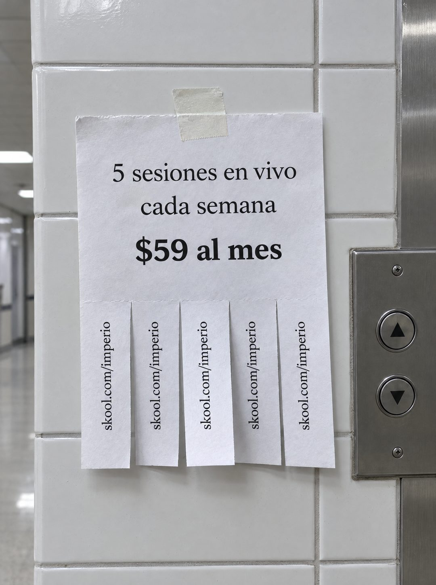

# 141 · Flyer con tiras en el pasillo (Free ticket)

**Familia:** Oferta y precio · **Necesitas:** Nada · **Resultado en Meta:** $9 invertidos, 0 compras (cuenta de Imperio, sep 2026) (muestra chica)



## Qué es
Variante del flyer con tiras para arrancar (formato 18): el mismo papel, pegado con cinta de papel a una pared de azulejos blancos en el pasillo de una universidad, junto a los botones del ascensor, con luz fluorescente.

## Por qué funciona
Al lado del ascensor es donde la gente espera y lee lo que tiene enfrente, así que el lugar mismo explica por qué alguien se detiene a mirar. El pasillo de universidad sugiere un público que está aprendiendo, sin tener que decirlo.

## Cuándo usarlo
Público frío joven o en etapa de formación (estudiantes, profesionales que se están capacitando). Sirve como rotación del flyer original.

## Así lo hicimos para Imperio
- **Texto en la imagen:** 5 sesiones en vivo / cada semana / $59 al mes / skool.com/imperio (en cada una de las cinco tiras, de lado)
- **Texto principal:**
  > 5 sesiones en vivo cada semana. No son webinars grabados: llegas con tu problema real y sales con el sistema andando.
  >
  > Más +35 cursos en español y +1.800 logros publicados por los miembros para copiar ideas.
  >
  > $59 al mes, y si no es para ti tienes 7 días de garantía 👇
- **Titular:** Imperio Agéntico · $59 al mes

## Receta para tu marca
- **Escena:** foto de [UN PASILLO DONDE ESPERA TU CLIENTE], con el flyer pegado con cinta de papel a una pared de azulejos junto a un ascensor y luz fluorescente fría.
- **Texto:** serif negra centrada: [QUÉ INCLUYE TU OFERTA] / [CADA CUÁNTO] / y más grande, en negrita: [TU PRECIO].
- **Tiras:** cinco tiras verticales abajo, todas sin arrancar, cada una con [TU ENLACE CORTO] escrito de lado.
- **Colores:** blanco, gris y acero; ningún color de marca.
- **Lo que no se toca:** tres líneas como máximo, el precio en negrita, el mismo dato en todas las tiras y un lugar donde la gente espera.

## Prompt con que se hizo el de Imperio (GPT Image 2.5)
```
[Nota: el de Imperio se generó en 3:4. Para el feed pídelo en 4:5]
[Referencia: adjunta como imagen de referencia el formato 018 de esta biblioteca (su ejemplo.jpg) o tu propia versión de ese formato] Photorealistic photo of the same kind of tear-off paper flyer as the reference, taped with masking tape to a white tiled wall in a university hallway next to an elevator button panel, cool fluorescent light. The flyer, printed in a black serif font, reads exactly: "5 sesiones en vivo" then "cada semana" then in large bold "$59 al mes". Along the bottom, five vertical tear-off tabs, all still attached, each printed sideways with exactly "skool.com/imperio". Realistic paper texture and shadows. Render every character and digit exactly, do not truncate. No other readable text, no logos, no opening question or exclamation marks.
```

## Ojo
- Imprime solo cifras de tu oferta que sigan vigentes el día que publicas (sesiones, precio, plazo).
- Revisa que las cinco tiras digan exactamente lo mismo y sin letras cortadas: si una sale distinta, se rehace.
- Marca la casilla de contenido generado por IA en el Administrador de anuncios.
