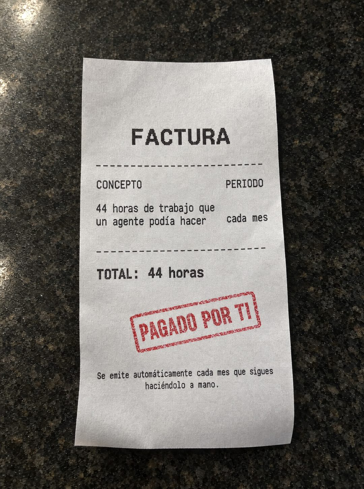

# 142 · Factura de tu tiempo en ticket (variante)

**Familia:** Objeto físico con texto · **Necesitas:** Nada · **Resultado en Meta:** $25 invertidos, 0 compras (cuenta de Imperio, sep 2026) (muestra chica)



## Qué es
Variante de la factura de tu tiempo (formato 44): el mismo cobro por las horas que tu cliente pierde haciendo algo a mano, pero impreso en un ticket térmico angosto, como los de una caja, con letra monoespaciada y sobre una superficie de piedra oscura.

## Por qué funciona
El ticket es el comprobante que todos reciben a diario, así que se lee de un vistazo y se siente más cotidiano que una factura formal. El timbre PAGADO POR TI da vuelta el sentido: no es una cuenta por pagar, es una que la persona ya está pagando sin darse cuenta.

## Cuándo usarlo
Público frío o tibio que hace a mano una tarea repetida. Sirve para mostrar el costo de no actuar y responder la objeción de precio.

## Así lo hicimos para Imperio
- **Texto en la imagen:** FACTURA / CONCEPTO / PERIODO / 44 horas de trabajo que / un agente podía hacer / cada mes / TOTAL: 44 horas / PAGADO POR TI (timbre rojo) / Se emite automáticamente cada mes que sigues / haciéndolo a mano. (letra chica, abajo)
- **Texto principal:**
  > Esa factura la pagas todos los meses y nunca te llega en papel.
  >
  > 44 horas repitiendo lo mismo, mientras un agente lo hace por $5 al día sin quejarse.
  >
  > Adentro aprendes a construirlo, en español y sin programar. $59 al mes 👇
- **Titular:** Imperio Agéntico · $59 al mes

## Receta para tu marca
- **Escena:** foto de un ticket térmico largo y algo curvado sobre [UNA SUPERFICIE DEL DÍA A DÍA DE TU CLIENTE], con luz suave desde arriba.
- **Texto:** letra monoespaciada negra: FACTURA / CONCEPTO y PERIODO / [LO QUE SE PIERDE, EN HORAS O EN DINERO] / [CADA CUÁNTO] / TOTAL: [LA CIFRA].
- **Timbre:** un timbre rojo algo torcido que dice PAGADO POR TI.
- **Pie:** en letra chica: Se emite automáticamente cada [PERIODO] que sigues [LO QUE HACE A MANO].
- **Lo que no se toca:** sin nombre de tienda, sin logos, sin código de barras y sin montos en dinero si el costo es tiempo.

## Prompt con que se hizo el de Imperio (GPT Image 2.5)
```
[Nota: el de Imperio se generó en 3:4. Para el feed pídelo en 4:5]
[Referencia: adjunta como imagen de referencia el formato 044 de esta biblioteca (su ejemplo.jpg) o tu propia versión de ese formato] Photorealistic photo of a long narrow thermal-paper receipt lying slightly curled on a dark stone kitchen counter, soft overhead light, realistic thermal print texture in black ink using a clean, highly legible monospace font. The receipt reads exactly, top to bottom, each item on its own line: bold header "FACTURA"; a dashed line; the column labels "CONCEPTO" on the left and "PERIODO" on the right; then the line item split in two lines on the left, first line "44 horas de trabajo que" and second line "un agente podía hacer", with "cada mes" on the right; a dashed line; "TOTAL: 44 horas" in bold; then a slightly crooked red ink rubber stamp that reads "PAGADO POR TI"; and at the bottom in small print on two lines "Se emite automáticamente cada mes que sigues" and "haciéndolo a mano." Spelling must be exact: podía has an accent on the i, haciéndolo has a full-height letter l, and there are no hyphens or dashes inside any sentence. Render every character, accent and digit exactly, do not truncate. No other text, no store names, no logos, no barcodes, no opening question or exclamation marks.
```

## Ojo
- Si sale texto roto, manos deformes o cifras mal escritas, se rehace.
- La letra monoespaciada tiende a cortar palabras con guiones o a deformar letras: pide en el prompt frases sin cortes, como se hizo en el ejemplo de Imperio.
- Marca la casilla de contenido generado por IA en el Administrador de anuncios.
