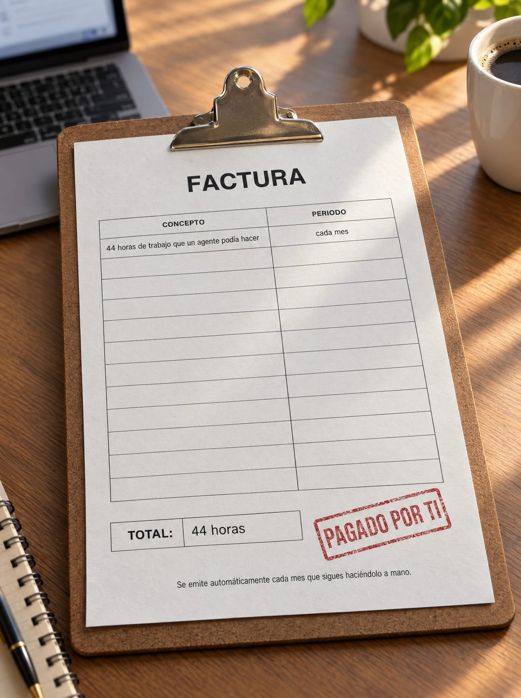

# 143 · Factura de tu tiempo en portapapeles (variante)

**Familia:** Objeto físico con texto · **Necesitas:** Nada · **Resultado en Meta:** $0 invertidos, 0 compras (cuenta de Imperio, sep 2026) (muestra chica)



## Qué es
Variante de la factura de tu tiempo (formato 44): la misma factura con tabla y timbre, pero sujeta a un portapapeles sobre un escritorio de oficina, con una laptop desenfocada, una taza de café y luz de tarde.

## Por qué funciona
El portapapeles es el objeto de quien revisa cuentas y pendientes, así que pone la factura en medio del trabajo diario de quien lee. La tabla casi vacía, con una sola fila llena, hace que ese único cobro pese más.

## Cuándo usarlo
Público frío o tibio de oficina o de servicios (administración, contabilidad, ventas) que hace a mano tareas repetidas. Sirve para mostrar el costo de no actuar.

## Así lo hicimos para Imperio
- **Texto en la imagen:** FACTURA / CONCEPTO / PERIODO / 44 horas de trabajo que un agente podía hacer / cada mes / [filas vacías] / TOTAL: 44 horas / PAGADO POR TI (timbre rojo) / Se emite automáticamente cada mes que sigues haciéndolo a mano. (letra chica, abajo)
- **Texto principal:**
  > Esa factura la pagas todos los meses y nunca te llega en papel.
  >
  > 44 horas repitiendo lo mismo, mientras un agente lo hace por $5 al día sin quejarse.
  >
  > Adentro aprendes a construirlo, en español y sin programar. $59 al mes 👇
- **Titular:** Imperio Agéntico · $59 al mes

## Receta para tu marca
- **Escena:** foto de un portapapeles sobre [EL ESCRITORIO DE TU CLIENTE], con una laptop de pantalla desenfocada, una taza de café y luz de ventana de tarde.
- **Documento:** la misma factura de tu versión del formato 44: FACTURA, tabla con CONCEPTO y PERIODO, una sola fila llena con [LO QUE SE PIERDE] y [CADA CUÁNTO], y el resto vacío.
- **Cierre:** recuadro TOTAL: [LA CIFRA] y, al lado, el timbre rojo PAGADO POR TI.
- **Pie:** Se emite automáticamente cada [PERIODO] que sigues [LO QUE HACE A MANO].
- **Lo que no se toca:** un documento anónimo, sin logo, nombre de empresa, dirección ni montos en dinero.

## Prompt con que se hizo el de Imperio (GPT Image 2.5)
```
[Nota: el de Imperio se generó en 3:4. Para el feed pídelo en 4:5]
[Referencia: adjunta como imagen de referencia el formato 044 de esta biblioteca (su ejemplo.jpg) o tu propia versión de ese formato] Photorealistic photo of the same printed invoice as the reference, now clipped to a brown clipboard lying on an office desk next to an open laptop (screen blurred) and a cup of coffee, afternoon window light. The invoice reads exactly: big bold title "FACTURA"; a table with headers "CONCEPTO" and "PERIODO"; first row "44 horas de trabajo que un agente podía hacer" and "cada mes"; the other rows empty; a box "TOTAL:" "44 horas"; a red rubber stamp "PAGADO POR TI"; and the footer line "Se emite automáticamente cada mes que sigues haciéndolo a mano." Render every character, accent and digit exactly, do not truncate. No other readable text, no logos, no opening question or exclamation marks.
```

## Ojo
- Si sale texto roto, manos deformes o cifras mal escritas, se rehace.
- La cifra del total tiene que salir de una cuenta que tu cliente reconozca como suya; no la infles.
- Marca la casilla de contenido generado por IA en el Administrador de anuncios.
