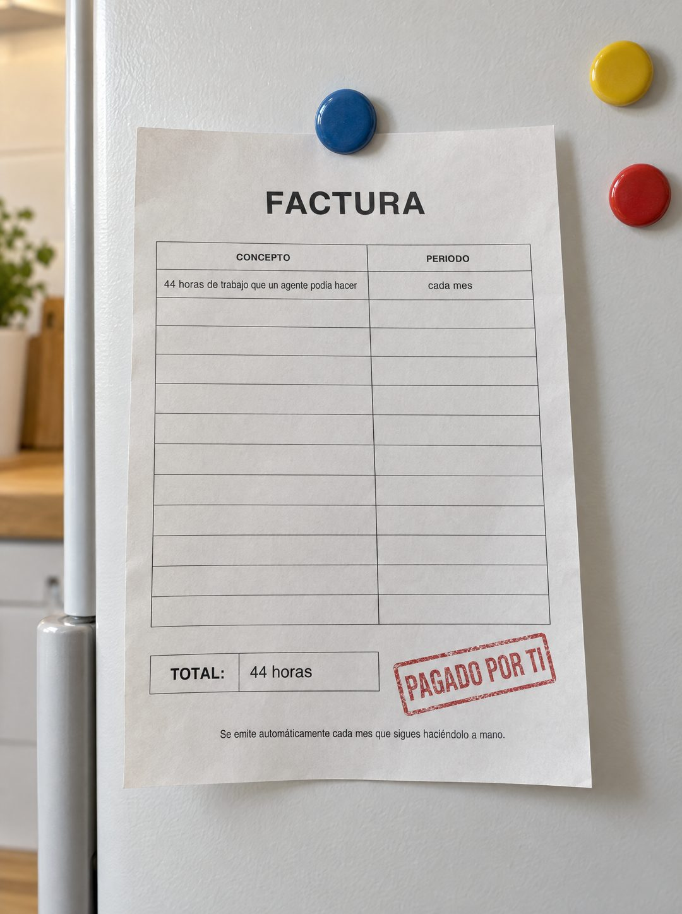

# 144 · Factura de tu tiempo en refrigerador (variante)

**Familia:** Objeto físico con texto · **Necesitas:** Nada · **Resultado en Meta:** $2 invertidos, 0 compras (cuenta de Imperio, sep 2026) (muestra chica)



## Qué es
Variante de la factura de tu tiempo (formato 44): la misma factura, pero sujeta con un imán a la puerta del refrigerador de la casa, junto a otros imanes de colores sin texto y con luz de cocina.

## Por qué funciona
En el refrigerador se ponen las cuentas de la casa, así que el lugar dice que es un gasto fijo que se paga todos los meses, como la luz o el agua. Lleva el costo del trabajo repetido a la vida personal, donde se siente más.

## Cuándo usarlo
Público frío que trabaja por su cuenta o desde la casa y mezcla trabajo con vida familiar. Sirve para mostrar el costo de no actuar desde lo cotidiano.

## Así lo hicimos para Imperio
- **Texto en la imagen:** FACTURA / CONCEPTO / PERIODO / 44 horas de trabajo que un agente podía hacer / cada mes / [filas vacías] / TOTAL: 44 horas / PAGADO POR TI (timbre rojo) / Se emite automáticamente cada mes que sigues haciéndolo a mano. (letra chica, abajo)
- **Texto principal:**
  > Esa factura la pagas todos los meses y nunca te llega en papel.
  >
  > 44 horas repitiendo lo mismo, mientras un agente lo hace por $5 al día sin quejarse.
  >
  > Adentro aprendes a construirlo, en español y sin programar. $59 al mes 👇
- **Titular:** Imperio Agéntico · $59 al mes

## Receta para tu marca
- **Escena:** foto de la puerta de [UN REFRIGERADOR BLANCO DE CASA] con la factura sujeta por un imán redondo, otros imanes de colores sin texto, el papel algo ondulado y luz suave de cocina.
- **Documento:** la misma factura de tu versión del formato 44: FACTURA, tabla con CONCEPTO y PERIODO, una fila con [LO QUE SE PIERDE] y [CADA CUÁNTO], y el resto vacío.
- **Cierre:** TOTAL: [LA CIFRA] y el timbre rojo PAGADO POR TI.
- **Pie:** Se emite automáticamente cada [PERIODO] que sigues [LO QUE HACE A MANO].
- **Lo que no se toca:** imanes sin texto ni marcas, un documento anónimo y la factura como único papel en la puerta.

## Prompt con que se hizo el de Imperio (GPT Image 2.5)
```
[Nota: el de Imperio se generó en 3:4. Para el feed pídelo en 4:5]
[Referencia: adjunta como imagen de referencia el formato 044 de esta biblioteca (su ejemplo.jpg) o tu propia versión de ese formato] Photorealistic photo of the same printed invoice as the reference, held by a single round magnet on a white refrigerator door at home, a couple of plain colorful fridge magnets nearby with no text, soft kitchen light, the paper slightly wavy. The invoice reads exactly: big bold title "FACTURA"; a table with headers "CONCEPTO" and "PERIODO"; first row "44 horas de trabajo que un agente podía hacer" and "cada mes"; the other rows empty; a box "TOTAL:" "44 horas"; a red rubber stamp "PAGADO POR TI"; and the footer line "Se emite automáticamente cada mes que sigues haciéndolo a mano." Render every character, accent and digit exactly, do not truncate. No other readable text, no logos, no opening question or exclamation marks.
```

## Ojo
- Si sale texto roto, manos deformes o cifras mal escritas, se rehace.
- Que los imanes y la cocina no muestren marcas ni textos legibles: si aparece uno, se rehace.
- Marca la casilla de contenido generado por IA en el Administrador de anuncios.
