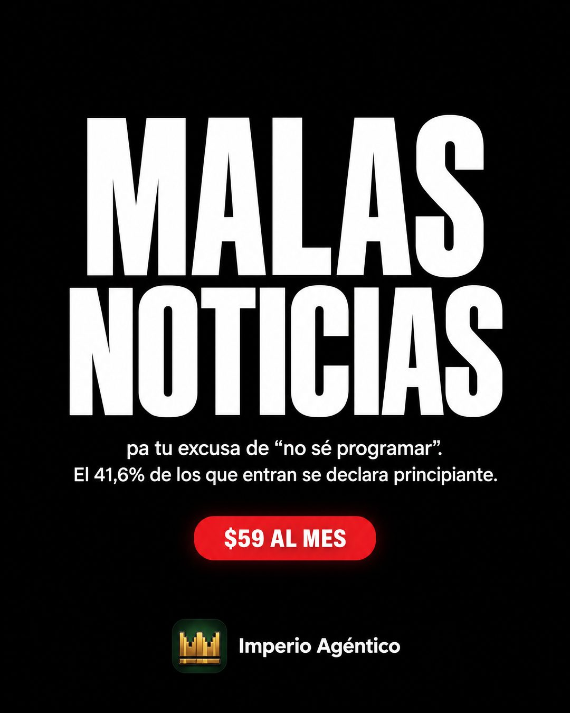

# 153 · Póster de malas noticias (Bad news)

**Familia:** Tipografía dura · **Necesitas:** Tu logo. Si tienes un dato real de tus clientes, mejor · **Resultado en Meta:** Sin datos propios todavía



## Qué es
Un póster negro con "MALAS NOTICIAS" gigante en blanco, una línea que aclara que la mala noticia es para la excusa del cliente y una píldora roja con el precio. En el ejemplo de Imperio, la excusa es "no sé programar" y la desarma un dato propio: el 41,6% de los que entran se declara principiante.

## Por qué funciona
Nadie espera que una marca abra con una mala noticia, así que el ojo se detiene a ver para quién es. El giro (la mala noticia es para tu excusa) pone la objeción principal en el titular y la responde con un dato concreto en la misma pieza. Es tipografía dura: afirma algo y no se esconde detrás de una foto.

## Cuándo usarlo
Público frío o tibio que conoce la categoría pero se frena con una excusa repetida (no sé, no tengo tiempo, no es para mí). Sirve para cualquier negocio con una objeción conocida; objetivo: responder esa objeción y frenar el scroll.

## Así lo hicimos para Imperio
- **Texto en la imagen:** MALAS / NOTICIAS / pa tu excusa de “no sé programar”. / El 41,6% de los que entran se declara principiante. / $59 AL MES (píldora roja) / Imperio Agéntico (junto al logo, abajo al centro)
- **Texto principal:**
  > Malas noticias pa la excusa de "no sé programar".
  >
  > Cuando preguntamos, el 41,6% de los que entran se declara principiante. Nadie te pide código: partes de un agente que ya funciona y lo adaptas a tu negocio.
  >
  > Tu primer sistema o agente IA en 7 días o te devolvemos el 100%. $59 al mes 👇

## Receta para tu marca
- **Formato:** póster vertical negro, todo centrado y con mucho espacio vacío.
- **Titular:** "MALAS NOTICIAS" en blanco, condensada y gigante, ocupando la mitad de la pieza.
- **Texto:** dos líneas chicas en blanco: "para tu excusa de [LA EXCUSA QUE MÁS ESCUCHAS, ENTRE COMILLAS]." / [EL DATO O EL HECHO DE TU OFERTA QUE LA DESARMA].
- **Oferta:** una píldora roja con [TU PRECIO] en blanco y, abajo al centro, [TU LOGO] con el nombre de tu marca.
- **Colores:** negro, blanco y un solo acento en la píldora (puede ser el color de tu marca si contrasta fuerte).
- **Lo que no se toca:** el titular gigante sobre negro, sin imagen. La línea de abajo tiene que nombrar una excusa real de tu cliente; si no, el giro no funciona.

## Prompt con que se hizo el de Imperio (GPT Image 2.5)
```
Minimal black poster ad, luxury fashion-brand announcement style. Huge bold white condensed sans-serif headline centered: 'MALAS NOTICIAS'. Below it, small white text in two lines: 'pa tu excusa de “no sé programar”.' and 'El 41,6% de los que entran se declara principiante.' Below that a small red rounded pill with white text '$59 AL MES'. At the bottom center, small, in white. [TU MARCA: logo y nombre] Lots of black space. Vertical 4:5 Instagram/Facebook feed ad, sharp and professional. All on-image text is Spanish and must be rendered EXACTLY as written inside the quotes, with every accent and ñ correct and every digit exact. Never use inverted question marks or inverted exclamation marks. No em dashes. Do not add any other words, logos or watermarks.
```

## Ojo
- La cifra que desarma la excusa tiene que salir de tus propios datos (una encuesta, tus ventas). Si no la tienes, usa un hecho de tu oferta en vez de un porcentaje.
- Si sale texto roto, manos deformes o cifras mal escritas, se rehace.
- Marca la casilla de contenido generado por IA en el Administrador de anuncios.
