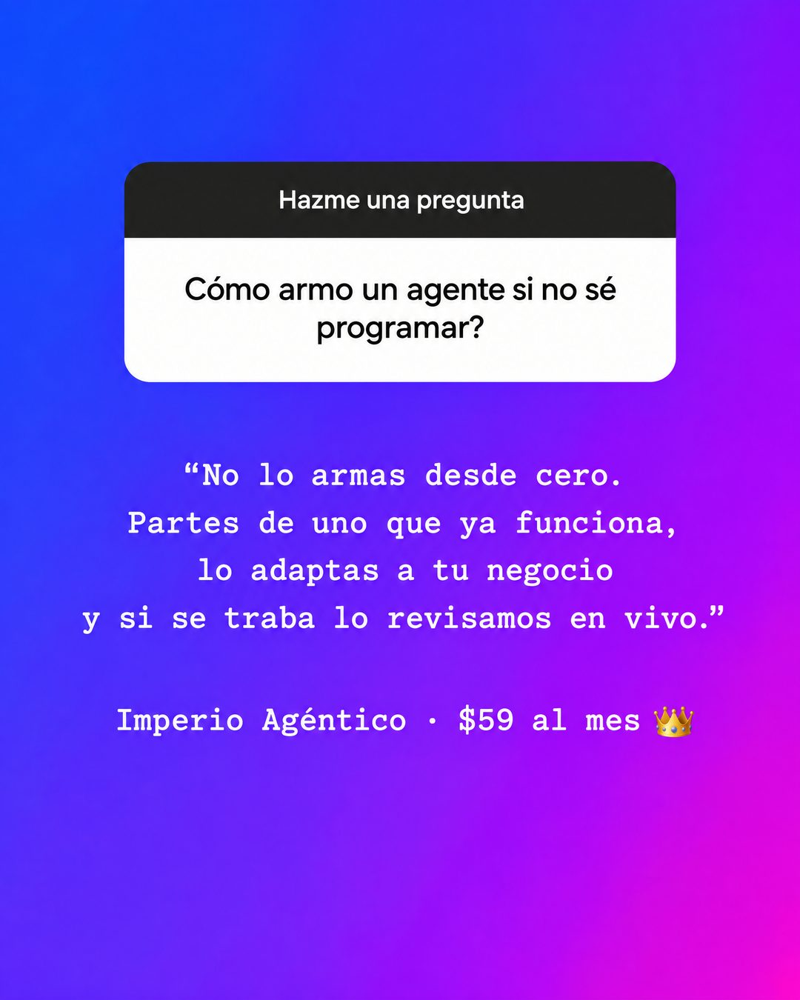

# 154 · Sticker de pregunta en story (Ask me a question)

**Familia:** Interfaz creíble · **Necesitas:** Nada · **Resultado en Meta:** Sin datos propios todavía



## Qué es
Una story de Instagram con el sticker "Hazme una pregunta": arriba, la pregunta que más te hacen; abajo, tu respuesta corta en letra de máquina de escribir. En el ejemplo de Imperio, la pregunta es cómo armar un agente sin saber programar.

## Por qué funciona
Se ve como un creador respondiendo a su audiencia, no como un anuncio, y la pregunta es la misma que tiene en la cabeza quien la lee. La respuesta desarma la objeción en cuatro líneas y solo al final aparece el precio, sin vender de más.

## Cuándo usarlo
Público frío o tibio que duda por una objeción concreta (no sé hacerlo, no tengo tiempo, no sé si es para mí). Sirve para cursos, servicios, consultas y cualquier negocio con preguntas frecuentes; objetivo: responder una objeción y frenar el scroll.

## Así lo hicimos para Imperio
- **Texto en la imagen:** Hazme una pregunta / Cómo armo un agente si no sé programar? / “No lo armas desde cero. / Partes de uno que ya funciona, / lo adaptas a tu negocio / y si se traba lo revisamos en vivo.” / Imperio Agéntico · $59 al mes 👑
- **Texto principal:**
  > La pregunta que más me llega: cómo armo un agente si no sé programar?
  >
  > Respuesta corta: no lo armas desde cero. Tomas uno que ya funciona, lo adaptas a tu negocio y si se traba lo revisamos en vivo (hay 2 sesiones de soporte a la semana pa eso).
  >
  > Imperio Agéntico, $59 al mes 👇

## Receta para tu marca
- **Formato:** captura de story vertical con fondo degradado de dos colores fuertes (en el ejemplo, azul eléctrico a magenta).
- **Pregunta:** arriba, el sticker blanco de Instagram con la cabecera oscura "Hazme una pregunta" y adentro [LA PREGUNTA QUE MÁS TE HACEN], sin signo de apertura.
- **Respuesta:** al centro, en blanco y con letra de máquina de escribir, entre comillas: [TU RESPUESTA EN 3 O 4 LÍNEAS CORTAS].
- **Cierre:** una última línea con [TU MARCA] · [TU PRECIO] y un emoji.
- **Colores:** cambia el degradado por dos colores de tu marca, siempre que el blanco se lea encima.
- **Lo que no se toca:** el sticker tal como lo muestra Instagram y la respuesta en máquina de escribir. Cero logo y cero botón: tiene que parecer una story.

## Prompt con que se hizo el de Imperio (GPT Image 2.5)
```
Instagram Story screenshot style on a vertical gradient from electric blue to magenta purple. Near the top, a white Instagram question sticker card with small black header 'Hazme una pregunta' and inside the question in black 'Cómo armo un agente si no sé programar?'. Below it, the answer in white typewriter font, centered, short lines: '“No lo armas desde cero.' / 'Partes de uno que ya funciona,' / 'lo adaptas a tu negocio' / 'y si se traba lo revisamos en vivo.”' and a last line 'Imperio Agéntico · $59 al mes 👑'. Vertical 4:5 Instagram/Facebook feed ad, sharp and professional. All on-image text is Spanish and must be rendered EXACTLY as written inside the quotes, with every accent and ñ correct and every digit exact. Never use inverted question marks or inverted exclamation marks. No em dashes. Do not add any other words, logos or watermarks.
```

## Ojo
- La pregunta tiene que ser una que de verdad te hacen. Si inventas una pregunta cómoda para lucirte, se nota.
- Si sale texto roto, manos deformes o cifras mal escritas, se rehace.
- Marca la casilla de contenido generado por IA en el Administrador de anuncios.
