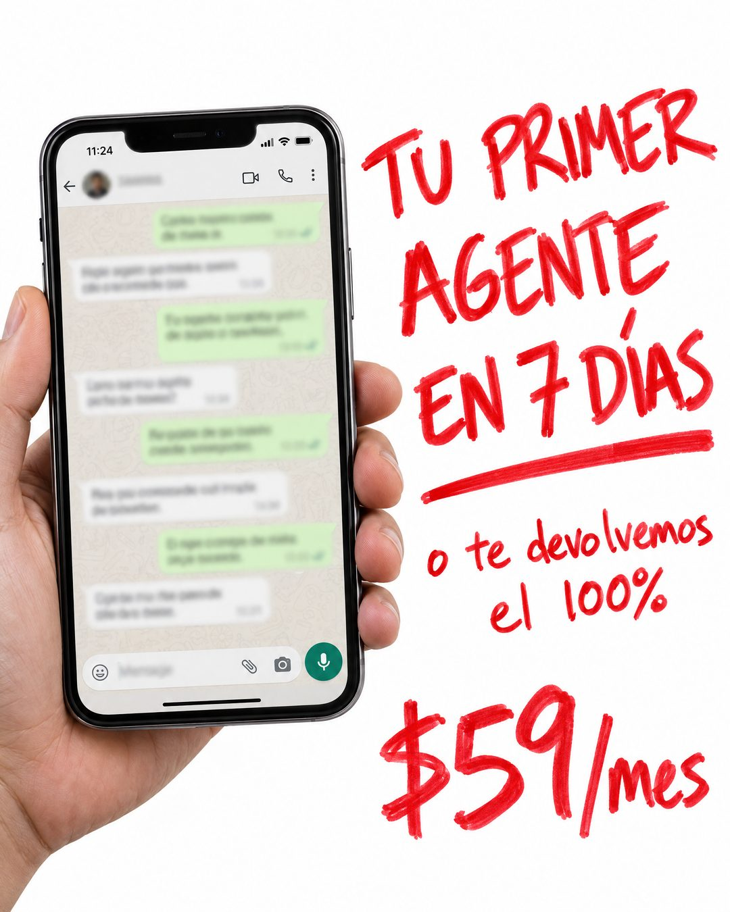

# 155 · Promesa a mano con marcador rojo (Handwritten)

**Familia:** Objeto físico con texto · **Necesitas:** Nada · **Resultado en Meta:** Sin datos propios todavía



## Qué es
Fondo blanco, una foto de una mano sosteniendo un teléfono con un chat desenfocado y, al lado, la promesa escrita a mano con marcador rojo grueso. En el ejemplo de Imperio: "TU PRIMER AGENTE EN 7 DÍAS", la garantía y el precio.

## Por qué funciona
La letra a mano se lee como algo escrito en el momento, no como diseño, y el rojo grueso marca urgencia. El teléfono muestra dónde vive el producto sin explicarlo y, al estar desenfocado, no promete nada que no puedas mostrar.

## Cuándo usarlo
Público frío o tibio, para empujar la oferta principal con plazo y garantía. Sirve para productos o servicios que se usan desde el teléfono (atención por WhatsApp, apps, reservas, cursos); objetivo: frenar el scroll y empujar la compra.

## Así lo hicimos para Imperio
- **Texto en la imagen:** [teléfono en la mano con un chat de WhatsApp desenfocado e ilegible] / TU PRIMER / AGENTE / EN 7 DÍAS / o te devolvemos / el 100% / $59/mes (todo a mano, con marcador rojo)
- **Texto principal:**
  > Tu primer sistema o agente IA en 7 días o te devolvemos el 100%.
  >
  > Y pa cuando te trabas, hay 6 sesiones en vivo a la semana.
  >
  > $59 al mes 👇

## Receta para tu marca
- **Formato:** fondo blanco limpio y vertical: a la izquierda, una mano sosteniendo un teléfono; a la derecha, el texto a mano.
- **Escena:** en la pantalla, [LA PANTALLA DONDE SE USA TU PRODUCTO], desenfocada e ilegible.
- **Titular:** a mano, con marcador rojo grueso y en mayúsculas: [TU PROMESA CON PLAZO], en tres líneas y subrayada.
- **Texto:** más chico y también a mano: [TU GARANTÍA]; abajo a la derecha, grande, [TU PRECIO].
- **Colores:** blanco y rojo marcador. Si tu marca tiene otro color fuerte, puede reemplazar al rojo.
- **Lo que no se toca:** la letra irregular y auténtica (nada de tipografías que imitan letra a mano), la pantalla ilegible y nada más en la pieza.

## Prompt con que se hizo el de Imperio (GPT Image 2.5)
```
Clean white background ad. On the left, a real photo of a hand holding a smartphone that shows a WhatsApp chat with blurred, illegible messages. On the right, big messy red Sharpie handwriting: 'TU PRIMER' / 'AGENTE' / 'EN 7 DÍAS', smaller below 'o te devolvemos el 100%', and at the bottom right in red marker '$59/mes'. Authentic, slightly uneven handwriting. Vertical 4:5 Instagram/Facebook feed ad, sharp and professional. All on-image text is Spanish and must be rendered EXACTLY as written inside the quotes, with every accent and ñ correct and every digit exact. Never use inverted question marks or inverted exclamation marks. No em dashes. Do not add any other words, logos or watermarks.
```

## Ojo
- Si sale texto roto, manos deformes o cifras mal escritas, se rehace.
- El chat del teléfono es una demostración de tu producto, nunca una conversación con un cliente: déjalo desenfocado y sin nombres legibles.
- Marca la casilla de contenido generado por IA en el Administrador de anuncios.
