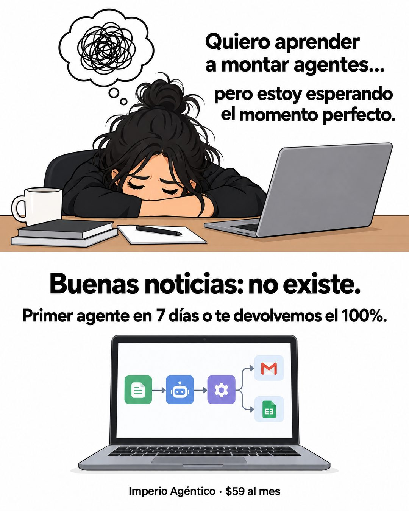

# 156 · Caricatura de la excusa (Meme)

**Familia:** Humor y meme · **Necesitas:** Nada · **Resultado en Meta:** Sin datos propios todavía



## Qué es
Una caricatura plana en dos mitades: arriba, un personaje rendido sobre su escritorio dice su excusa (en Imperio, "estoy esperando el momento perfecto"); abajo, el remate "Buenas noticias: no existe." con la promesa y un dibujo del producto.

## Por qué funciona
El personaje es el cliente en su peor momento y se reconoce sin sentirse atacado, porque es un dibujo. El remate le da la vuelta a la excusa con humor y en la misma pieza pone la promesa con plazo y garantía, así que no se queda en el chiste.

## Cuándo usarlo
Público frío que posterga la decisión (lo hago después, cuando tenga tiempo). Sirve para cursos, servicios y productos que se compran "algún día"; objetivo: frenar el scroll y bajar la fricción de empezar.

## Así lo hicimos para Imperio
- **Texto en la imagen:** Quiero aprender / a montar agentes... / pero estoy esperando / el momento perfecto. / Buenas noticias: no existe. / Primer agente en 7 días o te devolvemos el 100%. / [portátil con un flujo de íconos] / Imperio Agéntico · $59 al mes (letra chica, abajo)
- **Texto principal:**
  > Esperar el momento perfecto pa aprender a montar agentes es la forma más cómoda de no empezar nunca (te lo digo con cariño).
  >
  > Adentro partes de una base que ya funciona y la adaptas a tu negocio, con soporte en vivo.
  >
  > Tu primer agente en 7 días o te devolvemos el 100%. $59 al mes 👇

## Receta para tu marca
- **Formato:** ilustración plana tipo meme sobre fondo blanco, dividida en dos mitades.
- **Arriba:** un personaje rendido sobre su escritorio, con un globo de pensamiento enredado y la frase en negrita: "[LO QUE QUIERE LOGRAR]... pero estoy esperando [LA EXCUSA DE SIEMPRE]."
- **Remate:** al centro, grande y en negrita: "Buenas noticias: [EL REMATE QUE DESARMA LA EXCUSA, EN 2 O 3 PALABRAS]." y debajo [TU PROMESA CON PLAZO Y GARANTÍA].
- **Producto:** un dibujo simple de [TU PRODUCTO O LO QUE ENTREGAS], en el mismo estilo plano.
- **Marca:** abajo, en letra chica: [TU MARCA] · [TU PRECIO].
- **Lo que no se toca:** el estilo de caricatura (no foto) y el remate en una sola línea. Cambia la excusa, no la estructura.

## Prompt con que se hizo el de Imperio (GPT Image 2.5)
```
Simple flat cartoon meme ad on white. Top half: a cartoon woman with messy black hair lying face-down on a desk next to a laptop, with a thought bubble holding a tangled scribble; beside her bold black text 'Quiero aprender a montar agentes...' / 'pero estoy esperando el momento perfecto.' Bottom half: bold black centered text 'Buenas noticias: no existe.' and below 'Primer agente en 7 días o te devolvemos el 100%.' Next to it a simple laptop showing a small workflow diagram. Tiny text at the very bottom 'Imperio Agéntico · $59 al mes'. Vertical 4:5 Instagram/Facebook feed ad, sharp and professional. All on-image text is Spanish and must be rendered EXACTLY as written inside the quotes, with every accent and ñ correct and every digit exact. Never use inverted question marks or inverted exclamation marks. No em dashes. Do not add any other words, logos or watermarks.
```

## Ojo
- En el dibujo del producto, pide íconos genéricos: no uses logos de terceros (Gmail, Google Sheets u otros) que no tienes permiso de usar.
- Si sale texto roto, manos deformes o cifras mal escritas, se rehace.
- Marca la casilla de contenido generado por IA en el Administrador de anuncios.
