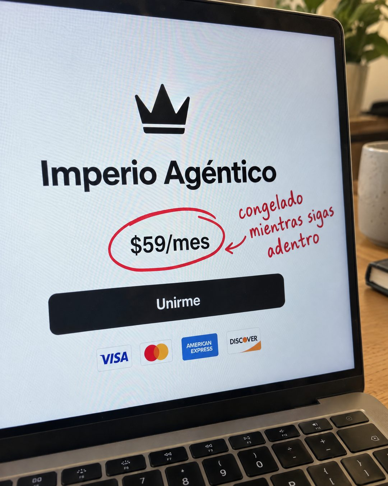

# 157 · Precio encerrado en el checkout (Checkout photo)

**Familia:** Interfaz creíble · **Necesitas:** Tu logo · **Resultado en Meta:** Sin datos propios todavía



## Qué es
Una foto de celular, algo en ángulo, de la pantalla de tu página de pago: logo, nombre, precio, botón y medios de pago. Encima, alguien encerró el precio con marcador rojo y escribió al lado, a mano, lo que lo hace especial.

## Por qué funciona
Parece una foto que alguien le mandó a un amigo, no un anuncio, y muestra el último paso de la compra, así que quien mira ya se imagina pagando. El círculo rojo lleva el ojo directo al precio y la nota a mano responde la objeción en pocas palabras (en Imperio, que el precio queda congelado).

## Cuándo usarlo
Remarketing o público tibio que ya vio la oferta y duda por el precio. Sirve para suscripciones, cursos, tiendas online y cualquier negocio con página de pago; objetivo: responder la objeción de precio y empujar la compra.

## Así lo hicimos para Imperio
- **Texto en la imagen:** Imperio Agéntico / $59/mes (encerrado a mano en rojo) / congelado / mientras sigas / adentro (letra manuscrita roja, con flecha) / Unirme / [logos de VISA, Mastercard, American Express y DISCOVER]
- **Texto principal:**
  > $59 al mes, y ese número queda congelado mientras sigas adentro.
  >
  > Los que entraron a 37 siguen pagando 37. Así funciona acá.
  >
  > 6 sesiones en vivo a la semana y tu primer sistema en 7 días o te devolvemos el 100% 👇

## Receta para tu marca
- **Escena:** foto de celular, levemente en ángulo, de un portátil sobre un escritorio real (planta, taza), con moiré suave en la pantalla.
- **Pantalla:** tu página de pago blanca y limpia: [TU LOGO], [NOMBRE DE TU PRODUCTO], [TU PRECIO], un botón negro con [TU LLAMADO] y los medios de pago que aceptas.
- **Marca a mano:** un círculo rojo de marcador alrededor del precio y una flecha hacia [LA CONDICIÓN QUE HACE ESPECIAL ESE PRECIO, EN 3 O 4 PALABRAS], en letra manuscrita roja.
- **Colores:** los de tu página real; el único agregado es el rojo del marcador.
- **Lo que no se toca:** que sea una foto de la pantalla (no una captura limpia) y una sola anotación a mano. Si encierras más de una cosa, se pierde el foco.

## Prompt con que se hizo el de Imperio (GPT Image 2.5)
```
Slightly angled amateur phone photo of a laptop screen on a desk, showing a clean white join page of an online community: title 'Imperio Agéntico', a price line '$59/mes', a black 'Unirme' button and a row of card payment logos. Someone circled '$59/mes' with a thick red pen stroke drawn over the photo and wrote next to it in red handwriting 'congelado mientras sigas adentro'. Subtle screen moiré, realistic. Vertical 4:5 Instagram/Facebook feed ad, sharp and professional. All on-image text is Spanish and must be rendered EXACTLY as written inside the quotes, with every accent and ñ correct and every digit exact. Never use inverted question marks or inverted exclamation marks. No em dashes. Do not add any other words, logos or watermarks.
```

## Ojo
- La nota a mano es una promesa de tu oferta: si el precio no queda congelado o la condición no existe, no la escribas.
- Muestra solo los medios de pago que de verdad aceptas.
- Marca la casilla de contenido generado por IA en el Administrador de anuncios.
