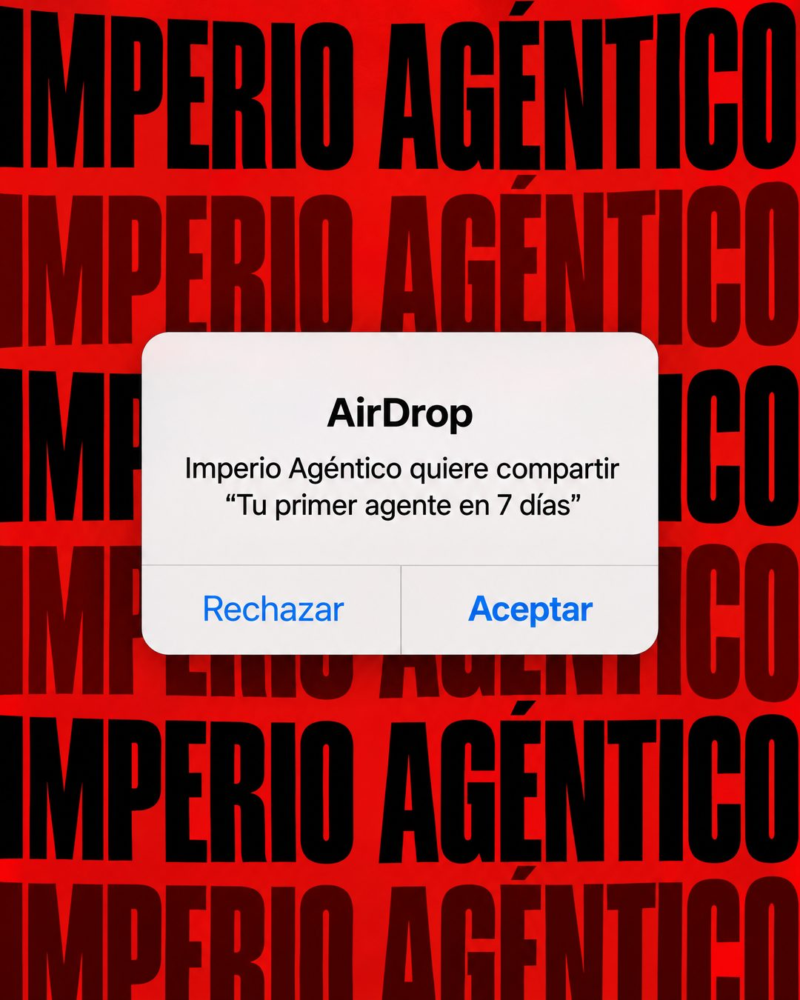

# 162 · Alerta de AirDrop sobre muro (AirDrop)

**Familia:** Interfaz creíble · **Necesitas:** Nada · **Resultado en Meta:** Sin datos propios todavía



## Qué es
Una alerta de AirDrop de iPhone, igual a la real, flotando sobre un muro de tipografía con el nombre de tu marca repetido de borde a borde. La alerta dice que tu marca quiere compartir tu promesa, con los botones Rechazar y Aceptar.

## Por qué funciona
Todos conocen esa ventana y saben que pide una decisión, así que el anuncio se lee como una invitación personal y no como publicidad. Los botones reducen la compra a un sí o un no, y el muro rojo frena el scroll antes de leer nada.

## Cuándo usarlo
Público frío o tibio, sobre todo en lanzamientos o promesas con plazo. Sirve para cualquier negocio con una promesa que quepa entre comillas en una línea; objetivo: frenar el scroll y empujar la decisión.

## Así lo hicimos para Imperio
- **Texto en la imagen:** [muro de fondo: IMPERIO AGÉNTICO repetido en negro y rojo oscuro sobre rojo] / AirDrop / Imperio Agéntico quiere compartir / “Tu primer agente en 7 días” / Rechazar / Aceptar
- **Texto principal:**
  > Imperio Agéntico quiere compartir contigo: tu primer agente en 7 días.
  >
  > Puedes rechazar. O aceptar por $59 al mes, y si en 7 días no tienes tu primer sistema andando, te devolvemos el 100% 👇

## Receta para tu marca
- **Fondo:** muro de [TU MARCA] en mayúsculas condensadas gigantes, repetido y cortado en los bordes, alternando negro y un tono oscuro de tu color principal.
- **Alerta:** al centro, la tarjeta blanca redondeada de iOS con sombra suave: "AirDrop" en negrita, "[TU MARCA] quiere compartir" y, entre comillas, [TU PROMESA EN UNA LÍNEA].
- **Botones:** "Rechazar" y "Aceptar" (Aceptar en azul y negrita), como en el iPhone.
- **Colores:** el muro lleva el color de tu marca; la alerta se queda blanca, con el azul de iOS.
- **Lo que no se toca:** la alerta idéntica a la real y nada más encima. Ni precio, ni logo, ni botones extra.

## Prompt con que se hizo el de Imperio (GPT Image 2.5)
```
Background: a bold red wall of huge repeating condensed text 'IMPERIO AGÉNTICO' in black and darker red, filling the frame edge to edge, cropped at the borders. Centered on top: a realistic iOS AirDrop alert (white rounded card, subtle shadow) with bold title 'AirDrop', text 'Imperio Agéntico quiere compartir' and '“Tu primer agente en 7 días”', and two buttons 'Rechazar' and 'Aceptar' (Aceptar in blue). Vertical 4:5 Instagram/Facebook feed ad, sharp and professional. All on-image text is Spanish and must be rendered EXACTLY as written inside the quotes, with every accent and ñ correct and every digit exact. Never use inverted question marks or inverted exclamation marks. No em dashes. Do not add any other words, logos or watermarks.
```

## Ojo
- Lo que va entre comillas es tu promesa tal cual: si tiene plazo, que sea el plazo real de tu oferta.
- Marca la casilla de contenido generado por IA en el Administrador de anuncios.
