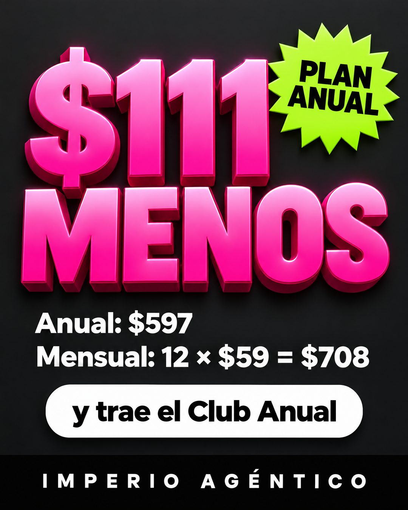

# 163 · Cifra de ahorro gigante (Discount callout)

**Familia:** Oferta y precio · **Necesitas:** Nada · **Resultado en Meta:** Sin datos propios todavía



## Qué es
El ahorro en una cifra gigante en 3D (en Imperio, "$111 MENOS") sobre fondo oscuro, con la cuenta debajo para que cualquiera la compruebe: el precio del plan largo contra los meses sueltos. Una estrella de color dice de qué plan se trata y una píldora suma el bono.

## Por qué funciona
Un número grande y rosado se ve antes de leer nada. Mostrar la cuenta completa (12 × $59 = $708 contra $597) hace que el ahorro no sea un porcentaje inflado sino una resta que el cliente hace de cabeza: la precisión de la oferta es lo que la vuelve creíble.

## Cuándo usarlo
Público tibio o remarketing que paga o está por pagar mes a mes, para empujar el plan anual o un paquete. Sirve para suscripciones, membresías, gimnasios o servicios con plan largo; objetivo: responder la objeción de precio y subir el ticket promedio.

## Así lo hicimos para Imperio
- **Texto en la imagen:** $111 / MENOS / PLAN / ANUAL (estrella verde lima, arriba a la derecha) / Anual: $597 / Mensual: 12 × $59 = $708 / y trae el Club Anual (píldora blanca) / IMPERIO AGÉNTICO (franja negra abajo)
- **Texto principal:**
  > La cuenta del plan anual, sin letra chica:
  >
  > 12 meses sueltos son 12 × $59 = $708. El anual cuesta $597. Son $111 menos.
  >
  > Y trae el Club Anual, que en el mensual no viene 👇

## Receta para tu marca
- **Fondo:** gris carbón casi negro.
- **Cifra:** [EL AHORRO EN DINERO] y debajo "MENOS", en 3D rosado fuerte con degradado, ocupando la mitad superior.
- **Sello:** una estrella de puntas verde lima arriba a la derecha con [EL NOMBRE DEL PLAN] en negro.
- **Cuenta:** dos líneas en blanco: "[PLAN LARGO]: [SU PRECIO]" / "[PLAN CORTO]: [CANTIDAD] × [PRECIO] = [TOTAL]"; debajo, una píldora blanca con [EL BONO QUE TRAE].
- **Marca:** franja negra abajo con [TU MARCA] en mayúsculas espaciadas.
- **Lo que no se toca:** la cuenta visible y exacta. Si el ahorro no sale de una resta que cualquiera puede hacer, el formato pierde el sentido.

## Prompt con que se hizo el de Imperio (GPT Image 2.5)
```
Dark charcoal background. Huge hot-pink gradient 3D bold text '$111' and below it 'MENOS' in the same style. A lime-green starburst badge top right with black text 'PLAN ANUAL'. White text lines: 'Anual: $597' and 'Mensual: 12 × $59 = $708'. A white rounded pill with black text 'y trae el Club Anual'. Bottom black bar with white spaced caps 'IMPERIO AGÉNTICO'. Vertical 4:5 Instagram/Facebook feed ad, sharp and professional. All on-image text is Spanish and must be rendered EXACTLY as written inside the quotes, with every accent and ñ correct and every digit exact. Never use inverted question marks or inverted exclamation marks. No em dashes. Do not add any other words, logos or watermarks.
```

## Ojo
- La resta tiene que cuadrar con tu lista de precios real: no infles el precio de referencia ni sumes un bono que no existe.
- Si sale texto roto, manos deformes o cifras mal escritas, se rehace.
- Marca la casilla de contenido generado por IA en el Administrador de anuncios.
