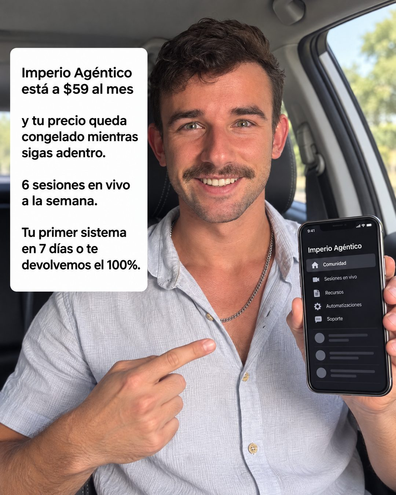

# 164 · Selfie en el auto con texto (UGC static)

**Familia:** Foto nativa · **Necesitas:** Una o dos fotos tuyas · **Resultado en Meta:** Sin datos propios todavía



## Qué es
Una foto tipo selfie del dueño de la marca dentro del auto, sonriendo y mostrando la app en el teléfono, con un recuadro blanco de texto estilo Instagram que resume la oferta en cuatro frases. En el ejemplo de Imperio, es Ben.

## Por qué funciona
Parece una story grabada entre una cosa y otra, no una producción, y la cara del dueño da la confianza que un logo no da. El recuadro blanco con letra simple se lee como lo que escribiría una persona, y el teléfono en mano muestra el producto sin explicarlo.

## Cuándo usarlo
Público frío o tibio, para presentar la oferta completa con la cara de la marca. Sirve para negocios donde el dueño es la marca (coaches, consultores, creadores, servicios locales); objetivo: generar confianza y empujar la compra.

## Así lo hicimos para Imperio
- **Texto en la imagen:** Imperio Agéntico / está a $59 al mes / y tu precio queda / congelado mientras / sigas adentro. / 6 sesiones en vivo / a la semana. / Tu primer sistema / en 7 días o te / devolvemos el 100%. (recuadro blanco a la izquierda) / [teléfono con la app: Imperio Agéntico, Comunidad, Sesiones en vivo, Recursos, Automatizaciones, Soporte]
- **Texto principal:**
  > Grabando esto en el auto porque es la pregunta que más me llega.
  >
  > Imperio está a $59 al mes y tu precio queda congelado mientras sigas adentro. 6 sesiones en vivo a la semana. Y si en 7 días no tienes tu primer sistema, te devolvemos el 100%.
  >
  > Entra acá 👇

## Receta para tu marca
- **Escena:** [TÚ] en el asiento del auto con luz de día, sonriendo a la cámara y mostrando el teléfono con [TU PRODUCTO O TU APP] en pantalla.
- **Texto:** recuadro blanco a la izquierda con letra negra simple tipo Instagram, en bloques cortos: [TU MARCA Y TU PRECIO] / [LA CONDICIÓN DEL PRECIO] / [LO QUE INCLUYE] / [TU PROMESA CON GARANTÍA].
- **Encuadre:** foto vertical de celular, sin filtros ni retoques notorios; el teléfono se lee pero no tapa la cara.
- **Colores:** los de la escena real; no agregues los colores de tu marca.
- **Lo que no se toca:** que parezca tomada con el celular por ti, no en un estudio. Cero logo y cero botón.

## Prompt con que se hizo el de Imperio (GPT Image 2.5)
```
[Si el formato lleva tu cara: adjunta 1 o 2 fotos tuyas como referencia y escribe: the person is exactly the one in the reference photos] Selfie photo taken inside a car in daylight, he smiles and holds his phone up toward the camera showing an online community app. On the left side, a white text box with plain black Instagram-style font: 'Imperio Agéntico está a $59 al mes' / 'y tu precio queda congelado mientras sigas adentro.' / '6 sesiones en vivo a la semana.' / 'Tu primer sistema en 7 días o te devolvemos el 100%.' Vertical 4:5 Instagram/Facebook feed ad, sharp and professional. All on-image text is Spanish and must be rendered EXACTLY as written inside the quotes, with every accent and ñ correct and every digit exact. Never use inverted question marks or inverted exclamation marks. No em dashes. Do not add any other words, logos or watermarks.
```

## Ojo
- Usa tus propias fotos como referencia: la cara tiene que ser la tuya, no la de un modelo que parezca cliente.
- Si sale texto roto, manos deformes o cifras mal escritas, se rehace.
- Marca la casilla de contenido generado por IA en el Administrador de anuncios.
