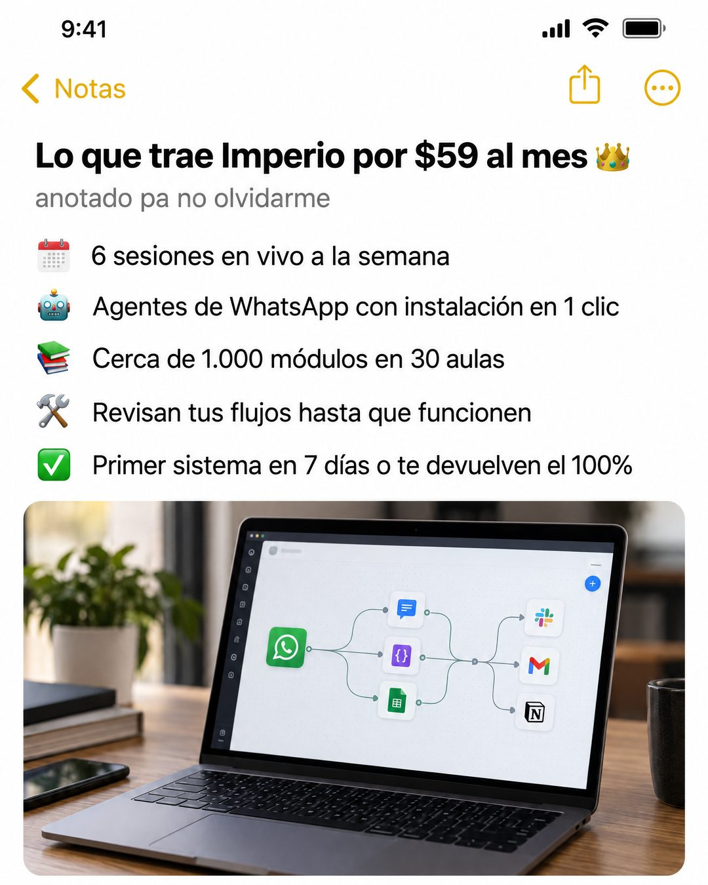

# 165 · Nota del iPhone con emojis (iPhone notes)

**Familia:** Interfaz creíble · **Necesitas:** Nada · **Resultado en Meta:** Sin datos propios todavía



## Qué es
Una captura de la app Notas del iPhone con un título, un subtítulo casual en gris, una lista de lo que incluye la oferta con un emoji por línea y una foto pegada dentro de la nota.

## Por qué funciona
Se ve tan simple que no parece anuncio: es la lista que uno anota para no olvidarse. Cada línea es un dato concreto (6 sesiones, 1 clic, cerca de 1.000 módulos, garantía), y la estructura de lista con emojis la distingue de otras notas que uses en la misma campaña.

## Cuándo usarlo
Público tibio que ya conoce la marca y quiere ver qué incluye. Sirve para cualquier negocio con una oferta de varias partes (membresías, paquetes, planes); objetivo: mostrar qué incluye y empujar la compra.

## Así lo hicimos para Imperio
- **Texto en la imagen:** [barra de la app: 9:41, < Notas] / Lo que trae Imperio por $59 al mes 👑 / anotado pa no olvidarme / 🗓️ 6 sesiones en vivo a la semana / 🤖 Agentes de WhatsApp con instalación en 1 clic / 📚 Cerca de 1.000 módulos en 30 aulas / 🛠️ Revisan tus flujos hasta que funcionen / ✅ Primer sistema en 7 días o te devuelven el 100% / [foto pegada de un portátil con un flujo de automatización]
- **Texto principal:**
  > La lista corta de lo que trae Imperio, anotada pa que no se me olvide nada:
  >
  > 📅 6 sesiones en vivo a la semana
  > 🤖 Agentes de WhatsApp con instalación en 1 clic
  > 📚 Cerca de 1.000 módulos en 30 aulas
  > ✅ Primer sistema en 7 días o te devolvemos el 100%
  >
  > $59 al mes 👇

## Receta para tu marca
- **Formato:** captura de la app Notas del iPhone en modo claro, con la barra de arriba (hora, "< Notas" en amarillo e íconos).
- **Título:** en negrita: "Lo que trae [TU MARCA] por [TU PRECIO]" con un emoji al final.
- **Subtítulo:** chico y gris, en tono personal: [UNA FRASE CASUAL, EJ. ANOTADO PARA NO OLVIDARME].
- **Lista:** cinco líneas, cada una con un emoji y [UNA PARTE CONCRETA DE TU OFERTA, CON CIFRA].
- **Foto:** abajo, pegada dentro de la nota, una foto realista de [TU PRODUCTO EN USO].
- **Lo que no se toca:** que se vea igual a la app Notas, sin logo, sin botón y sin colores de marca. Si haces más de una nota en la misma campaña, cambia la estructura (checklist, tareas tachadas, plan numerado).

## Prompt con que se hizo el de Imperio (GPT Image 2.5)
```
iPhone Notes app screenshot, light mode, yellow '< Notas' back button and icons at the top. Bold title 'Lo que trae Imperio por $59 al mes 👑'. Grey small subtitle 'anotado pa no olvidarme'. Emoji lines: '📅 6 sesiones en vivo a la semana', '🤖 Agentes de WhatsApp con instalación en 1 clic', '📚 Cerca de 1.000 módulos en 30 aulas', '🛠️ Revisan tus flujos hasta que funcionen', '✅ Primer sistema en 7 días o te devuelven el 100%'. Bottom right: a photo pasted inside the note of a laptop with an automation workflow. Vertical 4:5 Instagram/Facebook feed ad, sharp and professional. All on-image text is Spanish and must be rendered EXACTLY as written inside the quotes, with every accent and ñ correct and every digit exact. Never use inverted question marks or inverted exclamation marks. No em dashes. Do not add any other words, logos or watermarks.
```

## Ojo
- Cada línea es una promesa de tu oferta: pon solo lo que de verdad incluye, con cifras exactas.
- En la foto pegada, pide íconos genéricos o los de tu marca: no uses logos de terceros que no tienes permiso de usar.
- Marca la casilla de contenido generado por IA en el Administrador de anuncios.
