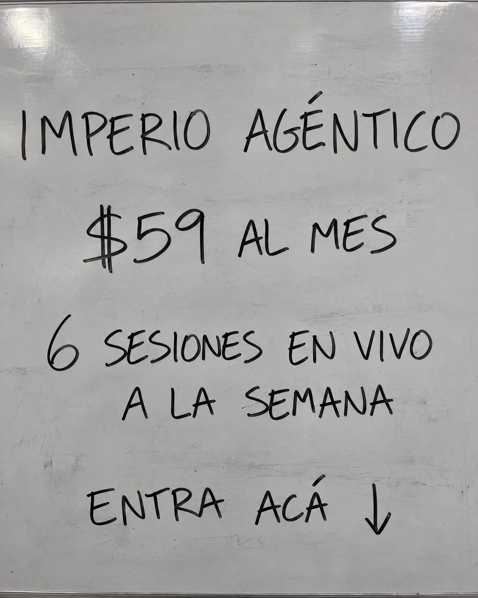

# 166 · Oferta en pizarra blanca (Whiteboard)

**Familia:** Objeto físico con texto · **Necesitas:** Nada · **Resultado en Meta:** Sin datos propios todavía



## Qué es
Una foto de una pizarra blanca algo usada, a cuadro completo, con la oferta escrita a mano con marcador negro: marca, precio, lo que incluye y un llamado con flecha hacia abajo.

## Por qué funciona
Es un objeto real, no diseño: parece una foto tomada en una sala de clases o en una oficina, y por eso el ojo no la descarta como anuncio. La letra a mano y las manchas de borrado le dan honestidad a una oferta dicha en cuatro líneas, sin adornos.

## Cuándo usarlo
Público frío o tibio, para presentar la oferta de forma directa. Sirve para cualquier negocio con una oferta fácil de decir (precio y uno o dos beneficios); objetivo: frenar el scroll y empujar la compra.

## Así lo hicimos para Imperio
- **Texto en la imagen:** IMPERIO AGÉNTICO / $59 AL MES / 6 SESIONES EN VIVO / A LA SEMANA / ENTRA ACÁ ↓
- **Texto principal:**
  > Sin diseño, sin vueltas.
  >
  > Imperio Agéntico: $59 al mes, 6 sesiones en vivo a la semana y +3.800 personas construyendo agentes en español.
  >
  > Entra acá 👇

## Receta para tu marca
- **Escena:** foto realista de una pizarra blanca grisácea que llena el cuadro, con reflejos de luz y manchas suaves de borrado.
- **Texto:** a mano, con marcador negro y letra casual en mayúsculas: [TU MARCA] / [TU PRECIO] / [TU BENEFICIO PRINCIPAL CON CIFRA] / [TU LLAMADO, EJ. ENTRA ACÁ] con una flecha hacia abajo.
- **Jerarquía:** cuatro bloques separados por aire y de tamaño parecido; el precio puede ir un poco más grande.
- **Colores:** solo negro sobre blanco. No agregues los colores de tu marca.
- **Lo que no se toca:** que sea una foto de una pizarra de verdad (con imperfecciones), sin logo y sin nada pegado encima.

## Prompt con que se hizo el de Imperio (GPT Image 2.5)
```
Photo of a slightly used grey-white whiteboard filling the frame, handwritten in black dry-erase marker with casual handwriting: 'IMPERIO AGÉNTICO' / '$59 AL MES' / '6 SESIONES EN VIVO' / 'A LA SEMANA' / 'ENTRA ACÁ ↓'. Real photo lighting, faint marker smudges. Vertical 4:5 Instagram/Facebook feed ad, sharp and professional. All on-image text is Spanish and must be rendered EXACTLY as written inside the quotes, with every accent and ñ correct and every digit exact. Never use inverted question marks or inverted exclamation marks. No em dashes. Do not add any other words, logos or watermarks.
```

## Ojo
- Si sale texto roto, manos deformes o cifras mal escritas, se rehace.
- Marca la casilla de contenido generado por IA en el Administrador de anuncios.
