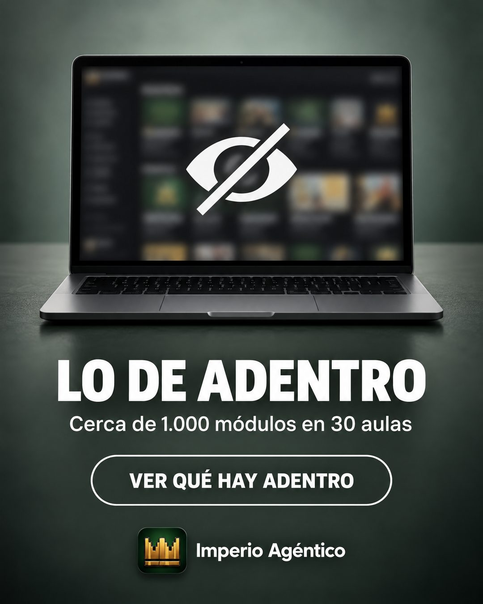

# 167 · Producto censurado con ojo tachado (Censored)

**Familia:** Interfaz creíble · **Necesitas:** Tu logo · **Resultado en Meta:** Sin datos propios todavía



## Qué es
Tu producto con la parte que importa desenfocada, como si estuviera censurada, un ícono grande de ojo tachado encima y, debajo, un titular que promete mostrar lo de adentro, con una cifra concreta y un botón.

## Por qué funciona
Lo tapado da ganas de verlo: el desenfoque y el ojo tachado despiertan curiosidad sin decir nada falso. A diferencia de un teaser vacío, la línea de abajo afirma algo concreto (cerca de 1.000 módulos en 30 aulas), así que la curiosidad tiene de dónde agarrarse.

## Cuándo usarlo
Público frío o tibio que todavía no ve qué hay dentro de la oferta. Sirve para cursos, membresías, software y productos cuyo interior no se ve en una foto; objetivo: frenar el scroll y llevar a ver más.

## Así lo hicimos para Imperio
- **Texto en la imagen:** [portátil con la pantalla desenfocada y un ícono blanco de ojo tachado] / LO DE ADENTRO / Cerca de 1.000 módulos en 30 aulas / VER QUÉ HAY ADENTRO (botón con borde blanco) / Imperio Agéntico (junto al logo, abajo al centro)
- **Texto principal:**
  > No te voy a mostrar todo por acá (no cabe).
  >
  > Son cerca de 1.000 módulos en 30 aulas: Claude Code, n8n, GHL, agentes de WhatsApp y de voz, vibe-coding.
  >
  > Míralo por dentro. $59 al mes 👇

## Receta para tu marca
- **Fondo:** estudio de un solo tono apagado (en el ejemplo, gris verdoso).
- **Producto:** [TU PRODUCTO] al centro, con [LO QUE HAY ADENTRO DE TU PRODUCTO] muy desenfocado y un ícono blanco grande de ojo tachado encima.
- **Titular:** en blanco y mayúsculas gruesas: [LO QUE ESTÁ ESCONDIDO EN 3 PALABRAS].
- **Texto:** una línea chica con [UNA CIFRA CONCRETA DE LO QUE HAY ADENTRO] y un botón con borde blanco: [TU LLAMADO, EJ. VER QUÉ HAY ADENTRO].
- **Marca:** [TU LOGO] y el nombre, chicos, abajo al centro.
- **Lo que no se toca:** la cifra concreta bajo el titular. Sin ella es un teaser que no dice nada, y esos se caen.

## Prompt con que se hizo el de Imperio (GPT Image 2.5)
```
Muted grey-green studio background. Center: a laptop whose screen is heavily blurred (censored) with a big white eye-slash icon on top. Below in bold white caps 'LO DE ADENTRO' and small white text 'Cerca de 1.000 módulos en 30 aulas'. A white outlined rounded button 'VER QUÉ HAY ADENTRO'. At the bottom, small. [TU MARCA: logo y nombre]  Vertical 4:5 Instagram/Facebook feed ad, sharp and professional. All on-image text is Spanish and must be rendered EXACTLY as written inside the quotes, with every accent and ñ correct and every digit exact. Never use inverted question marks or inverted exclamation marks. No em dashes. Do not add any other words, logos or watermarks.
```

## Ojo
- Lo que escondes tiene que existir tal cual: la cifra de la línea de abajo debe ser la real de tu producto.
- Marca la casilla de contenido generado por IA en el Administrador de anuncios.
