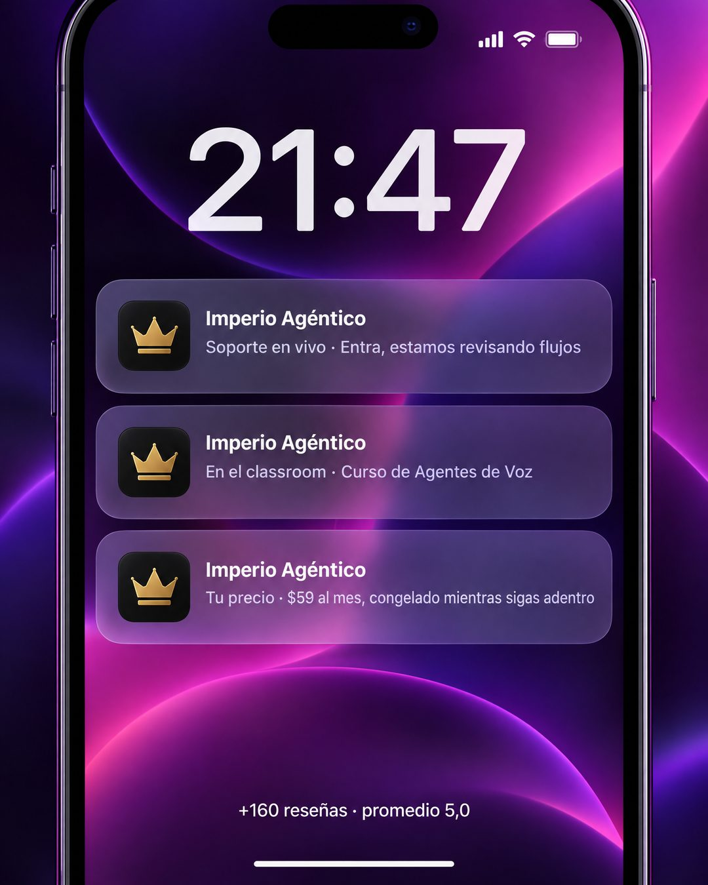

# 168 · Notificaciones en pantalla de bloqueo (Lockscreen)

**Familia:** Interfaz creíble · **Necesitas:** Tu logo · **Resultado en Meta:** Sin datos propios todavía



## Qué es
Una pantalla de bloqueo de iPhone con fondo abstracto, la hora en grande y tres notificaciones de tu app, cada una con un beneficio. Abajo, una línea chica con tu número de reseñas y tu promedio.

## Por qué funciona
Todo el mundo mira su pantalla de bloqueo decenas de veces al día, así que el formato se entiende al instante y se siente como algo que ya te está pasando. Tres notificaciones cuentan tres beneficios sin parecer una lista de venta: se ven como el día a día de alguien que ya es cliente.

## Cuándo usarlo
Público tibio o remarketing, para mostrar cómo se vive siendo cliente. Sirve para apps, membresías, servicios con seguimiento o cualquier negocio que le avisa cosas a sus clientes; objetivo: mostrar qué incluye y empujar la compra.

## Así lo hicimos para Imperio
- **Texto en la imagen:** 21:47 / Imperio Agéntico / Soporte en vivo · Entra, estamos revisando flujos / Imperio Agéntico / En el classroom · Curso de Agentes de Voz / Imperio Agéntico / Tu precio · $59 al mes, congelado mientras sigas adentro / +160 reseñas · promedio 5,0 (letra chica, abajo)
- **Texto principal:**
  > Así se ve el teléfono cuando estás adentro: soporte en vivo, cursos nuevos en el classroom y tu precio congelado.
  >
  > Imperio Agéntico, $59 al mes. +160 reseñas con promedio 5,0 👇

## Receta para tu marca
- **Fondo:** pantalla de bloqueo de iPhone con un fondo abstracto en los colores de tu marca y la hora grande (en el ejemplo, 21:47).
- **Notificaciones:** tres tarjetas de vidrio esmerilado apiladas, cada una con [TU LOGO] como ícono de app, [TU MARCA] en negrita y una línea: [CATEGORÍA] · [BENEFICIO CONCRETO].
- **Orden:** primero el servicio o el soporte, después el contenido y al final el precio con su condición.
- **Cierre:** abajo, en letra chica blanca, [TU NÚMERO REAL DE RESEÑAS] · promedio [TU PROMEDIO REAL]; si no lo tienes, quítalo.
- **Lo que no se toca:** que se vea idéntica a una pantalla de bloqueo real, sin titular ni botón encima.

## Prompt con que se hizo el de Imperio (GPT Image 2.5)
```
iPhone lock screen with a purple-magenta abstract wallpaper. Big clock '21:47'. Three stacked frosted-glass notifications from an app [TU MARCA: logo y nombre]: 1) 'Soporte en vivo · Entra, estamos revisando flujos' 2) 'En el classroom · Curso de Agentes de Voz' 3) 'Tu precio · $59 al mes, congelado mientras sigas adentro'. Near the bottom, small white text '+160 reseñas · promedio 5,0'. Vertical 4:5 Instagram/Facebook feed ad, sharp and professional. All on-image text is Spanish and must be rendered EXACTLY as written inside the quotes, with every accent and ñ correct and every digit exact. Never use inverted question marks or inverted exclamation marks. No em dashes. Do not add any other words, logos or watermarks.
```

## Ojo
- La línea de reseñas solo va con tus cifras reales y comprobables; si no las tienes, la pieza funciona igual sin ella.
- Las notificaciones son avisos de tu marca, no mensajes de clientes: no inventes nombres ni conversaciones.
- Marca la casilla de contenido generado por IA en el Administrador de anuncios.
