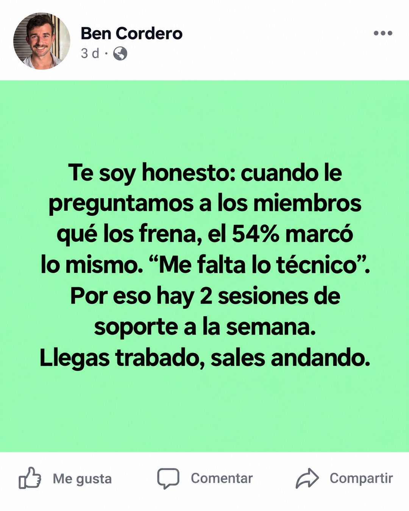

# 171 · Post con fondo de color (Low-fi native)

**Familia:** Interfaz creíble · **Necesitas:** Una o dos fotos tuyas · **Resultado en Meta:** Sin datos propios todavía



## Qué es
Una captura de un post de Facebook publicado por ti, con tu foto y tu nombre, y el texto sobre un fondo de color plano como los posts de solo texto. Sin contadores: solo los botones Me gusta, Comentar y Compartir.

## Por qué funciona
Parece un post orgánico de alguien que sigues, no un anuncio, y el "Te soy honesto" abre en tono de confesión. El dato de los propios miembros (el 54% marcó "me falta lo técnico") nombra el miedo de quien lee y lo responde con algo concreto: 2 sesiones de soporte a la semana.

## Cuándo usarlo
Público frío o tibio que se frena por una objeción conocida. Sirve para marcas personales, consultores y negocios con un fundador visible; objetivo: responder una objeción y generar confianza.

## Así lo hicimos para Imperio
- **Texto en la imagen:** Ben Cordero / 3 d · (ícono de público) / Te soy honesto: cuando le / preguntamos a los miembros / qué los frena, el 54% marcó / lo mismo. “Me falta lo técnico”. / Por eso hay 2 sesiones de / soporte a la semana. / Llegas trabado, sales andando. / Me gusta / Comentar / Compartir
- **Texto principal:**
  > Te soy honesto: cuando le preguntamos a los miembros qué los frena, el 54% marcó lo mismo. Me falta lo técnico.
  >
  > Por eso hay 2 sesiones de soporte a la semana. Llegas trabado, sales andando.
  >
  > $59 al mes 👇

## Receta para tu marca
- **Formato:** captura de un post de Facebook en modo claro.
- **Cabecera:** tu foto redonda, [TU NOMBRE], "3 d ·" con el ícono de público y el menú de tres puntos.
- **Post:** cuadrado de color plano y claro (en el ejemplo, verde menta) con texto negro centrado: [UNA CONFESIÓN O UN DATO REAL DE TUS CLIENTES] + [QUÉ HICISTE AL RESPECTO] + [UNA FRASE CORTA DE CIERRE].
- **Pie:** solo los botones "Me gusta", "Comentar" y "Compartir", sin números.
- **Colores:** el fondo del post puede ser un tono claro de tu marca, siempre que el texto negro se lea fuerte.
- **Lo que no se toca:** el post es tuyo, con tu nombre y tu cara, y no lleva contadores de reacciones ni de comentarios.

## Prompt con que se hizo el de Imperio (GPT Image 2.5)
```
[Si el formato lleva tu cara: adjunta 1 o 2 fotos tuyas como referencia y escribe: the person is exactly the one in the reference photos] Facebook post screenshot, light mode. Header: round profile photo of him, name 'Ben Cordero', '3 d · 🌎' and a three-dot menu. The post is a Facebook colored-background text post: a bright mint green square with centered black text: 'Te soy honesto: cuando le preguntamos a los miembros qué los frena, el 54% marcó lo mismo. “Me falta lo técnico”. Por eso hay 2 sesiones de soporte a la semana. Llegas trabado, sales andando.' Footer: only the buttons 'Me gusta', 'Comentar', 'Compartir' with no numbers or counts anywhere. Vertical 4:5 Instagram/Facebook feed ad, sharp and professional. All on-image text is Spanish and must be rendered EXACTLY as written inside the quotes, with every accent and ñ correct and every digit exact. Never use inverted question marks or inverted exclamation marks. No em dashes. Do not add any other words, logos or watermarks.
```

## Ojo
- Publícalo a tu nombre, nunca al de un cliente: un post de un cliente generado es un testimonio inventado. Tampoco pongas contadores de me gusta ni de comentarios.
- Si el post cita un porcentaje de tus clientes, tiene que salir de una encuesta real.
- Marca la casilla de contenido generado por IA en el Administrador de anuncios.
