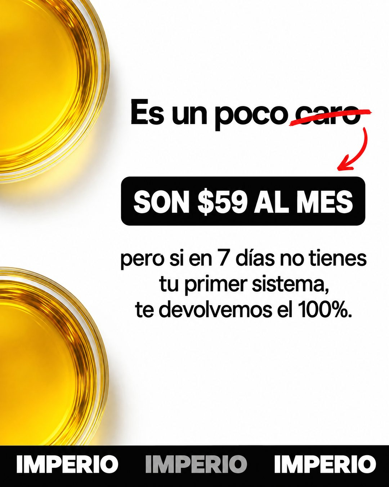

# 173 · Objeción de precio tachada

**Familia:** Oferta y precio · **Necesitas:** Nada. Si tienes una foto de tu producto desde arriba, mejor · **Resultado en Meta:** Sin datos propios todavía



## Qué es
Una pieza blanca que dice la objeción en voz alta ("Es un poco caro"), tacha la palabra en rojo y la reemplaza, con una flecha, por el precio real y la garantía. Una cinta con el nombre de la marca repetido cierra abajo.

## Por qué funciona
Decir primero lo que el cliente piensa baja la guardia: la marca se adelanta a la objeción en vez de esconderla. El tachón a mano y la flecha hacen visible el cambio de opinión, y la garantía responde con algo concreto: si no funciona, se devuelve el dinero.

## Cuándo usarlo
Público tibio o remarketing que ya vio el precio y duda. Sirve para cualquier negocio con garantía o con una razón concreta para su precio; objetivo: responder la objeción de precio.

## Así lo hicimos para Imperio
- **Texto en la imagen:** Es un poco caro (caro tachado en rojo) / SON $59 AL MES (etiqueta negra, con flecha roja) / pero si en 7 días no tienes / tu primer sistema, / te devolvemos el 100%. / IMPERIO IMPERIO IMPERIO (cinta negra abajo)
- **Texto principal:**
  > Sí, $59 al mes no es lo más barato que vas a encontrar.
  >
  > Pero si en 7 días no tienes tu primer sistema andando, te devolvemos el 100%. Y se cancela cuando quieras.
  >
  > Entra acá 👇

## Receta para tu marca
- **Fondo:** blanco limpio, con [UN PRIMER PLANO DE TU PRODUCTO VISTO DESDE ARRIBA] cortado en el borde izquierdo, arriba y abajo.
- **Objeción:** "Es un poco [LA OBJECIÓN EN UNA PALABRA]" en negro, con esa palabra tachada a mano en rojo y una flecha roja hacia abajo.
- **Respuesta:** una etiqueta negra con [TU PRECIO] en blanco y mayúsculas; debajo, tres líneas con [TU GARANTÍA].
- **Marca:** cinta negra abajo con [TU MARCA] repetida, alternando blanco y gris.
- **Lo que no se toca:** el tachón rojo a mano y la flecha: son los que muestran el cambio de "caro" a "vale la pena".

## Prompt con que se hizo el de Imperio (GPT Image 2.5)
```
White clean ad with two large yellow circles partly cropped at the left edge, top and bottom, like cups of golden liquid seen from above. Top black text 'Es un poco caro' with the word 'caro' struck through in red and a red hand-drawn arrow pointing to a black label with white caps 'SON $59 AL MES'. Middle black text: 'pero si en 7 días no tienes tu primer sistema,' / 'te devolvemos el 100%.' Bottom: a black ticker strip repeating 'IMPERIO IMPERIO IMPERIO' alternating white bold and grey. Vertical 4:5 Instagram/Facebook feed ad, sharp and professional. All on-image text is Spanish and must be rendered EXACTLY as written inside the quotes, with every accent and ñ correct and every digit exact. Never use inverted question marks or inverted exclamation marks. No em dashes. Do not add any other words, logos or watermarks.
```

## Ojo
- La garantía tiene que existir y estar escrita en tus condiciones: si no devuelves el dinero, no lo prometas.
- Marca la casilla de contenido generado por IA en el Administrador de anuncios.
