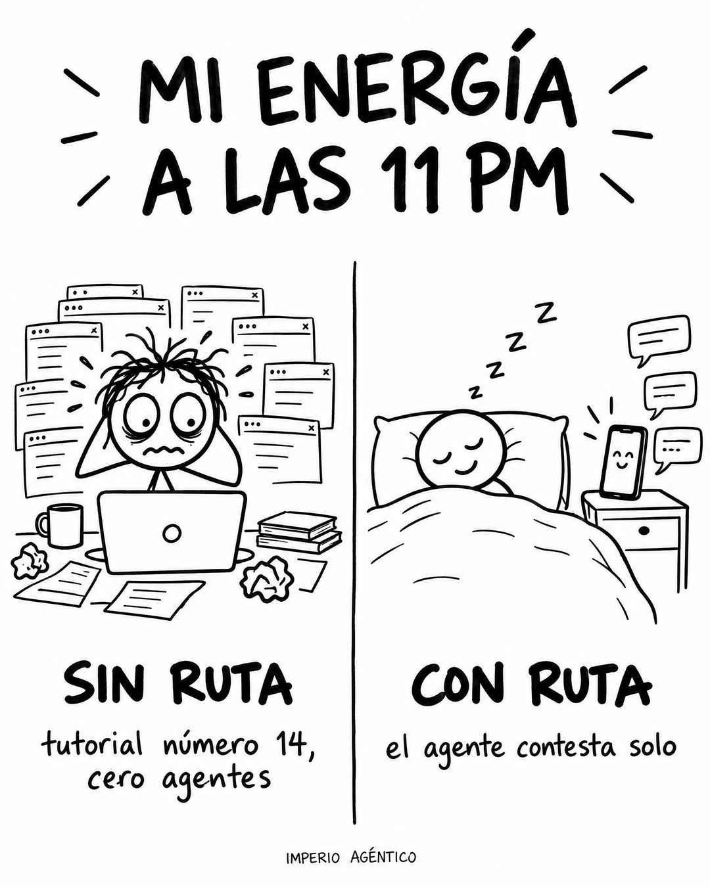

# 175 · Garabato antes y después (Doodle)

**Familia:** Humor y meme · **Necesitas:** Nada · **Resultado en Meta:** Sin datos propios todavía



## Qué es
Un dibujo a tinta negra sobre papel blanco, estilo garabato, con un título escrito a mano y dos escenas lado a lado: el cliente sin tu producto (agobiado) y con tu producto (tranquilo), cada una con una leyenda corta.

## Por qué funciona
El garabato no parece anuncio y el contraste entre las dos escenas se entiende sin leer. Las leyendas son concretas y con humor ("tutorial número 14, cero agentes" contra "el agente contesta solo"), y quien mira se ubica solo en el lado izquierdo.

## Cuándo usarlo
Público frío, para mostrar el cambio que produce tu producto. Sirve para cualquier negocio con un antes y después fácil de dibujar (tiempo, orden, energía, tranquilidad); objetivo: frenar el scroll y mostrar el beneficio.

## Así lo hicimos para Imperio
- **Texto en la imagen:** MI ENERGÍA / A LAS 11 PM / SIN RUTA / tutorial número 14, / cero agentes / CON RUTA / el agente contesta solo / IMPERIO AGÉNTICO (letra chica, abajo)
- **Texto principal:**
  > Sin ruta: tutorial número 14 a las 11 de la noche y cero agentes.
  >
  > Con ruta: un caso, una base que ya funciona y el agente contestando mientras duermes.
  >
  > Tu primer agente en 7 días o te devolvemos el 100%. $59 al mes 👇

## Receta para tu marca
- **Formato:** dibujo a tinta negra sobre papel blanco, estilo garabato con figuras simples, dividido por una línea vertical.
- **Título:** arriba, a mano y en mayúsculas: [UN MOMENTO DEL DÍA DE TU CLIENTE, EJ. MI ENERGÍA A LAS 11 PM], con rayitas de énfasis.
- **Izquierda:** el cliente agobiado, con "SIN [TU PRODUCTO O TU MÉTODO]" y una leyenda chica con [EL DOLOR CONCRETO, CON CIFRA SI PUEDES].
- **Derecha:** el mismo cliente tranquilo, con "CON [TU PRODUCTO O TU MÉTODO]" y una leyenda con [EL RESULTADO CONCRETO].
- **Marca:** [TU MARCA] en letra chica abajo al centro.
- **Lo que no se toca:** blanco y negro, trazo a mano y el mismo personaje en las dos escenas. Si lo pintas o lo pules, pierde el tono de garabato.

## Prompt con que se hizo el de Imperio (GPT Image 2.5)
```
Hand-drawn black ink doodle on white paper. Big hand-lettered title 'MI ENERGÍA A LAS 11 PM'. Left drawing: a stressed stick figure at a laptop with many browser tabs, eyes wide; handwritten caption below 'SIN RUTA' / 'tutorial número 14, cero agentes'. Right drawing: a calm stick figure asleep in bed while a small phone beside it answers messages by itself (little speech bubbles); caption 'CON RUTA' / 'el agente contesta solo'. Tiny footer 'IMPERIO AGÉNTICO'. Vertical 4:5 Instagram/Facebook feed ad, sharp and professional. All on-image text is Spanish and must be rendered EXACTLY as written inside the quotes, with every accent and ñ correct and every digit exact. Never use inverted question marks or inverted exclamation marks. No em dashes. Do not add any other words, logos or watermarks.
```

## Ojo
- La escena del "con" tiene que mostrar algo que tu producto de verdad hace, no una exageración.
- Marca la casilla de contenido generado por IA en el Administrador de anuncios.
