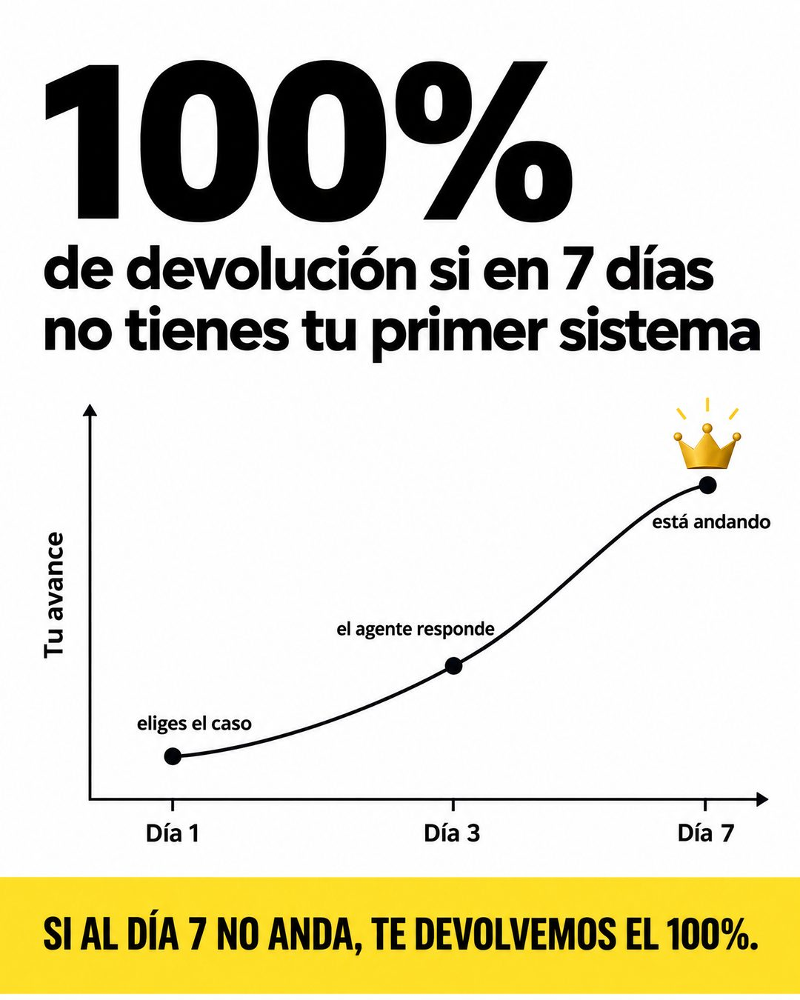

# 176 · Cifra gigante con curva de avance

**Familia:** Diagrama y dato · **Necesitas:** Nada · **Resultado en Meta:** Sin datos propios todavía



## Qué es
Una pieza de datos limpia: una cifra gigante arriba (la de tu garantía), un gráfico simple con una curva que sube por tres hitos en el tiempo y una franja amarilla que repite la garantía.

## Por qué funciona
El "100%" gigante se ve antes que todo, y la curva convierte una promesa abstracta en un plan con días concretos (día 1 eliges el caso, día 3 el agente responde, día 7 está andando). El gráfico da sensación de método y la franja deja claro qué pasa si no se cumple.

## Cuándo usarlo
Público tibio que duda de si podrá lograrlo. Sirve para cursos, servicios con implementación y cualquier negocio con un proceso por etapas y garantía; objetivo: bajar la fricción y responder la objeción "no voy a poder".

## Así lo hicimos para Imperio
- **Texto en la imagen:** 100% / de devolución si en 7 días / no tienes tu primer sistema / Tu avance (eje vertical) / eliges el caso / el agente responde / está andando / Día 1 / Día 3 / Día 7 / SI AL DÍA 7 NO ANDA, TE DEVOLVEMOS EL 100%. (franja amarilla abajo)
- **Texto principal:**
  > Día 1 eliges el caso. Día 3 el agente responde. Día 7 está andando.
  >
  > Y si al día 7 no anda, te devolvemos el 100%.
  >
  > $59 al mes 👇

## Receta para tu marca
- **Fondo:** blanco limpio.
- **Cifra:** arriba a la izquierda, [LA CIFRA DE TU GARANTÍA O TU PROMESA] en negro gigante y debajo [QUÉ SIGNIFICA ESA CIFRA, EN DOS LÍNEAS].
- **Gráfico:** eje vertical "Tu avance" y eje horizontal con [TRES HITOS DE TIEMPO]; una curva que sube por tres puntos con [LO QUE PASA EN CADA HITO] y un ícono de tu marca en la cima.
- **Franja:** amarilla abajo con [TU GARANTÍA EN UNA FRASE] en negro y mayúsculas.
- **Colores:** negro sobre blanco; el amarillo puede cambiar por el color fuerte de tu marca.
- **Lo que no se toca:** el gráfico simple, sin cuadrícula ni números inventados en los ejes: es un plan, no una medición.

## Prompt con que se hizo el de Imperio (GPT Image 2.5)
```
White clean data ad. Huge black bold '100%' top-left and below it 'de devolución si en 7 días no tienes tu primer sistema'. A simple line chart: y-axis label 'Tu avance', x-axis labels 'Día 1', 'Día 3', 'Día 7'; a curve rising through three dots annotated 'eliges el caso', 'el agente responde', 'está andando'; a small gold crown at the top of the curve. Bottom yellow band with black caps 'SI AL DÍA 7 NO ANDA, TE DEVOLVEMOS EL 100%.' Vertical 4:5 Instagram/Facebook feed ad, sharp and professional. All on-image text is Spanish and must be rendered EXACTLY as written inside the quotes, with every accent and ñ correct and every digit exact. Never use inverted question marks or inverted exclamation marks. No em dashes. Do not add any other words, logos or watermarks.
```

## Ojo
- La curva muestra tu plan, no resultados medidos: no le pongas datos ni porcentajes de clientes que no tienes.
- Si sale texto roto, manos deformes o cifras mal escritas, se rehace.
- Marca la casilla de contenido generado por IA en el Administrador de anuncios.
