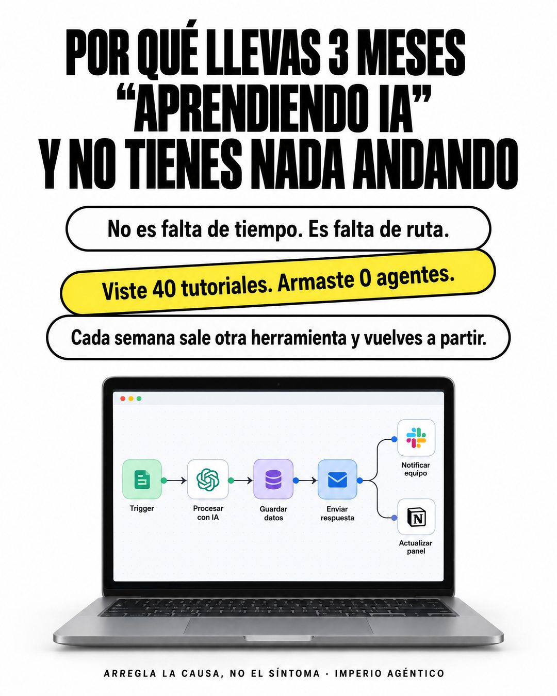

# 177 · El porqué del síntoma en píldoras

**Familia:** Tipografía dura · **Necesitas:** Nada · **Resultado en Meta:** Sin datos propios todavía



## Qué es
Un titular gigante en mayúsculas condensadas que nombra el síntoma que vive el cliente ("Por qué llevas 3 meses..."), tres píldoras debajo con la causa real y una imagen chica del producto. Cierra con una frase de método en letra espaciada.

## Por qué funciona
El titular describe con precisión la frustración de quien lee, así que se siente aludido y sigue leyendo. Las píldoras cambian el diagnóstico (no es falta de tiempo, es falta de ruta) y la píldora amarilla inclinada concentra el golpe en dos cifras: "Viste 40 tutoriales. Armaste 0 agentes."

## Cuándo usarlo
Público frío o tibio que lleva tiempo intentando resolver el problema solo. Sirve para cualquier negocio que ataca una causa que el cliente confunde con otra (dietas, finanzas, marketing, aprendizaje); objetivo: frenar el scroll y cambiar cómo ve su problema.

## Así lo hicimos para Imperio
- **Texto en la imagen:** POR QUÉ LLEVAS 3 MESES / “APRENDIENDO IA” / Y NO TIENES NADA ANDANDO / No es falta de tiempo. Es falta de ruta. / Viste 40 tutoriales. Armaste 0 agentes. (píldora amarilla inclinada) / Cada semana sale otra herramienta y vuelves a partir. / [portátil con un flujo: Trigger, Procesar con IA, Guardar datos, Enviar respuesta, Notificar equipo, Actualizar panel] / ARREGLA LA CAUSA, NO EL SÍNTOMA · IMPERIO AGÉNTICO
- **Texto principal:**
  > No es falta de tiempo. Es falta de ruta.
  >
  > Cada tutorial parte de cero y cada herramienta nueva te hace volver a partir. Adentro partes de un agente que ya funciona y lo adaptas a tu negocio.
  >
  > $59 al mes 👇

## Receta para tu marca
- **Fondo:** blanco.
- **Titular:** negro, en mayúsculas condensadas gigantes: "POR QUÉ [EL SÍNTOMA QUE VIVE TU CLIENTE, CON TIEMPO O CIFRA]".
- **Píldoras:** tres píldoras redondeadas con borde negro: [LA CAUSA REAL EN UNA FRASE] / [EL GOLPE CON DOS CIFRAS] (esta, amarilla e inclinada) / [POR QUÉ EL PROBLEMA SE REPITE].
- **Imagen:** abajo, [TU PRODUCTO EN USO] en un portátil o un objeto simple, sin texto que compita.
- **Cierre:** al pie, en mayúsculas chicas y espaciadas: "[TU FRASE DE MÉTODO] · [TU MARCA]".
- **Lo que no se toca:** el titular gigante y la píldora amarilla inclinada en el medio: es la que hace el trabajo.

## Prompt con que se hizo el de Imperio (GPT Image 2.5)
```
White ad. Big black bold condensed headline: 'POR QUÉ LLEVAS 3 MESES “APRENDIENDO IA” Y NO TIENES NADA ANDANDO'. Below, three stacked rounded outlined pills: 'No es falta de tiempo. Es falta de ruta.', then a slightly tilted yellow highlighted pill 'Viste 40 tutoriales. Armaste 0 agentes.', then 'Cada semana sale otra herramienta y vuelves a partir.' Bottom center: a laptop showing an automation flow. Footer small caps 'ARREGLA LA CAUSA, NO EL SÍNTOMA · IMPERIO AGÉNTICO'. Vertical 4:5 Instagram/Facebook feed ad, sharp and professional. All on-image text is Spanish and must be rendered EXACTLY as written inside the quotes, with every accent and ñ correct and every digit exact. Never use inverted question marks or inverted exclamation marks. No em dashes. Do not add any other words, logos or watermarks.
```

## Ojo
- En la pantalla del producto, pide íconos genéricos o los de tu marca: no uses logos de terceros que no tienes permiso de usar.
- Si sale texto roto, manos deformes o cifras mal escritas, se rehace.
- Marca la casilla de contenido generado por IA en el Administrador de anuncios.
