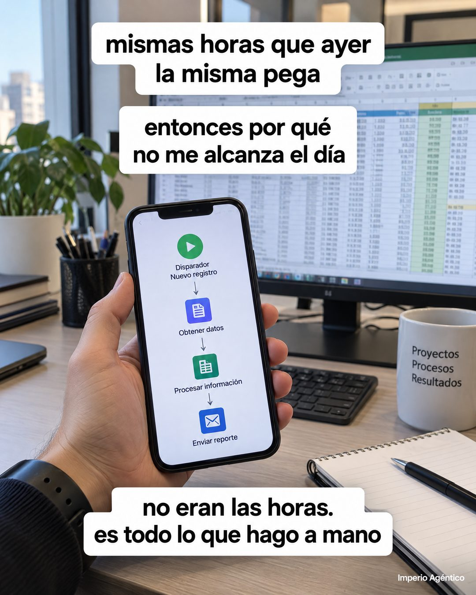

# 179 · Foto POV con subtítulos tipo TikTok

**Familia:** Foto nativa · **Necesitas:** Nada. Si tienes foto de tu lugar de trabajo, mejor · **Resultado en Meta:** Sin datos propios todavía



## Qué es
Una foto en primera persona de alguien que sostiene el teléfono en su escritorio, con tres subtítulos blancos tipo TikTok que cuentan un pensamiento en tres tiempos: la queja, la pregunta y el diagnóstico. La pantalla del teléfono muestra la solución.

## Por qué funciona
Parece un video nativo de Reels o TikTok, no un anuncio, así que se lee como contenido. Los subtítulos en minúscula y en primera persona hacen que el cliente se escuche a sí mismo, y la última caja le cambia el diagnóstico: no le faltan horas, le sobra trabajo manual.

## Cuándo usarlo
Público frío, arriba del embudo. Sirve para cualquier negocio que ahorra tiempo o elimina una tarea repetitiva; el objetivo es frenar el scroll y cambiar cómo el cliente explica su problema.

## Así lo hicimos para Imperio
- **Texto en la imagen:** mismas horas que ayer / la misma pega / entonces por qué / no me alcanza el día / [teléfono en la mano con un flujo: Disparador Nuevo registro, Obtener datos, Procesar información, Enviar reporte] / [taza: Proyectos / Procesos / Resultados] / no eran las horas. / es todo lo que hago a mano / Imperio Agéntico (letra chica, abajo a la derecha)
- **Texto principal:**
  > No te falta tiempo. Se te va en lo que haces a mano.
  >
  > Seguimiento, respuestas, planillas: ahí vive tu primer agente. Adentro lo armas partiendo de uno que ya funciona.
  >
  > $59 al mes 👇

## Receta para tu marca
- **Escena:** foto vertical en primera persona: una mano sostiene el teléfono frente a [EL LUGAR DONDE TRABAJA TU CLIENTE], con [LA TAREA PESADA] visible al fondo y luz real.
- **Pantalla:** el teléfono muestra [TU PRODUCTO O EL RESULTADO] en pasos simples y legibles.
- **Texto:** tres cajas blancas con letra negra en minúscula, estilo subtítulo: arriba [LA QUEJA DE SIEMPRE], al medio [LA PREGUNTA QUE SE HACE], abajo [EL DIAGNÓSTICO REAL].
- **Marca:** solo [TU MARCA] en letra chica blanca en una esquina.
- **Lo que no se toca:** las frases en primera persona y en minúscula, sin titular ni botón. Si suena a eslogan, deja de parecer un video nativo.

## Prompt con que se hizo el de Imperio (GPT Image 2.5)
```
POV photo: a hand holding a smartphone in front of an office desk with a monitor full of spreadsheets. White TikTok-style caption boxes with black text over the photo: top 'mismas horas que ayer' / 'la misma pega'; middle 'entonces por qué' / 'no me alcanza el día'; bottom 'no eran las horas.' / 'es todo lo que hago a mano'. The phone screen shows an automation flow. Tiny corner text 'Imperio Agéntico'. Vertical 4:5 Instagram/Facebook feed ad, sharp and professional. All on-image text is Spanish and must be rendered EXACTLY as written inside the quotes, with every accent and ñ correct and every digit exact. Never use inverted question marks or inverted exclamation marks. No em dashes. Do not add any other words, logos or watermarks.
```

## Ojo
- Las cajas no pueden tapar la pantalla del teléfono: es donde se ve la salida.
- Si sale texto roto, manos deformes o cifras mal escritas, se rehace.
- Marca la casilla de contenido generado por IA en el Administrador de anuncios.
