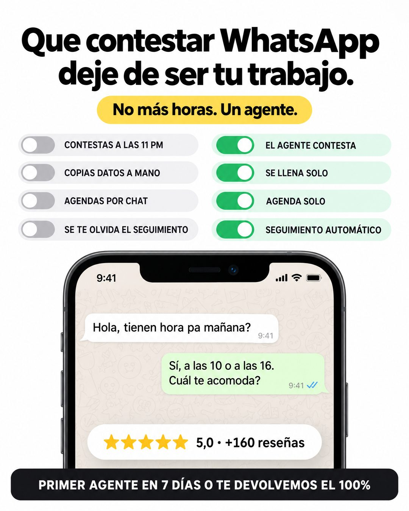

# 180 · Interruptores antes y después con chat

**Familia:** Interfaz creíble · **Necesitas:** Tu promedio y cantidad de reseñas reales · **Resultado en Meta:** Sin datos propios todavía



## Qué es
Dos columnas de interruptores: a la izquierda, apagadas, las tareas que hoy el cliente hace a mano; a la derecha, encendidas, cómo quedan con tu solución. Abajo, un teléfono con un chat de demostración, un chip de calificación y la garantía.

## Por qué funciona
El interruptor se entiende sin leer: apagar lo que te quita tiempo y encender lo que lo resuelve. Cada fila de la derecha contesta a una de la izquierda, el chat de demostración vuelve concreta la promesa y el chip de reseñas responde si funciona, siempre que sea real.

## Cuándo usarlo
Público tibio que ya conoce el problema y compara opciones. Sirve para software o servicios que automatizan tareas (atención, agenda, seguimiento); el objetivo es mostrar el antes y después de un vistazo y empujar la compra con la garantía.

## Así lo hicimos para Imperio
- **Texto en la imagen:** Que contestar WhatsApp / deje de ser tu trabajo. / No más horas. Un agente. (píldora amarilla) / CONTESTAS A LAS 11 PM / COPIAS DATOS A MANO / AGENDAS POR CHAT / SE TE OLVIDA EL SEGUIMIENTO (columna izquierda, interruptores apagados) / EL AGENTE CONTESTA / SE LLENA SOLO / AGENDA SOLO / SEGUIMIENTO AUTOMÁTICO (columna derecha, interruptores verdes encendidos) / [teléfono con un chat:] Hola, tienen hora pa mañana? / Sí, a las 10 o a las 16. Cuál te acomoda? / ★★★★★ 5,0 · +160 reseñas / PRIMER AGENTE EN 7 DÍAS O TE DEVOLVEMOS EL 100% (franja negra, abajo)
- **Texto principal:**
  > Contestar WhatsApp a las 11 de la noche no debería ser tu trabajo.
  >
  > El agente contesta, agenda y hace el seguimiento. En Imperio aprendes a montarlo (el curso de Agentes de WhatsApp se instala en 1 clic).
  >
  > Tu primer agente en 7 días o te devolvemos el 100%. $59 al mes 👇

## Receta para tu marca
- **Titular:** negro grueso en dos líneas: Que [LA TAREA QUE TU CLIENTE ODIA] / deje de ser tu trabajo., con una píldora amarilla debajo: [TU PROMESA EN 5 PALABRAS].
- **Interruptores:** cuatro filas por lado; a la izquierda, gris y apagado, [TAREA MANUAL 1 A 4] en mayúsculas; a la derecha, verde y encendido, [CÓMO QUEDA CON TU SOLUCIÓN 1 A 4].
- **Prueba:** un teléfono con un chat de demostración de dos mensajes ([PREGUNTA TÍPICA DE TU CLIENTE] y [RESPUESTA DE TU PRODUCTO]) y un chip con [TU PROMEDIO] · [TU NÚMERO DE RESEÑAS].
- **Cierre:** franja negra abajo con [TU GARANTÍA EXACTA] en mayúsculas blancas.
- **Colores:** fondo blanco, verde solo en lo encendido y amarillo en la píldora; cambia el verde por tu color solo si se sigue leyendo como encendido.
- **Lo que no se toca:** el mismo número de filas por lado, y cada fila de la derecha respondiendo a la de la izquierda.

## Prompt con que se hizo el de Imperio (GPT Image 2.5)
```
White ad. Bold black headline 'Que contestar WhatsApp' / 'deje de ser tu trabajo.' A small yellow pill 'No más horas. Un agente.' Two columns of toggle rows: left in light grey 'CONTESTAS A LAS 11 PM', 'COPIAS DATOS A MANO', 'AGENDAS POR CHAT', 'SE TE OLVIDA EL SEGUIMIENTO'; right with green toggles ON 'EL AGENTE CONTESTA', 'SE LLENA SOLO', 'AGENDA SOLO', 'SEGUIMIENTO AUTOMÁTICO'. Below, a phone showing a WhatsApp chat with only these messages: customer 'Hola, tienen hora pa mañana?', agent 'Sí, a las 10 o a las 16. Cuál te acomoda?'. A rounded chip '★★★★★ 5,0 · +160 reseñas'. Footer caps 'PRIMER AGENTE EN 7 DÍAS O TE DEVOLVEMOS EL 100%'. Every chat message is written WITHOUT inverted question marks and WITHOUT inverted exclamation marks (never the characters U+00BF or U+00A1 anywhere, questions only end with ?). Vertical 4:5 Instagram/Facebook feed ad, sharp and professional. All on-image text is Spanish and must be rendered EXACTLY as written inside the quotes, with every accent and ñ correct and every digit exact. Never use inverted question marks or inverted exclamation marks. No em dashes. Do not add any other words, logos or watermarks.
```

## Ojo
- Nunca inventes testimonios, chats de clientes, reseñas ni capturas de resultados: si el formato muestra prueba social, usa material real o déjalo fuera.
- La garantía de la franja tiene que existir tal cual en tus condiciones de venta.
- Marca la casilla de contenido generado por IA en el Administrador de anuncios.
