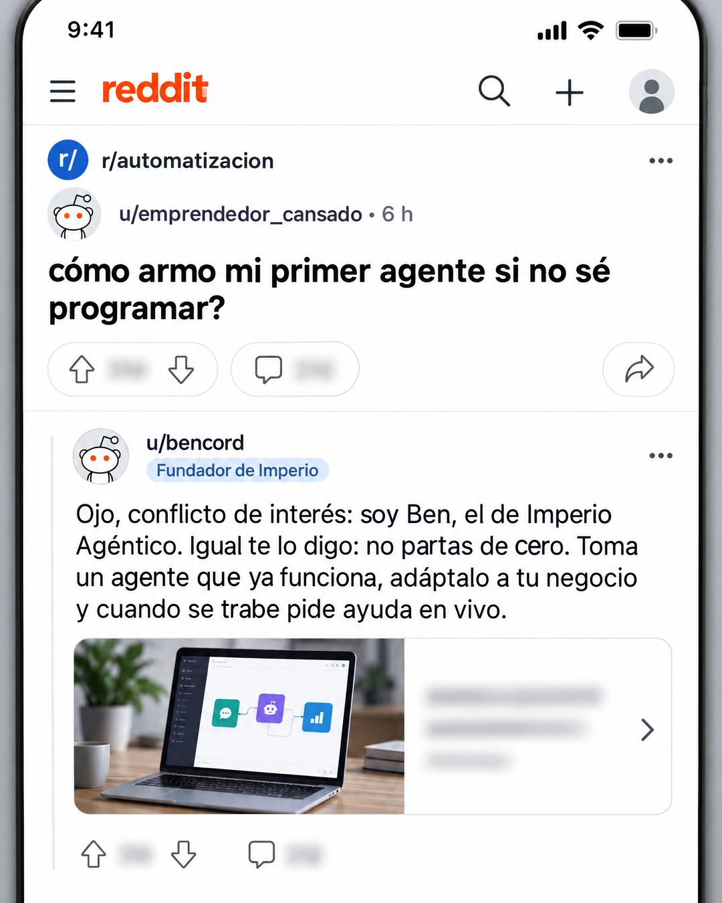

# 182 · Respuesta del dueño en Reddit

**Familia:** Interfaz creíble · **Necesitas:** Nada · **Resultado en Meta:** Sin datos propios todavía



## Qué es
Una captura de un hilo de foro donde alguien hace la pregunta que se hace tu cliente y el comentario destacado es tuyo: firmado con tu cuenta, declarando el conflicto de interés y con un consejo útil antes de cualquier venta.

## Por qué funciona
Se lee como una conversación real y no como anuncio, y la pregunta del hilo es la objeción del cliente con sus palabras. Declarar el conflicto de interés convierte lo que sería una recomendación falsa en autoridad propia: el dueño da la cara y aun así da un consejo que sirve.

## Cuándo usarlo
Público frío o tibio con una duda concreta antes de comprar. Sirve para negocios donde el dueño sabe del tema (servicios, formación, software); el objetivo es responder una objeción con un consejo útil.

## Así lo hicimos para Imperio
- **Texto en la imagen:** [barra de la app: reddit, lupa, más, perfil] / r/automatizacion / u/emprendedor_cansado • 6 h / cómo armo mi primer agente si no sé programar? / [votos y comentarios desenfocados] / u/bencord / Fundador de Imperio (etiqueta) / Ojo, conflicto de interés: soy Ben, el de Imperio Agéntico. Igual te lo digo: no partas de cero. Toma un agente que ya funciona, adáptalo a tu negocio y cuando se trabe pide ayuda en vivo. / [vista previa de enlace con foto de una laptop y texto desenfocado] / [votos desenfocados]
- **Texto principal:**
  > Me lo preguntan harto: cómo armo mi primer agente si no sé programar?
  >
  > Conflicto de interés declarado, soy Ben de Imperio. Igual te lo digo: no partas de cero. Toma uno que ya funciona, adáptalo y pide ayuda en vivo cuando se trabe.
  >
  > Eso es lo que hacemos adentro. $59 al mes 👇

## Receta para tu marca
- **Formato:** captura vertical de una app de foro en modo claro, con barra superior, la comunidad (r/[TU TEMA]) y el tiempo de publicación.
- **Pregunta:** título en negrita de un usuario con nombre genérico: [LA PREGUNTA QUE MÁS TE HACEN], en minúscula y sin signo de apertura.
- **Respuesta:** el comentario destacado lo firma u/[TU USUARIO] con una etiqueta de [TU ROL] y abre con: Ojo, conflicto de interés: soy [TU NOMBRE], de [TU MARCA]. Sigue con [TU CONSEJO EN 3 PASOS CORTOS].
- **Relleno:** votos, comentarios y la vista previa del enlace desenfocados; avatares genéricos, sin caras.
- **Lo que no se toca:** la respuesta es tuya y declara el conflicto de interés. Si un usuario inventado te recomienda, pasa a ser un testimonio falso.

## Prompt con que se hizo el de Imperio (GPT Image 2.5)
```
Reddit mobile app screenshot, light mode. Top bar 'reddit', subreddit 'r/automatizacion'. Post by 'u/emprendedor_cansado' · 6 h, bold title 'cómo armo mi primer agente si no sé programar?'. Below, the top comment by 'u/bencord' with a small flair 'Fundador de Imperio': 'Ojo, conflicto de interés: soy Ben, el de Imperio Agéntico. Igual te lo digo: no partas de cero. Toma un agente que ya funciona, adáptalo a tu negocio y cuando se trabe pide ayuda en vivo.' Under it a link preview card with a laptop image. Both users have plain default Reddit alien avatars, no human faces. All vote and comment counts blurred. Vertical 4:5 Instagram/Facebook feed ad, sharp and professional. All on-image text is Spanish and must be rendered EXACTLY as written inside the quotes, with every accent and ñ correct and every digit exact. Never use inverted question marks or inverted exclamation marks. No em dashes. Do not add any other words, logos or watermarks.
```

## Ojo
- Nunca simules que un tercero te recomienda: la respuesta la firma tu cuenta y dice quién eres.
- No uses el logo ni la mascota de una plataforma real sin permiso: pide una barra de foro genérica.
- Marca la casilla de contenido generado por IA en el Administrador de anuncios.
