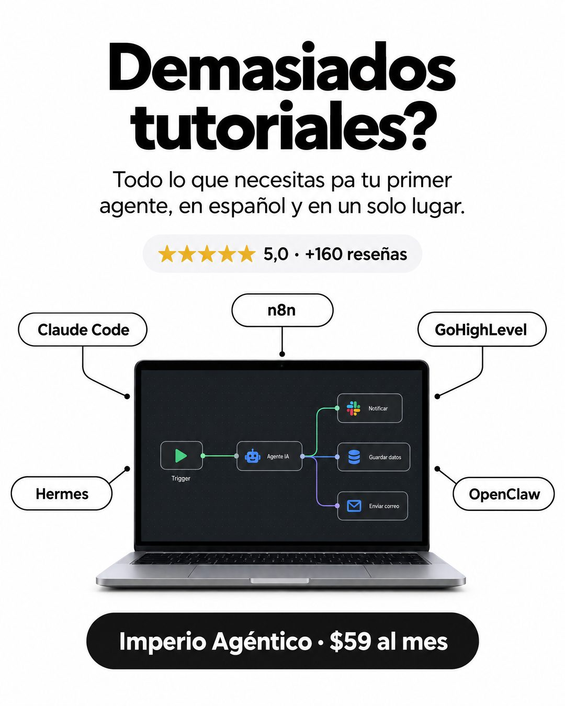

# 185 · Producto al centro con etiquetas

**Familia:** Diagrama y dato · **Necesitas:** Tu promedio y cantidad de reseñas reales · **Resultado en Meta:** Sin datos propios todavía



## Qué es
Una pregunta corta que nombra el cansancio del cliente, la promesa de tener todo en un solo lugar y el producto al centro, rodeado de etiquetas con líneas finas que nombran lo que incluye. Abajo, una píldora con la marca y el precio.

## Por qué funciona
La pregunta del titular es la queja del cliente dicha con sus palabras. Las etiquetas alrededor del producto muestran de un vistazo todo lo que reúne, y el precio a la vista cierra la cuenta sin esconder nada.

## Cuándo usarlo
Público tibio que ya probó varias herramientas o proveedores por separado. Sirve para cursos, paquetes, software todo en uno o servicios que integran varias cosas; el objetivo es mostrar el alcance y responder la objeción de dispersión.

## Así lo hicimos para Imperio
- **Texto en la imagen:** Demasiados tutoriales? / Todo lo que necesitas pa tu primer agente, en español y en un solo lugar. / ★★★★★ 5,0 · +160 reseñas / Claude Code / n8n / GoHighLevel / Hermes / OpenClaw (píldoras con líneas hacia la laptop) / [pantalla con un flujo: Trigger, Agente IA, Notificar, Guardar datos, Enviar correo] / Imperio Agéntico · $59 al mes (píldora negra, abajo)
- **Texto principal:**
  > Claude Code, n8n, GoHighLevel, Hermes, OpenClaw. Todo en español y en un solo lugar.
  >
  > +160 reseñas con promedio 5,0 y 6 sesiones en vivo a la semana.
  >
  > $59 al mes 👇

## Receta para tu marca
- **Titular:** pregunta grande en negro, dos líneas: Demasiados [LO QUE TU CLIENTE YA ACUMULÓ SIN RESULTADO]?, sin signo de apertura.
- **Bajada:** Todo lo que necesitas para [EL RESULTADO], [TU DIFERENCIAL] y en un solo lugar.
- **Centro:** [TU PRODUCTO] en primer plano, rodeado de cinco píldoras con borde y líneas finas: [LO QUE INCLUYE 1 A 5].
- **Prueba y precio:** un chip con [TU PROMEDIO] · [TU NÚMERO DE RESEÑAS] y una píldora negra abajo con [TU MARCA] · [TU PRECIO].
- **Colores:** fondo blanco o gris muy claro, texto negro, estrellas amarillas; tu color de marca solo dentro de la pantalla del producto.
- **Lo que no se toca:** las etiquetas nombran cosas concretas que el cliente reconoce, no beneficios abstractos.

## Prompt con que se hizo el de Imperio (GPT Image 2.5)
```
White ad. Big black title 'Demasiados tutoriales?'. Subtitle 'Todo lo que necesitas pa tu primer agente, en español y en un solo lugar.' Rating chip '★★★★★ 5,0 · +160 reseñas'. Center: a laptop with an automation flow, surrounded by outlined pill labels with thin connector lines: 'Claude Code', 'n8n', 'GoHighLevel', 'Hermes', 'OpenClaw'. Bottom pill 'Imperio Agéntico · $59 al mes'. Vertical 4:5 Instagram/Facebook feed ad, sharp and professional. All on-image text is Spanish and must be rendered EXACTLY as written inside the quotes, with every accent and ñ correct and every digit exact. Never use inverted question marks or inverted exclamation marks. No em dashes. Do not add any other words, logos or watermarks.
```

## Ojo
- Nunca inventes testimonios, chats de clientes, reseñas ni capturas de resultados: si el formato muestra prueba social, usa material real o déjalo fuera.
- Nombra herramientas de terceros solo como texto: sin sus logos, salvo que tengas permiso.
- Marca la casilla de contenido generado por IA en el Administrador de anuncios.
