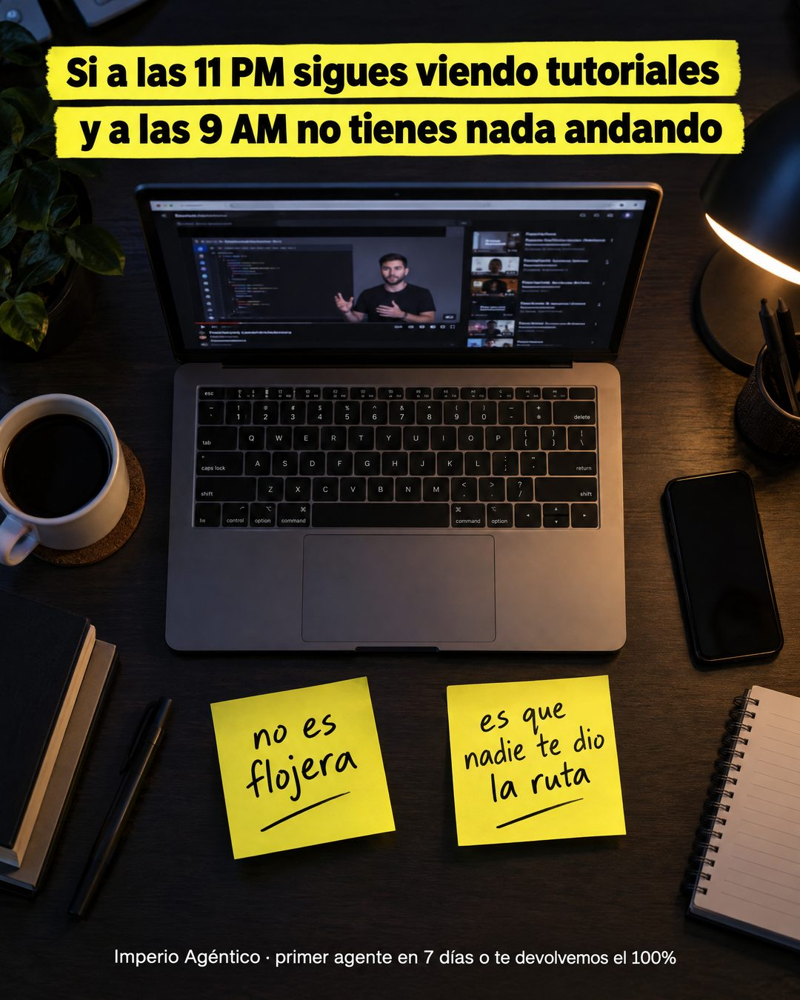

# 186 · Post-its en escritorio de noche

**Familia:** Objeto físico con texto · **Necesitas:** Nada · **Resultado en Meta:** Sin datos propios todavía



## Qué es
Una foto cenital de un escritorio de noche, con una frase arriba en franjas de resaltador amarillo que describe la rutina del cliente y dos post-its escritos a mano que le dan el diagnóstico. La marca y la garantía van en una línea chica abajo.

## Por qué funciona
El post-it escrito a mano es un objeto real, y lo que parece capturado del mundo rinde más que lo diseñado. La frase de arriba describe con horas exactas lo que el cliente hace, y los post-its le quitan la culpa antes de venderle nada.

## Cuándo usarlo
Público frío o tibio que lleva tiempo intentando solo. Sirve para formación, coaching o servicios que entregan un método; el objetivo es frenar el scroll con identificación y bajar la culpa.

## Así lo hicimos para Imperio
- **Texto en la imagen:** Si a las 11 PM sigues viendo tutoriales / y a las 9 AM no tienes nada andando (franjas de resaltador amarillo, arriba) / [laptop con un video tutorial en pantalla] / no es flojera (post-it) / es que nadie te dio la ruta (post-it) / Imperio Agéntico · primer agente en 7 días o te devolvemos el 100% (letra chica blanca, abajo)
- **Texto principal:**
  > No es flojera. Es que nadie te dio la ruta.
  >
  > Adentro eliges un caso, partes de un agente que ya funciona y lo terminas con soporte en vivo.
  >
  > Tu primer agente en 7 días o te devolvemos el 100%. $59 al mes 👇

## Receta para tu marca
- **Escena:** foto cenital de [EL LUGAR DONDE TU CLIENTE PELEA CON EL PROBLEMA] de noche, con luz cálida de lámpara y [LA SEÑAL DEL PROBLEMA] a la vista (una pantalla, un papel, una herramienta).
- **Titular:** dos franjas de resaltador amarillo con texto negro grueso: Si a las [HORA] sigues [LO QUE HACE SIN AVANZAR] / y a las [HORA] no tienes [EL RESULTADO].
- **Post-its:** dos notas amarillas escritas con plumón negro: [LO QUE NO ES EL PROBLEMA] y [LA CAUSA REAL].
- **Marca:** una línea chica blanca abajo: [TU MARCA] · [TU PROMESA O GARANTÍA].
- **Lo que no se toca:** las horas concretas y la letra a mano. Si los post-its salen con letra de computador, se pierde el objeto real.

## Prompt con que se hizo el de Imperio (GPT Image 2.5)
```
Top-down photo of a dark desk at night with an open laptop. Top: yellow highlighter-style boxes with black bold text 'Si a las 11 PM sigues viendo tutoriales' / 'y a las 9 AM no tienes nada andando'. Two bright yellow sticky notes on the desk with black marker handwriting 'no es flojera' and 'es que nadie te dio la ruta'. Small white footer 'Imperio Agéntico · primer agente en 7 días o te devolvemos el 100%'. Vertical 4:5 Instagram/Facebook feed ad, sharp and professional. All on-image text is Spanish and must be rendered EXACTLY as written inside the quotes, with every accent and ñ correct and every digit exact. Never use inverted question marks or inverted exclamation marks. No em dashes. Do not add any other words, logos or watermarks.
```

## Ojo
- Si sale texto roto, manos deformes o cifras mal escritas, se rehace.
- La garantía de la línea chica tiene que existir tal cual en tus condiciones de venta.
- Marca la casilla de contenido generado por IA en el Administrador de anuncios.
