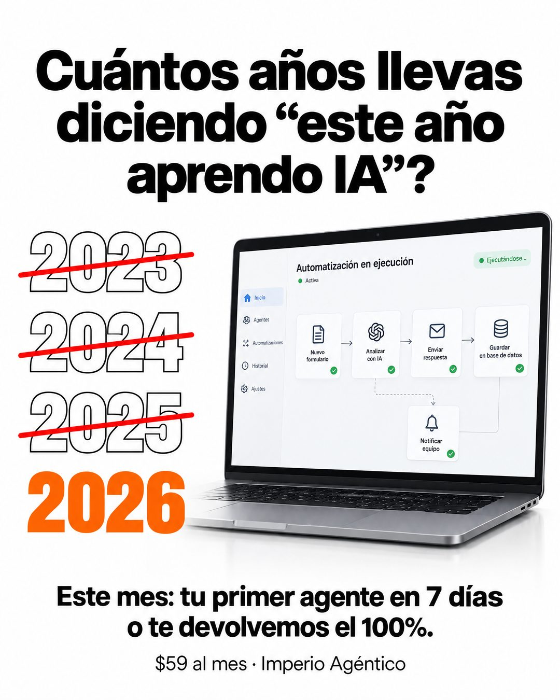

# 187 · Años tachados hasta el actual

**Familia:** Tipografía dura · **Necesitas:** Nada · **Resultado en Meta:** Sin datos propios todavía



## Qué es
Una pregunta que le recuerda al cliente la promesa que se repite cada año, una columna de años tachados en rojo y el año actual destacado en color. Al lado, el resultado funcionando, y abajo la oferta con plazo.

## Por qué funciona
Los años tachados muestran el costo de postergar sin decirlo: el cliente cuenta solo cuántos años lleva igual. El año actual sin tachar convierte esa culpa en urgencia, y la garantía con plazo le baja el riesgo a decidir ahora.

## Cuándo usarlo
Público tibio o remarketing que lleva tiempo pensando en comprar. Sirve para cualquier meta que la gente posterga (aprender algo, ordenar sus finanzas, empezar a entrenar); el objetivo es empujar la decisión.

## Así lo hicimos para Imperio
- **Texto en la imagen:** Cuántos años llevas diciendo “este año aprendo IA”? / 2023 / 2024 / 2025 (con contorno y tachados en rojo) / 2026 (naranja, sin tachar) / [laptop con un panel: Automatización en ejecución, Activa, Ejecutándose..., y un flujo de cinco pasos con checks verdes] / Este mes: tu primer agente en 7 días / o te devolvemos el 100%. / $59 al mes · Imperio Agéntico
- **Texto principal:**
  > 2023, 2024, 2025: "este año aprendo IA".
  >
  > Este mes puede ser distinto: tu primer agente en 7 días o te devolvemos el 100%.
  >
  > $59 al mes 👇

## Receta para tu marca
- **Titular:** pregunta en negro grueso: Cuántos años llevas diciendo “[LA PROMESA QUE TU CLIENTE SE HACE CADA AÑO]”?, sin signo de apertura.
- **Años:** a la izquierda, tres años anteriores en números grandes con contorno y una raya roja encima, y el año actual debajo, lleno en [TU COLOR DE MARCA] y sin tachar.
- **Producto:** a la derecha, [TU PRODUCTO O EL RESULTADO] funcionando, simple y legible.
- **Oferta:** abajo, en negrita: Este mes: [TU PROMESA CON PLAZO], y en letra chica [TU PRECIO] · [TU MARCA].
- **Lo que no se toca:** el año actual es el real y el único sin tachar; si publicas cerca de fin de año, revisa que no quede viejo.

## Prompt con que se hizo el de Imperio (GPT Image 2.5)
```
White ad. Black headline 'Cuántos años llevas diciendo “este año aprendo IA”?'. Left column: large outlined numbers stacked '2023', '2024', '2025', each crossed out with a red line; below them '2026' in bold orange, not crossed. Right: a laptop showing a working automation. Bottom text: 'Este mes: tu primer agente en 7 días o te devolvemos el 100%.' and small '$59 al mes · Imperio Agéntico'. Vertical 4:5 Instagram/Facebook feed ad, sharp and professional. All on-image text is Spanish and must be rendered EXACTLY as written inside the quotes, with every accent and ñ correct and every digit exact. Never use inverted question marks or inverted exclamation marks. No em dashes. Do not add any other words, logos or watermarks.
```

## Ojo
- Si sale texto roto, manos deformes o cifras mal escritas, se rehace.
- Pide íconos genéricos en la pantalla: sin logos de otras marcas en los pasos del flujo.
- Marca la casilla de contenido generado por IA en el Administrador de anuncios.
