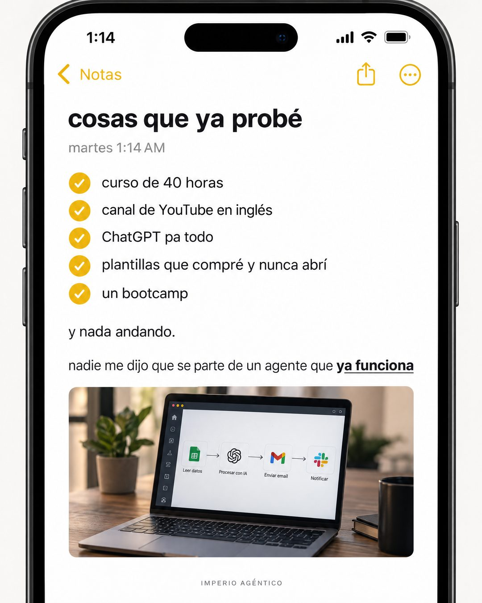

# 188 · Nota del teléfono con intentos fallidos

**Familia:** Interfaz creíble · **Necesitas:** Nada · **Resultado en Meta:** Sin datos propios todavía



## Qué es
Una captura de la app de notas del teléfono, de madrugada, con una lista marcada de todo lo que el cliente ya intentó, una línea que admite que nada funcionó y la frase que nadie le dijo. Abajo, una foto chica de la solución.

## Por qué funciona
Se ve tan simple que no parece anuncio. La estructura de lista de intentos ya hechos es distinta a la de otras notas (tareas tachadas, plan numerado), así que no se canibalizan, y cada ítem es algo que el cliente reconoce como propio. La última línea le entrega la idea nueva en negrita sin sonar a venta.

## Cuándo usarlo
Público frío o tibio que ya gastó tiempo o dinero en alternativas. Sirve para cualquier negocio que resuelve algo que la gente intenta sola muchas veces; el objetivo es generar identificación y responder la objeción de 'ya probé de todo'.

## Así lo hicimos para Imperio
- **Texto en la imagen:** [barra del teléfono: 1:14, Notas] / cosas que ya probé / martes 1:14 AM / curso de 40 horas / canal de YouTube en inglés / ChatGPT pa todo / plantillas que compré y nunca abrí / un bootcamp (lista con círculos amarillos marcados) / y nada andando. / nadie me dijo que se parte de un agente que ya funciona (ya funciona en negrita y subrayado) / [foto de una laptop con un flujo: Leer datos, Procesar con IA, Enviar email, Notificar] / IMPERIO AGÉNTICO (letra chica, abajo)
- **Texto principal:**
  > Curso de 40 horas, canales en inglés, plantillas que nunca abriste.
  >
  > Lo que casi nadie te dice: el primer agente no se arma desde cero. Se parte de uno que ya funciona y se adapta.
  >
  > Eso es Imperio. $59 al mes 👇

## Receta para tu marca
- **Formato:** captura vertical de la app de notas en modo claro, con barra de estado y una hora de madrugada.
- **Título:** en minúscula y negrita: cosas que ya probé, con la fecha gris debajo ([DÍA] [HORA DE MADRUGADA]).
- **Lista:** cinco ítems con círculo marcado: [INTENTO 1 A 5 DE TU CLIENTE], escritos como él los anotaría.
- **Cierre:** una línea suelta, y nada [EL RESULTADO QUE NO LLEGÓ]., y después: nadie me dijo que [TU IDEA CLAVE], con [LAS 2 O 3 PALABRAS CLAVE] en negrita y subrayadas.
- **Imagen y marca:** una foto chica de [TU PRODUCTO O RESULTADO] dentro de la nota y [TU MARCA] en letra chica gris al final.
- **Lo que no se toca:** minúsculas, tono de nota personal y la hora de madrugada. Si parece diseñado, deja de ser nota.

## Prompt con que se hizo el de Imperio (GPT Image 2.5)
```
iPhone Notes app screenshot, light mode. Title 'cosas que ya probé'. Small grey line 'martes 1:14 AM'. Yellow check circles list: 'curso de 40 horas', 'canal de YouTube en inglés', 'ChatGPT pa todo', 'plantillas que compré y nunca abrí', 'un bootcamp'. Then a plain line 'y nada andando.' Then 'nadie me dijo que se parte de un agente que ya funciona' with 'ya funciona' bold and underlined. Bottom: a small inserted photo of a laptop with an automation. Tiny footer 'IMPERIO AGÉNTICO'. Vertical 4:5 Instagram/Facebook feed ad, sharp and professional. All on-image text is Spanish and must be rendered EXACTLY as written inside the quotes, with every accent and ñ correct and every digit exact. Never use inverted question marks or inverted exclamation marks. No em dashes. Do not add any other words, logos or watermarks.
```

## Ojo
- Si sale texto roto, manos deformes o cifras mal escritas, se rehace.
- Si la foto de la nota muestra pantallas, pide íconos genéricos, sin logos de otras marcas.
- Marca la casilla de contenido generado por IA en el Administrador de anuncios.
