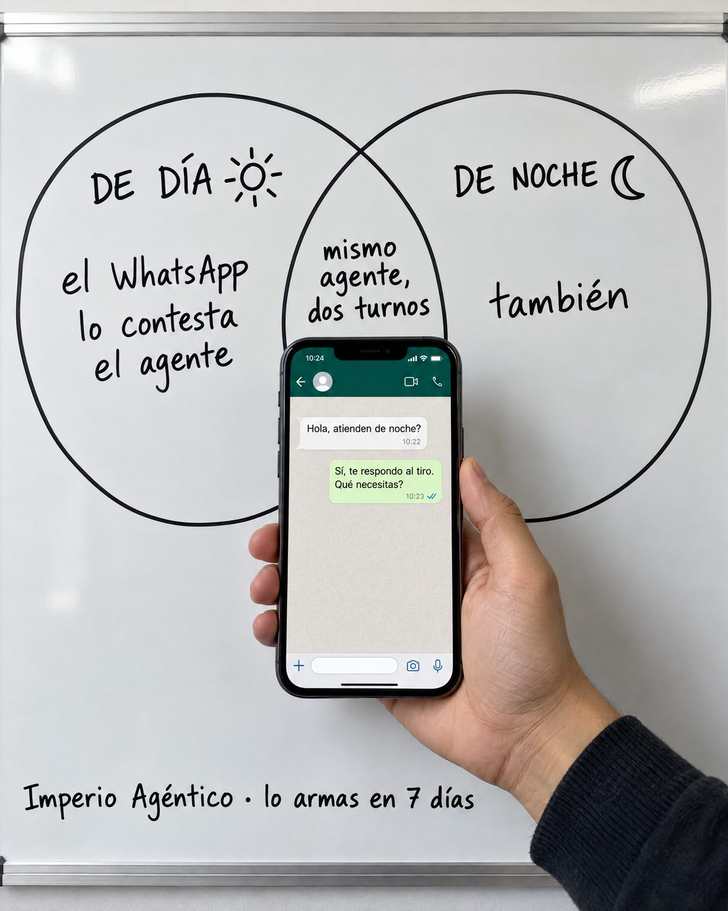

# 190 · Venn en pizarra con teléfono

**Familia:** Diagrama y dato · **Necesitas:** Nada · **Resultado en Meta:** Sin datos propios todavía



## Qué es
Una pizarra blanca con un diagrama de Venn hecho a mano con plumón: dos círculos con dos momentos del cliente y, en la intersección, la idea que los une. Una mano real sostiene un teléfono con la prueba justo en el centro.

## Por qué funciona
La pizarra es un objeto real y el dibujo a mano parece una explicación de pasillo, no un anuncio. El remate es una sola palabra ('también') que ocupa un círculo entero, y el chat de demostración en el centro lo vuelve concreto.

## Cuándo usarlo
Público frío o tibio. Sirve para negocios que resuelven algo en dos momentos o contextos distintos (día y noche, oficina y casa, temporada alta y baja); el objetivo es frenar el scroll y explicar el beneficio de un vistazo.

## Así lo hicimos para Imperio
- **Texto en la imagen:** DE DÍA (con un sol dibujado) / el WhatsApp lo contesta el agente / mismo agente, dos turnos (en la intersección) / DE NOCHE (con una luna dibujada) / también / [teléfono en una mano con un chat:] Hola, atienden de noche? / Sí, te respondo al tiro. Qué necesitas? / Imperio Agéntico · lo armas en 7 días (a mano, abajo)
- **Texto principal:**
  > De día el WhatsApp lo contesta el agente. De noche también.
  >
  > Mismo agente, dos turnos. Lo armas en 7 días o te devolvemos el 100%.
  >
  > $59 al mes 👇

## Receta para tu marca
- **Escena:** foto de frente de una pizarra blanca con marco de aluminio, luz de oficina real y algo de reflejo.
- **Diagrama:** dos círculos a plumón negro; a la izquierda [MOMENTO 1] con un dibujo simple y [QUÉ PASA CON TU SOLUCIÓN]; a la derecha [MOMENTO 2] con su dibujo y una sola palabra: también. En la intersección, [TU IDEA EN 4 PALABRAS].
- **Prueba:** una mano real sostiene el teléfono en la intersección con un chat de demostración: [PREGUNTA DEL CLIENTE] y [RESPUESTA DE TU PRODUCTO].
- **Marca:** abajo, a mano: [TU MARCA] · [TU PROMESA CON PLAZO].
- **Lo que no se toca:** todo escrito a mano, sin tipografía de computador en la pizarra, y el segundo círculo casi vacío.

## Prompt con que se hizo el de Imperio (GPT Image 2.5)
```
Photo of a white whiteboard with a hand-drawn black marker Venn diagram: left circle title 'DE DÍA ☀' with handwriting 'el WhatsApp lo contesta el agente'; right circle title 'DE NOCHE ☾' with handwriting 'también'; in the intersection small 'mismo agente, dos turnos'. A real hand holds a smartphone at the intersection showing a WhatsApp chat with only these messages: customer 'Hola, atienden de noche?', agent 'Sí, te respondo al tiro. Qué necesitas?'. Bottom small handwriting 'Imperio Agéntico · lo armas en 7 días'. Every chat message is written WITHOUT inverted question marks and WITHOUT inverted exclamation marks (never the characters U+00BF or U+00A1 anywhere, questions only end with ?). Vertical 4:5 Instagram/Facebook feed ad, sharp and professional. All on-image text is Spanish and must be rendered EXACTLY as written inside the quotes, with every accent and ñ correct and every digit exact. Never use inverted question marks or inverted exclamation marks. No em dashes. Do not add any other words, logos or watermarks.
```

## Ojo
- Si sale texto roto, manos deformes o cifras mal escritas, se rehace.
- El chat es una demostración de tu producto: nunca lo presentes como la conversación de un cliente real.
- Marca la casilla de contenido generado por IA en el Administrador de anuncios.
