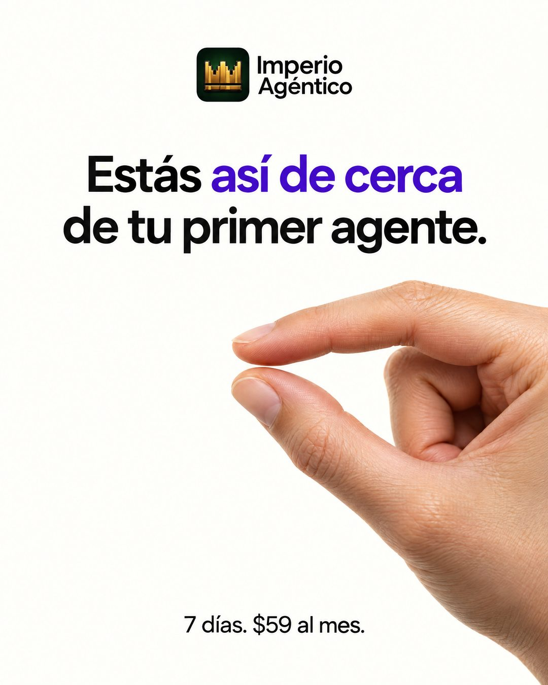

# 192 · Así de cerca, con gesto y logo (Script)

**Familia:** Tipografía dura · **Necesitas:** Tu logo · **Resultado en Meta:** Sin datos propios todavía



## Qué es
Un anuncio minimalista con el logo arriba, una frase que le dice al cliente que está muy cerca de su resultado y una mano real haciendo el gesto de así de cerca, con el pulgar y el índice casi juntos.

## Por qué funciona
El gesto convierte la frase en imagen: se entiende antes de leer y casi todos lo han hecho alguna vez. Mucho espacio en blanco y una sola idea hacen que respire entre anuncios recargados, y la línea final baja la fricción con plazo y precio.

## Cuándo usarlo
Remarketing o público tibio que ya consideró comprar y está a un paso. Sirve para cualquier negocio con un primer resultado rápido; el objetivo es bajar la fricción y empujar la compra.

## Así lo hicimos para Imperio
- **Texto en la imagen:** [logo de Imperio Agéntico: ícono de corona y nombre, arriba al centro] / Estás así de cerca (así de cerca en morado) / de tu primer agente. / 7 días. $59 al mes. (letra chica, abajo)
- **Texto principal:**
  > Estás así de cerca de tu primer agente.
  >
  > Un caso, una base que ya funciona y 7 días. Si no anda, te devolvemos el 100%.
  >
  > $59 al mes 👇

## Receta para tu marca
- **Marca:** [TU LOGO] chico, arriba al centro.
- **Titular:** al centro, sans moderna negra en dos líneas: Estás así de cerca / de [TU RESULTADO]., con “así de cerca” en [TU COLOR DE MARCA].
- **Imagen:** a la derecha, una mano real con el pulgar y el índice casi tocándose, piel con textura real, sobre fondo blanco roto.
- **Cierre:** abajo, en letra chica: [TU PLAZO]. [TU PRECIO].
- **Lo que no se toca:** el espacio en blanco y una sola mano con dedos perfectos. Si la mano sale rara, se cae el anuncio entero.

## Prompt con que se hizo el de Imperio (GPT Image 2.5)
```
Minimal off-white ad. Top center small: [TU MARCA: logo y nombre] Center text in black modern sans 'Estás así de cerca' with 'así de cerca' in purple; below it 'de tu primer agente.' Right: a realistic hand with thumb and index finger almost touching (pinch gesture). Bottom small '7 días. $59 al mes.' Vertical 4:5 Instagram/Facebook feed ad, sharp and professional. All on-image text is Spanish and must be rendered EXACTLY as written inside the quotes, with every accent and ñ correct and every digit exact. Never use inverted question marks or inverted exclamation marks. No em dashes. Do not add any other words, logos or watermarks.
```

## Ojo
- Si sale texto roto, manos deformes o cifras mal escritas, se rehace.
- El plazo que imprimes tiene que ser el real de tu oferta, no un número que suene bien.
- Marca la casilla de contenido generado por IA en el Administrador de anuncios.
