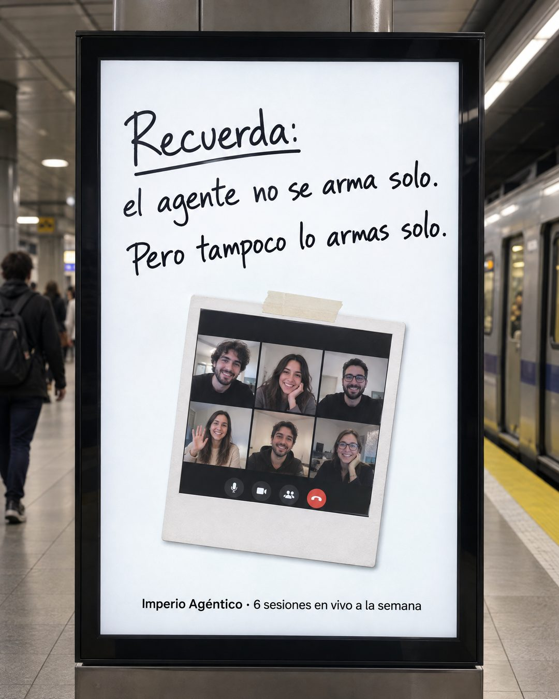

# 193 · Nota manuscrita en el metro (Whiteboard)

**Familia:** Objeto físico con texto · **Necesitas:** Nada. Si tienes una foto real de tu comunidad, mejor · **Resultado en Meta:** Sin datos propios todavía



## Qué es
Una foto de una pantalla publicitaria en un andén de metro que muestra una nota escrita a mano sobre fondo blanco, con una polaroid pegada con cinta. La marca y un dato de la oferta van en una línea chica abajo.

## Por qué funciona
El cartel en el metro es un objeto del mundo real y se lee como foto, no como diseño. La nota a mano juega con dos sentidos de la misma frase y responde la objeción de 'no voy a poder solo' sin listar beneficios.

## Cuándo usarlo
Público frío o tibio que teme quedarse solo con el problema. Sirve para comunidades, servicios con acompañamiento o clases en grupo; el objetivo es responder la objeción de soledad y mostrar que hay gente detrás.

## Así lo hicimos para Imperio
- **Texto en la imagen:** Recuerda: / el agente no se arma solo. / Pero tampoco lo armas solo. / [polaroid pegada con cinta: videollamada grupal de seis personas] / Imperio Agéntico · 6 sesiones en vivo a la semana (letra chica, abajo de la pantalla)
- **Texto principal:**
  > El agente no se arma solo. Pero tampoco lo armas solo.
  >
  > 6 sesiones en vivo a la semana, con +3.800 personas construyendo lo mismo que tú.
  >
  > $59 al mes 👇

## Receta para tu marca
- **Escena:** foto de una pantalla publicitaria vertical en un andén de metro, con un tren y gente desenfocada al fondo y luz fluorescente real.
- **Nota:** en la pantalla, fondo blanco y plumón negro a mano: Recuerda: (subrayado) / [LO QUE TU CLIENTE CREE QUE TIENE QUE HACER] / [EL GIRO: POR QUÉ NO LO HACE SOLO].
- **Foto pegada:** una polaroid con cinta de [TU COMUNIDAD, EQUIPO O CLASE EN ACCIÓN].
- **Pie:** una línea tipográfica chica: [TU MARCA] · [UN DATO CONCRETO DE TU OFERTA].
- **Lo que no se toca:** la letra a mano y el entorno real del metro. Si la pantalla se ve como un diseño plano, se pierde el objeto.

## Prompt con que se hizo el de Imperio (GPT Image 2.5)
```
Photo in a subway station of a large digital advertising screen that shows a white background with black handwritten marker text 'Recuerda:' / 'el agente no se arma solo.' / 'Pero tampoco lo armas solo.' and a taped polaroid photo of a group video call. Small bottom line on the screen 'Imperio Agéntico · 6 sesiones en vivo a la semana'. Vertical 4:5 Instagram/Facebook feed ad, sharp and professional. All on-image text is Spanish and must be rendered EXACTLY as written inside the quotes, with every accent and ñ correct and every digit exact. Never use inverted question marks or inverted exclamation marks. No em dashes. Do not add any other words, logos or watermarks.
```

## Ojo
- Si la polaroid muestra personas, usa una foto real de tu comunidad con permiso o caras claramente genéricas: no presentes caras generadas como si fueran tus clientes.
- Si sale texto roto, manos deformes o cifras mal escritas, se rehace.
- Marca la casilla de contenido generado por IA en el Administrador de anuncios.
