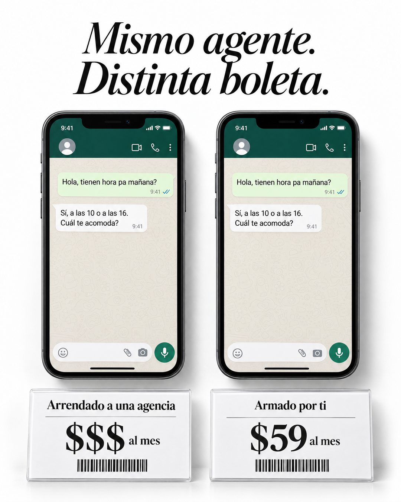

# 194 · Mismo resultado, distinto precio (Us vs them)

**Familia:** Diagrama y dato · **Necesitas:** Nada · **Resultado en Meta:** Sin datos propios todavía



## Qué es
Dos versiones idénticas del mismo resultado, una al lado de la otra, cada una sobre una tarjeta de precio de góndola con código de barras: la alternativa cara a la izquierda y tu opción a la derecha. Un titular en serif cursiva lo resume.

## Por qué funciona
Si el resultado se ve idéntico, lo único que queda por comparar es el precio, y el cliente saca la cuenta solo. Los signos $$$ de la alternativa evitan inventar la cifra de un tercero, y las tarjetas de góndola hacen que los dos parezcan productos en un estante.

## Cuándo usarlo
Público tibio que duda entre contratar a otro o hacerlo con tu ayuda. Sirve para cursos, herramientas o productos que reemplazan un servicio caro; el objetivo es responder la objeción de precio.

## Así lo hicimos para Imperio
- **Texto en la imagen:** Mismo agente. / Distinta boleta. / [dos teléfonos con el mismo chat:] Hola, tienen hora pa mañana? / Sí, a las 10 o a las 16. Cuál te acomoda? / Arrendado a una agencia / $$$ al mes (tarjeta de precio izquierda) / Armado por ti / $59 al mes (tarjeta de precio derecha)
- **Texto principal:**
  > Mismo agente. Distinta boleta.
  >
  > El que le arriendas a una agencia se paga todos los meses y nunca es tuyo. El que armas tú se queda contigo (y lo sabes arreglar).
  >
  > Aprende a armarlo en Imperio. $59 al mes 👇

## Receta para tu marca
- **Titular:** serif elegante en cursiva negra, dos líneas: Mismo [RESULTADO]. / Distinto precio.
- **Producto:** dos [MUESTRAS IDÉNTICAS DE TU RESULTADO] lado a lado, iguales hasta el último detalle (en el ejemplo, el mismo chat en dos teléfonos).
- **Precios:** debajo de cada una, una tarjeta blanca de góndola con código de barras: [LA ALTERNATIVA CARA] / $$$ y [TU OPCIÓN] / [TU PRECIO].
- **Colores:** fondo blanco limpio, texto negro y nada de color de marca: la elegancia está en el blanco y la serif.
- **Lo que no se toca:** las dos muestras idénticas. Si se ven distintas, el cliente compara calidad y no precio.

## Prompt con que se hizo el de Imperio (GPT Image 2.5)
```
Clean white luxury product ad. Big elegant serif italic headline 'Mismo agente.' / 'Distinta boleta.' Two white shelf price cards with barcodes side by side: left card 'Arrendado a una agencia' with price '$$$ al mes'; right card 'Armado por ti' with price '$59 al mes'. Above the cards, two identical phones showing the same WhatsApp chat with only these messages: customer 'Hola, tienen hora pa mañana?' and agent 'Sí, a las 10 o a las 16. Cuál te acomoda?'. Every chat message is written WITHOUT inverted question marks and WITHOUT inverted exclamation marks (never the characters U+00BF or U+00A1 anywhere, questions only end with ?). Vertical 4:5 Instagram/Facebook feed ad, sharp and professional. All on-image text is Spanish and must be rendered EXACTLY as written inside the quotes, with every accent and ñ correct and every digit exact. Never use inverted question marks or inverted exclamation marks. No em dashes. Do not add any other words, logos or watermarks.
```

## Ojo
- No le pongas cifra al precio de la alternativa si no la puedes probar: los signos $$$ dicen lo mismo sin inventar.
- El chat es una demostración de tu producto: nunca lo presentes como la conversación de un cliente real.
- Marca la casilla de contenido generado por IA en el Administrador de anuncios.
