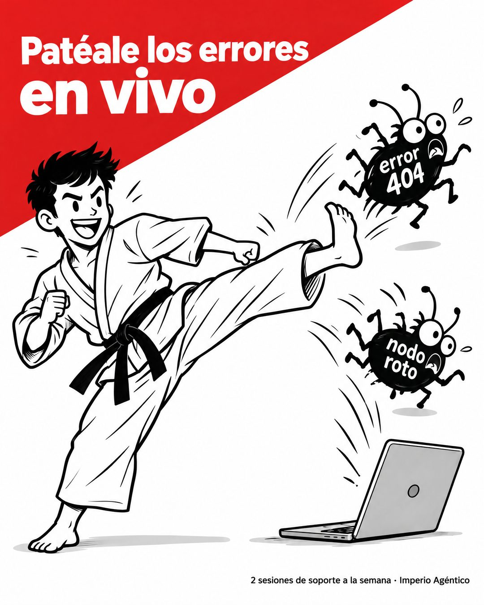

# 195 · Caricatura pateando el problema (Doodle)

**Familia:** Humor y meme · **Necesitas:** Nada · **Resultado en Meta:** Sin datos propios todavía



## Qué es
Una ilustración a tinta negra estilo cómic donde un personaje le da una patada literal al problema del cliente, dibujado como bichos con nombre. Un bloque rojo en diagonal lleva el titular y una línea chica dice qué incluye la oferta.

## Por qué funciona
El dibujo a mano rompe con las fotos y pantallas del feed y se lee en un segundo. Convertir el problema en bichos con nombre lo vuelve reconocible y gracioso, y la línea chica aterriza el chiste en algo concreto de la oferta.

## Cuándo usarlo
Público frío o tibio con un problema técnico o frustrante. Sirve para soporte, servicio técnico, mantenimiento o cualquier negocio que arregla fallas; el objetivo es frenar el scroll con humor y mostrar que hay ayuda concreta.

## Así lo hicimos para Imperio
- **Texto en la imagen:** Patéale los errores / en vivo (bloque rojo en diagonal, arriba a la izquierda) / error 404 / nodo roto (escritos sobre los bichos) / 2 sesiones de soporte a la semana · Imperio Agéntico (letra chica, abajo a la derecha)
- **Texto principal:**
  > Ese error 404 o ese nodo roto que te tiene pegado hace 3 días: tráelo a la sesión de soporte.
  >
  > Hay 2 a la semana, en vivo. Revisamos tus flujos hasta que funcionen.
  >
  > $59 al mes 👇

## Receta para tu marca
- **Ilustración:** dibujo a tinta negra sobre blanco, estilo cómic, de un personaje [HACIENDO UNA ACCIÓN FÍSICA CONTRA EL PROBLEMA] y [EL PROBLEMA DE TU CLIENTE DIBUJADO COMO BICHOS O MONSTRUOS] saliendo disparado.
- **Etiquetas:** cada bicho lleva escrito [UN PROBLEMA CONCRETO QUE TU CLIENTE RECONOCE].
- **Titular:** bloque rojo en diagonal arriba a la izquierda, con texto blanco grueso: [VERBO EN IMPERATIVO] [EL PROBLEMA] / [CÓMO O DÓNDE].
- **Pie:** letra chica abajo a la derecha: [LO QUE INCLUYE TU OFERTA, CON CIFRA] · [TU MARCA].
- **Lo que no se toca:** solo negro y un color fuerte. Si agregas más colores o sombras, deja de parecer garabato.

## Prompt con que se hizo el de Imperio (GPT Image 2.5)
```
White background with a red diagonal corner block at the top-left containing white bold text 'Patéale los errores' / 'en vivo'. Black ink doodle illustration: a cartoon guy in a karate gi mid-kick sending little bug creatures labeled 'error 404' and 'nodo roto' flying away from a laptop. Small text bottom right '2 sesiones de soporte a la semana · Imperio Agéntico'. Vertical 4:5 Instagram/Facebook feed ad, sharp and professional. All on-image text is Spanish and must be rendered EXACTLY as written inside the quotes, with every accent and ñ correct and every digit exact. Never use inverted question marks or inverted exclamation marks. No em dashes. Do not add any other words, logos or watermarks.
```

## Ojo
- Inventa tu propio personaje: no uses personajes de marcas, series o caricaturas conocidas.
- Si sale texto roto, manos deformes o cifras mal escritas, se rehace.
- Marca la casilla de contenido generado por IA en el Administrador de anuncios.
